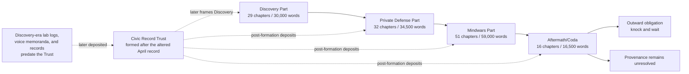

# Design Document: Mindwars Novel

## Overview

### Design Basis and Research Findings

This design treats the novel as the product. The checker, file conventions, and site exclusion exist only to protect a long creative process from bookkeeping drift.

The design draws from the approved [requirements](requirements.md) and four primary canon sources:

- [*The Synaptic Frontier*](../../../songs/The%20Synaptic%20Frontier.md) establishes mathematical radio, the mind as a field, an undiscovered inward channel, open invitation, and Mara’s reception of a stranger’s continuous ordinary morning eight seconds after it occurs. The source experiences no canonical discontinuity; the eight seconds belong to reception/transport timing observed by Mara.
- [*Faraday*](../../../songs/Faraday.md) turns discovery into boundary: December, the copper room, the April term sheet, page-nine `transmit enable`, the lock on the inside, and consent as the condition of entry.
- [*The Final Frontier*](../../../songs/The%20Final%20Frontier.md) turns the private boundary into an undeclared conflict over mindspace. Counterphase is both defense and transmission; the null succeeds, but diminishes the defending voice and harms civilians throughout an affected area canonically described as three counties wide.
- [*The Radius*](../../../songs/The%20Radius.md) changes scale and genre pressure. Two years after the null, a visitor eleven miles from the array asks for an impossible restoration. Her consent is valid; the refusal rests on physics and truth. Domestic room tone, a relay, a kettle, and a human voice replace carrier tones and public declaration.
- Inspection of the workspace found **no Site_Build in this repository**. The lyrics-site tooling lives in a separate repository, and the four Canon_Sources here are reference copies collected under `songs/`. An earlier version of this design asserted that `.tools/build_site.py` scans every visible top-level directory; that file is not present in this workspace, and the assertion is withdrawn. Because the manuscript cannot leak into a build that does not exist here, the isolation obligation becomes a portable declaration this project owns and the lyrics repository can consume, rather than an edit to source this project does not hold. See open choice 9 and decision `DEC-008`.

These findings produce five controlling design decisions:

1. The external mystery is never solved from an adversary position. The Foreign_Signal is knowable only through human reception, inference, and damage.
2. The central arc is ethical rather than merely technical: consent is necessary for legitimate entry, but consent cannot make a false memory true.
3. The trilogy completes when the invasive transmission is silenced and a human consent doctrine survives the war. The Coda does not reopen that conflict; it presents the unpaid civilian bill.
4. Production language becomes characterization. Spaciousness, counterphase, dry voice, room tone, and refused swell govern narrative distance rather than numerical prose style.
5. Withholding must arise from limited knowledge, record timing, shame, or institutional control—not from a narrator coyly refusing to think a fact they plainly know.

No external factual source is needed to establish the speculative mechanism. Before drafting culturally specific language memories for Safiya Mir, the exact maternal-language choice and any non-English wording require author confirmation and appropriate linguistic/cultural review; this is an authenticity dependency, not permission to alter the canonical loss.

### Narrative Overview and Promise

**Title:** ***The Final Frontier***. Settled by author decision `DEC-001` in [`planning/decisions.md`](../../../Mindwars%20Novel/planning/decisions.md).

The novel takes its title from the source song *The Final Frontier*, the song that led to the book and that supplies the Mindwars_Part. The phrase reads as exploration and turns out to name the reversal: the mind is the territory being crossed. The earlier working candidates *The Country Behind the Eyes* and *The Quiet Radius* are retired. “The Mindwars” remains the in-world historical name for the undeclared war and may support jacket copy, but it is not the cover title. Because the title duplicates a source-song title by intent, the Front_Matter source acknowledgment must state that relationship explicitly rather than leaving a reader to guess why a listed source song shares the book’s name.

**Premise:** Computational radio physicist Mara Venn proves that thought has an addressable frequency when her receiver captures a stranger’s continuous ordinary morning eight seconds after it occurs. The preferred provisional Novel_Extension identifies county emergency dispatcher Nia Calder as that source and, separately, as the first casualty of a later intrusive thought that feels like her own; this braid remains subject to an explicit author decision before continuity-dependent arc or prose work. Under that preferred braid, Mara’s content-free invitation is followed by the separate later arrival inside Nia; chronology does not establish causation. Commercial promises conceal a bidirectional system; private copper defenses cannot return the world; and an undeclared war forces Mara to defend mental sovereignty by transmitting a counterwave through the same frontier. The null ends the intrusion and harms civilians. Two years later Safiya Mir, whose private maternal language was erased inside that defensive silence, asks Mara to put it back.

**Thematic argument:** A person’s “yes” is the indispensable boundary of the self, but authorization does not create truth, erase power, or discharge responsibility. A defense can be necessary and still incur a debt. Repair begins when the defender gives up the scale of history, refuses a consoling counterfeit, and remains present for the person the victory left out.

**Dramatic question:** Can people defend the sovereignty of the mind through an inherently invasive medium without becoming occupiers themselves—and what do the defenders owe those injured by the act that saved them?

**Reader promise:** The book delivers an escalating speculative conspiracy/thriller told in short, first-person-past chapters, with rapid but legible viewpoint rotation, reciprocal cross-cuts, fair withheld disclosures, and varied chapter-end pulls. Technical discovery always produces a human consequence. Institutional language always meets a body. The large conflict reaches a real conclusion; the ending then becomes smaller, drier, and more morally difficult rather than louder.

**Genre and tone:** Intimate speculative thriller with procedural, legal, and war-history pressure. Discovery is awestruck but uneasy; private defense is tender and resolute; the Mindwars are solemn and urgent without martial glamour; the Coda is domestic, grieving, and unresolved without self-pity. The prose must be original. It uses high-level short-chapter and cross-cut architecture but does not imitate Dan Brown or any other living or dead author’s sentence-level voice.

**Non-goals:**

- no Foreign_Signal POV, decoded manifesto, final flag, confirmed sender, or authoritative origin story;
- no Coda invasion, counterphase event, renewed campaign, sequel teaser disguised as an attack, or reversal of the settled war;
- no scene-by-scene novelization of lyrics and no dependence on repeated lyric quotation;
- no technical manual in which apparatus displaces the human stakes;
- no claim that valid consent obliges Mara to transmit, and no successful or ambiguous counterfeit restoration;
- no redemption verdict that makes Safiya forgive Mara or treats hospitality as equivalent to repair;
- no automated score for voice, pace, beauty, tenderness, hook quality, or emotional truth;
- no transcript-only presentation, omniscient adversary cutaway, rhetorical cliffhanger at every chapter, or deliberate imitation of another novelist.

### Trilogy Completion and Coda Threshold

The three Main Parts form a complete dramatic sentence:

1. **Discovery_Part — possibility:** a mind is a field; the channel exists; Mara opens it.
2. **Private_Defense_Part — boundary:** an inward channel is a door; copper supplies a private “no”; consent becomes the rule.
3. **Mindwars_Part — shared defense:** isolation cannot be freedom; defenders use counterphase, confront their own invasive capacity, and silence the Foreign_Signal at real cost.

The end of the Mindwars_Part settles the war-level action: the Foreign_Signal is silent, active defender counterphase has ceased, no adversary remains to negotiate with, and mental consent has become the surviving doctrine. Mara is not triumphant; the same null that succeeded has diminished her and harmed unknown civilians.

The **Aftermath_Coda** starts two years later and asks a different class of question. It moves from public consequence to a visitor’s exact loss, valid request, impossible remedy, shared kitchen, and outward obligation. The final provenance question opens a second cycle of inquiry—who owns a thought or memory after insertion, deletion, reconstruction, and testimony—without supplying a new transmission or restarting the Mindwars.

## Architecture

### Narrative System



The provisional plan is **128 chapters and 140,000 Prose_Words**, inside the approved 120–135 chapter and 130,000–150,000 word ranges. These are planning targets, not the Approved_Baseline. Calibration may alter them; author approval later establishes one exact final chapter count and inclusive word range.

| Story_Movement | Chapters | Provisional words | Average planning load | Structural job |
|---|---:|---:|---:|---|
| Discovery_Part | 1–29 | 30,000 | ~1,034 | Wonder becomes first violation |
| Private_Defense_Part | 30–61 | 34,500 | ~1,078 | Private refusal becomes an inadequate social answer |
| Mindwars_Part | 62–112 | 59,000 | ~1,157 | Undeclared conflict, counterphase, null, and cost |
| Aftermath_Coda | 113–128 | 16,500 | ~1,031 | Public bill becomes an intimate unmet request and outward duty |
| **Total** | **128** | **140,000** | **~1,094** | — |

Mindwars is unambiguously longest and the Coda is shorter than every Main Part. The working distribution assumes at least 108 normal chapters and no more than 20 purposeful outliers; the 80-percent normal share requires at least 103 normal chapters out of 128, so the planned outlier budget keeps deliberate margin above the floor. No outlier may exceed 2,500 words. Likely microchapters are reserved for interruption, simultaneous null effects, and threshold beats, not used as routine pacing decoration. Exact outliers and their functions belong in the later Arc_Outline.

### Testimony Frame

#### The Record

The manuscript presents witness-composed narrative materials held by the **Civic Record Trust**, an independent public-interest archive that Julian Adebayo forms only after he sees the April negotiation record altered by institutional summaries. The Trust does not exist during Discovery. Discovery-era lab logs, voice memoranda, and other contemporaneous records predate it and are later deposited with provenance intact. From its post-April formation onward, the Trust accepts encrypted, signed first-person deposits, allows embargo and release conditions, and preserves those post-formation accounts alongside the earlier deposited source records and later recollection. After the null, its custodial board assembles a chronological public record from the complete holdings. The Trust is governed by custodians rather than by Julian alone; its board has no POV and supplies no omniscient explanation.

This frame supports first-person past without turning chapters into hearing transcripts:

- each chapter is a witness-authored narrative statement, not question-and-answer testimony;
- narrators reconstruct scenes, bodily perception, remembered dialogue, and their own mistaken beliefs in novelistic form;
- editorial joins, evidence citations, and chain-of-custody facts remain in Front_Matter or planning records rather than interrupting prose;
- remembered dialogue may use natural person and tense, while narration remains first-person past;
- the archive warrants provenance of the account, not objective truth inside it. Contradictions between accounts are dramatic evidence.

#### Record Horizon and Tension

Each Arc_Outline entry carries a planning-only `record_horizon`: the latest event the narrator knows when composing the source account. The chapter may not foreshadow facts beyond that horizon. A source account may be composed minutes after an event, during a lull, in a lab log, as a voice memorandum, under seal, or years later. Early Discovery records are created before the Trust and deposited only after its formation; rolling Trust deposits occur only from the post-April formation onward. Public-facing chapter labels omit composition, deposition, and release dates.

Consequently, a first-person-past voice does not prove that the narrator survives the whole book, remains cognitively intact, or understands the later outcome. The central suspense is also broader than bodily survival: whether a perception is owned, whether a witness will act, whether a defense can remain consensual, and what the record will admit. The Front_Matter states that the Trust holds later-deposited contemporaneous source records as well as post-formation and retrospective accounts and does not certify the later status of every witness.

#### Reader-Facing Labels

Every prose chapter begins, after machine-readable metadata, with a restrained label:

`Chapter 01 · Mara Venn · Noise Floor`

The label gives sequence, full Character_Name, and a short chapter title. A date or location appears only when it materially orients a cross-cut. POV_IDs, Timeline_IDs, motif IDs, and docket mechanics stay in the Chapter_Header, not the visible title. Part pages name the four Story_Movements; only the first three are labeled “Part.” The fourth is explicitly “Aftermath/Coda.”

### Named POV Cast

The provisional roster contains four human POVs. All names and institutional details below are Novel_Extensions and must be recorded in the Canon_Bible before approved prose depends on them.

| Character | Stable IDs | Knowledge and plot function | Moral pressure and relationships | Blind spots / reason to narrate |
|---|---|---|---|---|
| **Dr. Mara Venn** | `CHAR-001`, `POV-MARA` | Computational radio physicist at Northline Array; finder, copper-room designer, counterphase lead, and Anchor_POV. She alone spans all four movements and owns the technical decisions at discovery, page nine, and the null. | She opens the channel, refuses the Open Channel Consortium, then authorizes the null that harms civilians throughout an affected area canonically described as three counties wide. Julian is her former trusted counsel; under the preferred provisional braid, Nia moves from unknown signal source to witness, collaborator, and moral check; Safiya is a stranger to whom Mara owes an account. | She mistakes naming a mechanism for understanding a consequence and elevates private guilt into public principle. She narrates to preserve the scientific truth and, eventually, to enter evidence against herself. |
| **Nia Calder** | `CHAR-002`, `POV-NIA` | County emergency dispatcher provisionally assigned two distinct roles: the source of the continuous December morning Mara receives eight seconds after it occurs, and the first casualty of a separate, later arriving thought that feels self-authored. The eight-second transport timing is observed only by Mara; Nia experiences no gap. This combined role is a preferred but unapproved Novel_Extension. | Under the preferred braid, she needs protection without being reduced to “case zero,” distrusts Mara’s fascination, works with Julian to make witness control enforceable, and later chooses a specific defensive risk rather than being volunteered. | She believes exact chronology can restore certainty about ownership; it cannot. She withholds the operational mistake she fears the later intrusive thought caused until evidence can separate fact from shame. She narrates because official summaries turn human experience into a symptom instead of a violation. |
| **Julian Adebayo** | `CHAR-003`, `POV-JULIAN` | Technology-transactions lawyer who brings the April term sheet on behalf of the Open Channel Consortium, initially believing a consensual network can be negotiated. He understands contracts, institutional incentives, redactions, and chain of custody. He later establishes the Civic Record Trust and records the war’s public history. | His language helped make bidirectional access saleable. Loyalty to Mara conflicts with professional duty; loyalty to the record later conflicts with emergency secrecy. Nia teaches him that “disclosure” is not the same as consent. | He hides behind balanced clauses and imagines a clean paper trail can separate him from the machine. He narrates to expose how ordinary, benevolent language carried the dangerous capability and to prevent the victors from owning the archive. |
| **Safiya Mir** | `CHAR-004`, `POV-SAFIYA` | School librarian and occasional community interpreter who lived eleven miles from Northline Array. She was never occupied by the Foreign_Signal. The null erased the private Kashmiri register she alone used with her deceased mother. Two years later she becomes the visitor who knocks, consents, requests restoration, and receives an honest refusal. | She must insist that her freely given “yes” is real without allowing Mara to turn the refusal into another lecture on consent. She has no prior relationship with the others; that absence makes the debt civic rather than personal. | She has rehearsed the request so completely that she initially narrates herself as evidence. She delays admitting that she fears a fabricated memory could satisfy her. She narrates because the public record counts saved people but has no category for what the defense removed. |

#### Provisional Source/Casualty Braid — Author Gate

The identification of Nia as both the source of the late-received ordinary morning and the first casualty is a **major provisional Novel_Extension**, not a Binding_Canon_Fact. Canon establishes a stranger’s continuous morning received by Mara eight seconds late and, separately, a first casualty whose arriving thought felt self-authored; canon does not establish that they are the same person. The Canon_Bible must record this braid with `status: provisional`, and an explicit author `approve` or `reject` decision is required before any continuity-dependent Arc_Outline entry or Prose_Body treats the identity as settled.

If approved, the preferred braid and current beat architecture stand. If rejected, the author selects which single role Nia retains and the other role passes to a distinct human witness: a distinct casualty if Nia remains the source, or a distinct source witness if Nia remains the casualty. The fallback does not alter canon, the four-POV load, the 128-chapter allocation, or the 140,000-word target; the additional human may remain a named supporting witness rather than a POV. The affected Discovery purposes, reveal records, and later references are then substituted narrowly before prose, and adding a fifth POV would require its own explicit roster and arc decision.

Under the preferred braid, Nia embodies insertion: an alien arrival is mistaken for self. Under the fallback, Nia or the distinct casualty carries that function according to the author’s role decision. Safiya always embodies subtraction: no foreign thought arrives, but a defensive act removes part of her access to self and mother. Combining the insertion casualty with Safiya would create a falsely neat victim, blur the canonical distinction between intrusion and null harm, and let one consent decision stand in for two ethically different injuries. Safiya receives a POV rather than existing solely as an instrument of Mara’s guilt; her request, consent, disappointment, and choice to remain at the table belong to her.

No selected or future POV may represent the Foreign_Signal or any actual, alleged, or hypothesized sender. Characters may propose states, startups, emergent systems, natural phenomena, or unknown agents, but the Canon_Bible marks every account `unverified`, and no account receives privileged narrative confirmation.

### Detailed Sequence and Beat Architecture

The later Arc_Outline will expand each row into one entry per chapter. It may refine chapter boundaries but must not invent a different causal spine without a documented Arc_Change. The Discovery rows currently express the preferred provisional Nia source/casualty braid; they are planning hypotheses, not canon. The author gate above must resolve the braid before continuity-dependent entries or prose are fixed, and rejection triggers the narrow role substitutions described there without changing the movement or POV allocations.

#### Discovery_Part — Chapters 1–29

| Range | POV emphasis | Chronology, beats, cross-cuts, and reveal design |
|---|---|---|
| **1–5: Noise floor** | Mara / Nia / Mara / Nia / Mara | In December Mara runs the mathematical receiver at Northline Array and finds structure below known noise. Under the preferred braid, the cross-cut moves to Nia’s continuous ordinary morning—alarm, weather call, commute, dispatch console—without announcing that she is the source. Mara receives that morning with an exactly eight-second transport delay; only Mara observes the offset, and Nia experiences no gap. The opening handoff moves from a waveform feature to the same sensory detail in the uninterrupted source-side scene. The added room lets the ordinary morning be lived at full length before it is revealed as data, and lets Mara’s verification fail once before it holds. Reveal: the signal carries experience, not a conventional message. |
| **6–10: A stranger’s morning** | Julian / Nia / Mara / Julian / Mara | Julian audits a funding disclosure and establishes that Mara’s receiver has no transmit stage. Under the preferred braid, Nia’s source-side experience remains continuous and supplies an ordinary detail Mara later uses to test source matching; Nia notices no discontinuity because the eight seconds belong only to Mara’s reception timing. Mara repeats the reception and realizes the pattern maps to neural timing. She withholds the provisional source identity from the institute while trying to verify it, and Julian’s second chapter shows institutional appetite forming around an unpublished result. Reveal ownership remains Mara’s; readers may infer the preferred Nia link before either woman knows the other. |
| **11–15: The field** | Mara / Nia / Mara / Julian / Julian | Mara demonstrates that small changes in frequency correlate with attention and formulates the mind-as-field hypothesis. Nia handles a call whose details echo a pattern Mara recorded. Mara’s second chapter turns the hypothesis into a repeatable person-specific result. Julian warns that proving person-specific reception creates immediate rights questions, then traces the first contact between the institute and the nascent Open Channel Consortium. The first major reversal is that the “receiver” can infer a person more precisely than a location. |
| **16–20: Open invitation** | Mara / Nia / Mara / Nia / Mara | Mara sends a deliberately content-free handshake using a temporary bench path, framed by her as knocking rather than entering. This is the Discovery “Come in” event. Cross-cut to Nia receiving an instruction during an emergency-routing decision and experiencing it as her own thought, then to the hours in which she acts on it and cannot locate its source. The sequence withholds whether the handshake and arrival share a source; chronology proves only proximity, not causation. |
| **21–25: Case zero refuses the name** | Nia / Julian / Mara / Nia / Mara | Under the preferred braid, Nia reconstructs the later routing decision and cannot find a memory that generated the intrusive thought; this event is separate from Mara’s earlier eight-second reception delay. Julian traces institute–consortium contact into a fundable proposal. Mara reaches Nia and initially treats her as confirmation. Nia forces Mara to hear the difference between receiving a signal and losing confidence in one’s own yes, and refuses the name “case zero” before Mara can make it official. Provisional reveal: if the author approves the braid, Nia is both the source of the late-received continuous morning and the first documented casualty; if rejected, this cluster assigns the source and casualty confirmations to the author-selected distinct humans without changing canon. |
| **26–29: The door runs inward** | Julian / Mara / Nia / Mara | External interest gathers before a public announcement. Mara confirms the apparatus can address as well as receive, though the origin of the intrusive content remains unestablished. Nia tests the channel under controlled conditions and identifies an arrival only after acting on it. Movement ending: possibility becomes an uninvited crossing, and Mara closes the lab around a problem that is already outside it. |

Discovery closes its promise—somebody alive finds the channel—while overturning the implied innocence of finding it. Mara’s open invitation may be causally relevant, but the manuscript never upgrades correlation into a confirmed Foreign_Signal origin.

#### Private_Defense_Part — Chapters 30–61

| Range | POV emphasis | Chronology, beats, cross-cuts, and reveal design |
|---|---|---|
| **30–35: Copper and quiet** | Mara / Nia / Mara / Julian / Nia / Mara | Mara uses the same notebook and field model to design a copper room, and the build itself gets scene time: mesh, seams, door, and the first measured silence. Nia experiences quiet there as relief and as terrifying proof that ordinary space is permeable. Julian creates a legal distinction between reception, transmission, and consent but discovers the consortium treats assent as a service default. Nia’s second chapter tests what she can and cannot do inside a sealed room and still call a life. The copper room is a private boundary, not yet a social solution. |
| **36–42: The benevolent offer** | Julian / Mara / Nia / Julian / Mara / Julian / Nia | Through winter and early spring, the Open Channel Consortium offers medical, linguistic, and emergency uses. The expanded sequence dramatizes the offer as a genuine temptation with named benefits and real beneficiaries rather than a thin trap: Mara and Julian both believe some claims, and Julian’s chapters show how ordinary benevolent drafting makes the capability saleable. Nia challenges demonstrations that enroll subjects through broad forms. Cross-cuts pair sales language with Nia’s inability to identify the source of a thought. Julian agrees to bring a term sheet because he thinks the lock can be contractual. |
| **43–49: April, page nine** | Mara / Julian / Mara / Julian / Nia / Mara / Julian | In April representatives arrive with a term sheet and pen. The negotiation, the specification reading, the discovery, and the aftermath each get their own scene. Mara reads the interface specification and finds `transmit enable` on page nine. Julian first argues it can be constrained, then discovers the line is architectural rather than optional. Nia learns her case was used to justify deployment without her permission. Reversal: the proposed receiver network is a write-capable network by design. |
| **50–55: Put it in the record** | Julian / Mara / Nia / Julian / Mara / Mara | Mara refuses the deal and makes the first Record_Progression demand: the transmit capability and refusal must be preserved, not summarized away. After Julian sees the April negotiation record softened in altered meeting minutes, he forms the Civic Record Trust and opens its encrypted post-formation witness escrow. Nia deposits her own account under conditions she controls, while Discovery-era lab logs and voice memoranda are transferred later as pre-Trust source records with their original dates and provenance. Institutional pressure transfers work to a parallel emergency program, and Mara’s closing pair shows the refusal costing her the instruments she needs. |
| **56–61: The handle inside** | Nia / Mara / Julian / Mara / Nia / Mara | Mara and Nia formulate a challenge-response protocol in which entry follows specific, current consent, and the protocol is drafted, broken, and repaired on the page. Copper rooms spread, but reports of intrusion also spread; permanent enclosure cannot constitute freedom. Julian leaves consortium representation and secures the deposits. Movement ending: “Come in” becomes conditional—ask, receive an answer, and let the person behind the door control the handle—just as a synchronized incident demonstrates that private rooms cannot defend public life. |

Private Defense ends with a valid ethical rule and an inadequate physical strategy. The protagonists do not drift into war because a villain declares it; accumulated effects make conflict legible after it has already begun.

#### Mindwars_Part — Chapters 62–112

| Range | POV emphasis | Chronology, beats, cross-cuts, and reveal design |
|---|---|---|
| **62–69: No first shot** | Nia / Mara / Julian / Nia / Mara / Julian / Mara / Julian | Intrusive arrivals appear across unrelated people. No border, demand, language, or sender unifies them. Under the approved role decision, Nia documents the first casualty either from her own experience or as a distinct witness’s controlled account, without turning that person into a government case study. Mara is asked for a flag and refuses certainty. Julian sees emergency authorities classify mental autonomy as an infrastructure problem, and the longer run shows the classification hardening into policy while nobody admits a war has begun. Later history will call this the Mindwars; in scene, no one yet has the stable term. |
| **70–77: Mirror of the signal** | Julian / Mara / Mara / Nia / Mara / Nia / Julian / Nia | Copper buys time but leaves people sealed away. Mara proves a counterwave can cancel an incoming pattern, then states the danger: cancellation also transmits through minds. In Chapter 73 Nia asks the exact Mindwars-only challenge “Did I say yes?” and forces trial consent to be specific, revocable, and local. The first consenting test succeeds technically while producing an afterimage in Mara’s own inner speech, and Nia’s following chapters hold the afterimage against the protocol before anyone scales it. |
| **78–85: A shield can enter** | Nia / Julian / Mara / Mara / Julian / Nia / Mara / Mara | Emergency officials seek automatic protective transmission. Julian uses the page-nine record to show that defenders are adopting the capability they condemned; this is not evidence that the consortium sent the Foreign_Signal. Nia chooses one bounded counterphase session and distinguishes chosen risk from imposed protection. Mara begins speaking in a public “we,” but Nia’s chapters keep that collective from swallowing individual answers, and the expanded run lets the first protective network be built, argued over, and used. |
| **86–93: Territory** | Julian / Mara / Nia / Julian / Mara / Nia / Julian / Mara | Effects intensify and half the intercepts fail to parse as any spoken language. The archive contains competing origin theories but no confirmation, and Julian’s chapters keep each theory attributed to a believer. Mara realizes the frontier metaphor was reversed: people are not explorers approaching empty territory; their minds are the shore being crossed. The counterphase network holds local pockets while models predict a synchronized breach beyond copper capacity. |
| **94–101: The affected area in the model** | Nia / Mara / Julian / Mara / Nia / Julian / Mara / Mara | A broad null becomes the only modeled defense likely to stop the synchronized event. Official summaries call its civilian effects negligible. Julian finds the real extent: an affected area canonically described as three counties wide. Mara’s model predicts possible subtraction as well as silence but cannot identify which memories or faculties are vulnerable. Nia refuses manufactured unanimity; witnesses may consent for themselves, but nobody can collect a meaningful answer from everyone in the affected area in time. The added chapters spend the decision at full cost, including the thematic admission that silence has a radius without converting the canonical width into a mathematical radius. |
| **102–108: Null night** | Nia / Mara / Julian / Nia / Mara / Julian / Mara | Reciprocal Cross_Cuts hold all seven chapters on one Timeline_ID. Nia works from a consent shelter as the intrusion peaks; Julian preserves the authorization trail; Mara drives the two patterns into exact counterphase. The null affects civilians throughout an area canonically described as three counties wide. The Foreign_Signal goes quiet. Mara’s internal voice also becomes measurably and subjectively quieter. No POV enters Safiya’s home; her Tuesday kettle and loss remain withheld until she owns that account in the Coda. |
| **109–112: The history of quiet** | Julian / Nia / Julian / Mara | Authorities announce success without a surrender or counterparty. Julian makes the second Record_Progression event by entering the consent dispute and civilian uncertainty into the history named “the Mindwars,” then watches the first official summaries begin to smooth it. Nia rejects the category “saved” as a complete description. Mara shuts down active counterphase and withdraws behind retained copper. Movement ending: the war is over and the defending line held, but the silence contains absences nobody has counted. |

Rhetorical collective declaration is permitted only in this movement and principally in Mara’s war-facing deposits. It is counterweighted by named, singular consents. Active defender counterphase begins and ends here.

#### Aftermath_Coda — Chapters 113–128

| Chapter | POV | Beat and ethical function |
|---:|---|---|
| **113** | Nia | Two years after the null, the Foreign_Signal remains silent and no all-clear or treaty exists. Nia works with the Civic Record Trust’s civilian-loss intake and shows that public categories capture intrusion better than subtraction. The scale is still public, but the action is accounting, not combat. |
| **114** | Julian | Julian prepares a new release of the record and finds Safiya’s documented request: never intruded upon, eleven miles from Northline Array, missing a maternal language since null night. He does not adjudicate it or warn Mara into a prepared defense; he gives Safiya the address and preserves her control of contact. |
| **115** | Safiya | Safiya travels through communities inside the affected area and rehearses facts rather than vengeance. She passes other people’s uncounted losses on the way and declines to become their spokesperson. |
| **116** | Safiya | Safiya reaches Mara’s copper-retained house, knocks three unhurried times, and waits. This is the visitor-arrival Motif_Event; compliance with the protocol does not guarantee remedy. |
| **117** | Mara | From the other side of the same threshold, Mara hears the three knocks and recognizes the protocol she taught the world. She opens the door. The reciprocal Cross_Cut adds her paralysis and self-mythology without replaying Safiya’s journey; the knocks remain one Motif_Event seen from two positions. |
| **118** | Safiya | Safiya gives her account: Tuesday, kettle on, eleven miles away, no foreign arrival, then the private Kashmiri register she shared only with her dead mother is inaccessible. This is Kettle Motif_Event one. Her evidence remains concrete; she is not reduced to an emblem of harm within the affected area. |
| **119** | Safiya | Safiya specifies the exact shape of the loss: which words still arrive, which will not descend, and what a clean lexical absence feels like from inside. She owns the full account of her Tuesday and refuses to let it be summarized for her. |
| **120** | Mara | Mara understands “three counties wide” as people rather than geometry. Safiya’s testimony turns the earlier “silence has a radius” admission into an account owed by the person who fired it. |
| **121** | Mara | Mara notices her own reflexes—invoke the number saved, explain the mechanism, convert the room into doctrine—and stops using them one at a time. She does not seek reassurance. |
| **122** | Safiya | Safiya asks Mara to use the retained transmitter to put something back. She gives affirmative, sober, repeated, freely chosen consent and invokes the conditional invitation. Her yes removes lack of authorization as Mara’s reason to refuse; it does not waive truth. |
| **123** | Safiya | Safiya holds the consent steady against Mara’s ethics, refuses to let a refusal become a lecture on consent, and admits the hope she has hidden: that even a counterfeit might feel merciful. The request stays hers. |
| **124** | Mara | Mara considers the mechanism and refuses because she does not possess Safiya’s mother or the erased language-memory. Any constructed replacement could arrive with false self-authentication and become a stranger in the mother’s place. A relay is switched off before Mara puts the kettle on—Kettle Motif_Event two. This is the Coda_Turn from cathedral-scale explanation to dry human presence. |
| **125** | Mara | After the turn, Mara’s attention narrows to water, chairs, breath, and the other person in the room. She offers no doctrine, no absolution request, and no second proposal disguised as help. |
| **126** | Safiya | Safiya receives no restoration and does not pronounce absolution. She decides what presence she will accept without calling it repair, and chooses to remain. |
| **127** | Mara | Mara listens while Safiya tells the mother’s remembered life. Spoken voice through ordinary air reaches a consenting ear in both directions; companionship is real and insufficient, and no machine is involved in it. |
| **128** | Mara | Mara makes the third Record_Progression event as an entry against herself, stays through the encounter, and accepts an outward duty to visit the affected communities she had abstracted as a radius. At the first new threshold she knocks and waits rather than broadcasts. The Final_Passage contains the exact question “Whose was that?” exactly twice and nowhere else. It concerns provenance after damage; no signal returns and no sender is solved. |

This ending honors Safiya’s consent as genuine while refusing the false equation `consent + capability = ethical restoration`. Mara’s outward action is obligation, not campaign. It offers no anthem, victory claim, forgiveness demand, or moral arithmetic.

### POV Rotation, Cross-Cut Grammar, and Reveal Ownership

#### Provisional POV Load

| POV | Discovery | Private Defense | Mindwars | Coda | Total |
|---|---:|---:|---:|---:|---:|
| `POV-MARA` | 14 | 14 | 21 | 7 | 56 |
| `POV-NIA` | 9 | 8 | 14 | 1 | 32 |
| `POV-JULIAN` | 6 | 10 | 16 | 1 | 33 |
| `POV-SAFIYA` | 0 | 0 | 0 | 7 | 7 |
| **Movement total** | **29** | **32** | **51** | **16** | **128** |

Mara remains central at 56 of 128 chapters and owns the four movement turns, but 72 chapters belong elsewhere. Under the author-approved role decision, Nia owns the assigned source/casualty phenomenology and consent challenge; Julian owns institutional causality and record custody; Safiya owns the final request and its meaning. Safiya’s late story entry is deliberate; her seven Coda chapters give the request, the consent, and the aftermath enough room to be hers. Representative calibration Chapter 118 samples Safiya’s own voice, while Chapter 124 samples Mara’s response before final continuity, so Safiya receives her Voice_Brief evidence in calibration. Julian is not represented in the Calibration_Batch and therefore requires the Requirement 5.11 first-appearance Editorial_Gate before the first later batch containing him can be approved.

#### Rotation Rules

1. No POV may run more than three consecutive chapters; this architecture targets one or two and permits three only when uninterrupted interior pressure is the point.
2. A POV transition must add knowledge, moral pressure, consequence, or interpretive position. A second angle may not merely restate the prior scene.
3. Mara owns discoveries and technical choices, but never narrates another person’s interior harm. The harmed POV receives the consequence whenever available.
4. Every non-anchor POV gets at least one irreversible choice: Nia conditions and later accepts a defense; Julian breaks with the consortium and releases the record; Safiya asks, waits, and decides what human presence she will accept without calling it repair.
5. The prose does not alternate mechanically. Rotation follows causality: action → human consequence, assertion → contradiction, concealed document → embodied meaning, public scale → private cost.

#### Cross-Cut Grammar

A Cross_Cut is declared only when chapters share a Timeline_ID, consequence, or withheld disclosure. Each relationship is reciprocal in the Arc_Outline.

- **Sensory match:** waveform feature → lived sound; relay click → kettle; clean silence → missing word.
- **Causal cut:** end before an action’s outcome; open the next POV at the consequence.
- **Contradiction cut:** one narrator makes a claim; the next possesses evidence that reframes it.
- **Threshold cut:** alternate sides of the same door, room, consent prompt, or institutional decision.
- **Temporal braid:** hold several chapters on one Timeline_ID, especially Null night, while each adds non-overlapping action.
- **Delayed return:** leave a long-fuse disclosure with a named owner and return only when the owner can release it without false coyness.

Repeated scene time is justified only by Material_Narrative_Value. The three knocks in Chapters 116–117 are one Motif_Event seen from two positions, not two events. Dialogue may repeat only when its interpretation changes; otherwise the second chapter begins after the shared line.

#### Reveal Ledger Rules

The Arc_Outline or Canon_Bible records for each major withheld fact: `fact_id`, `knowers_before`, `reveal_owner_pov`, `reader_release_chapter`, `withheld_from`, `withholding_basis`, and `payoff_window`.

Core reveal ownership is fixed except for the explicitly gated Nia role braid:

- **Provisional source/casualty identity:** under the preferred braid, readers infer Nia as the source of Mara’s eight-second-delayed reception across Chapters 1–20 and Nia/Mara confirm it in Chapters 21–25; the separate intrusive-thought casualty reveal follows in the same cluster. This mapping becomes fixed only if the author approves the Novel_Extension. If rejected, the Reveal Ledger assigns each reveal to Nia or the distinct human witness chosen for that role while preserving the same canonical facts and fair-release windows.
- The receiver is bidirectional: technical clues in Discovery; Mara owns confirmation in Chapters 26–29; page-nine institutional intent is owned by Julian/Mara in Chapters 43–49.
- The first casualty’s feared operational consequence belongs to that casualty; under the preferred braid Nia owns it. Release follows evidence in the Private_Defense_Part, not melodramatic concealment.
- Counterphase transmits: Mara owns the mechanism in Chapters 70–77; Nia owns its consent meaning in the same sequence.
- **Affected-area extent:** Julian owns documentary confirmation in Chapters 94–101 that the affected area is canonically described as three counties wide; Mara owns the technical consequence. The documented width is never converted into a radial measurement.
- Safiya’s Tuesday loss: Safiya alone owns its full account in Chapters 118–119. Null-night chapters may show unexplained telemetry, never her unconsented interior.
- Foreign_Signal provenance: no reveal owner and no release chapter. Every theory remains unresolved.

#### Hook Taxonomy

Each Chapter_Header states one nonblank hook description. Hooks are varied and editorially judged by function, not punctuation:

- **question gap:** a fair unanswered causal or identity question;
- **consequence cut:** action ends, next POV bears the result;
- **reversal:** a fact changes the meaning of the scene just completed;
- **decision lock:** a character makes an irreversible choice whose effect follows;
- **document edge:** a line, omission, signature, or redaction changes stakes;
- **image echo:** a concrete image returns under altered meaning;
- **threshold:** knock, answer, opening, refusal, relay, or crossed boundary;
- **absence:** expected sound, word, memory, or response does not arrive;
- **moral remainder:** the practical problem closes but leaves an ethical debt;
- **quiet landing:** a consequential human action invites continuation without danger inflation.

No hook type should dominate a batch, and no more than two adjacent chapters should end on a question gap. Most short-fuse hooks pay off or materially reframe within one to four chapters; long-fuse hooks are labeled in the Reveal Ledger. A hook is not effective merely because it ends on a fragment, threat, or withheld noun.

## Components and Interfaces

### Voice System

Voice_Briefs are drafting interfaces: they specify what each consciousness notices and avoids, not a numeric style template. All narration uses first-person past; direct dialogue and quoted matter remain grammatically natural.

#### `POV-MARA` — Mara Venn

- **Syntax and rhythm:** Controlled analytic clauses that establish mechanism, qualify uncertainty, and then land on a plain assertion. Under fear, the qualification falls away. She names a system before naming a feeling and tends to turn a room into a principle.
- **Image families and sensory attention:** fields, harmonics, phase, thresholds, pressure, geometry, copper mesh, bone conduction, rooms inside rooms. She hears missing frequencies and notices instruments before faces.
- **Emotional distance:** Initially converts awe and guilt into scientific scale. Her authority is compelling but not omniscient; abstractions often reveal avoidance.
- **Omission/evasion/delayed notice:** Delays admitting the pleasure of discovery, how much she believed the consortium’s promise, and how badly she wanted the null to make her right. Notices hands, thirst, fatigue, and domestic objects late.
- **Reverb_Profile:** **Cathedral-to-room-tone.** In the Main Parts, remembered scenes acquire long conceptual decay: one act echoes into history, doctrine, and species-level claim. This can be beautiful and self-protective. It never becomes an imitation of sermon or another novelist. After the Coda_Turn, the echo stops; concrete actions and another person’s presence are allowed to remain unexpanded.
- **Movement evolution:** Discovery is spacious, curious, and increasingly ashamed. Private Defense is close, copper-lined, argumentative, and singular (“I”). Mindwars permits her sole heightened movement into public “we,” then breaks that register in the null. The Coda begins with old cathedral-scale confession; after the relay goes off and kettle goes on, her attention narrows to water, chair, breath, listening, threshold, and waiting. The drying is qualitative, not measured by sentence length.

#### `POV-NIA` — Nia Calder

- **Syntax and rhythm:** Dispatch logic: sequence, correction, timestamp, condition, consequence. She restarts statements when a word overclaims certainty. Fragments appear at ownership breaks, not as constant mannerism.
- **Image families and sensory attention:** call queues, routes, intersections, headset pressure, breath over a line, status lights, remembered instructions, the bodily instant before action.
- **Emotional distance:** Close and self-auditing. She distrusts lyrical elevation that turns her into a symbol, but concrete procedural detail can carry intense feeling.
- **Omission/evasion/delayed notice:** Withholds the mistake she fears she made under the arriving thought until records can test it. Delays anger; notices quickly when institutions paraphrase her into passivity.
- **Reverb_Profile:** **Treated booth with a damaged return feed.** Little ambient grandeur; every word is checked for whether it came back altered. Repetition is verification, not incantation.
- **Movement evolution:** Discovery moves from ordinary competence to epistemic fracture. Private Defense turns chronology into a boundary tool and then admits chronology cannot prove authorship. Mindwars makes her a consent architect who chooses risk without speaking for everyone. In the Coda she is an experienced civic witness, not healed and not frozen as case zero.

#### `POV-JULIAN` — Julian Adebayo

- **Syntax and rhythm:** Balanced clauses, defined terms, concessions, and qualifications. Early paragraphs can resemble an argument he expects to survive review; a short unqualified admission punctures them when he can no longer hide in professional language.
- **Image families and sensory attention:** margins, pressure marks, signatures, staples, doors held by policy, redaction bars, versions, custody seals, tables where nobody names the body affected.
- **Emotional distance:** Institutionally buffered. He observes who is authorized to speak and initially mistakes procedural access for moral legitimacy.
- **Omission/evasion/delayed notice:** Uses passive voice around his own April role, withholds how persuasive he found the promised good, and notices late that a complete record cannot itself repair anyone.
- **Reverb_Profile:** **Hearing chamber.** Statements carry the imagined presence of future reviewers. As he accepts complicity, the room empties and his prose stops anticipating acquittal.
- **Movement evolution:** Discovery is skeptical due diligence. Private Defense moves from negotiator to dissenter and record custodian. Mindwars makes him a historian inside an event that keeps trying to redact itself. In the Coda he opens access to Safiya and then relinquishes interpretive control.

#### `POV-SAFIYA` — Safiya Mir

- **Syntax and rhythm:** Concrete, accumulative testimony with precise reported speech and deliberate parallel structures learned from her mother. She circles inaccessible words without performing broken English or ornamental aphasia.
- **Image families and sensory attention:** kettle steam, weather at windows, cloth, mouths forming sounds, the feel of a name, road distance, library order, a clean lexical space where a word should descend.
- **Emotional distance:** Entirely dry and close. She has rehearsed facts to survive disbelief, but the narration remains personal rather than clinical.
- **Omission/evasion/delayed notice:** Initially hides the hope that even a counterfeit might feel merciful and the fear that Mara will use ethics to avoid her. Notices Mara’s fragility late and refuses to make comforting it her task.
- **Reverb_Profile:** **Near microphone in a domestic room.** No historical echo is supplied for her. Objects do not become symbols until her own use makes them so; pauses belong to missing access, choice, or restraint.
- **Movement evolution:** She appears only in the Coda: claimant approaching a public figure → exact witness at a threshold → autonomous person giving valid consent → requester receiving a truthful no → daughter choosing to tell a human listener about her mother without naming that act restoration.

### Canon and Continuity System

The **Canon_Bible** is a usable narrative reference, not a lore encyclopedia. It contains:

1. **Binding_Canon_Facts:** source, canonical statement, narrative implications, protected ambiguity, and affected Timeline_IDs/chapters.
2. **Novel_Extensions:** stable ID, selected fact, first dependency, rationale, consistency implications, and status (`provisional`, `approved`, `retired`).
3. **Timeline:** Timeline_ID, interval/event, relative and known absolute chronology, participants, chapters, and cross-cut group.
4. **Names and entities:** Character_ID/name/aliases; place, institution, system, and document names; first use and continuity notes.
5. **Unresolved questions:** theories, who believes them, evidence for/against, and a hard `confirmed: false` field for Foreign_Signal provenance.
6. **Reveal ledger:** knowledge state and reader-release design described above.
7. **Dialogue provenance:** any Canon_Dialogue or close adaptation, canonical speaker, source location, chapter use, and meaning-preservation note.

A Novel_Extension is required when a new fact will constrain later prose: the proposed identification of Nia as both the late-morning source and first casualty, the Northline Array name, Julian’s role, Civic Record Trust formation/governance/deposit rules, Safiya’s profession, relationships, dates more specific than canon, or named institutions. The Nia source/casualty braid is recorded as a major provisional extension and cannot become an approved dependency until the explicit author gate resolves it. A detail may remain local color without Bible entry only if later continuity cannot depend on it. An approved chapter may not become the first unrecorded source of a continuity-changing fact.

Canon wins over Novel_Extension. If an extension conflicts with canon, it is revised or retired; canon is not rationalized away. If two canon statements appear in tension, the Bible records the tension and preserves it in character knowledge until author adjudication. Foreign_Signal theories are always attributed to a character or document and never promoted by metadata, chapter order, or editorial note into fact.

The Timeline encodes the December source morning as one continuous source-side interval and Mara’s reception as the same material observed with an eight-second transport offset; it contains no source-side discontinuity event. It also places Civic Record Trust formation strictly after Julian observes alteration of the April negotiation record, distinguishes each record’s composition time from its later deposit time, and stores the null extent text as `three counties wide` without deriving a radial measurement.

### Movement-Level Motif Map

Motifs are planned dramatic functions, not keyword quotas. Repetition within one continuous scene remains one Motif_Event unless its function changes. Incidental mentions are excluded. Only rows explicitly marked as Literal_Phrase_Constraints receive exact automated checks.

| Motif family / planned IDs | Discovery | Private Defense | Mindwars | Aftermath/Coda | Representation and constraint |
|---|---|---|---|---|---|
| **Come in** — `MOT-COME-01..04` | Mara’s content-free open invitation exposes wonder without adequate boundary (Chs. 16–20). | Conditional invitation: ask, receive a current answer, handle inside (Chs. 56–61). | Protective or other entry is legitimate only after freely given consent (Chs. 70–85). | Safiya freely says yes in Chs. 122–123, but consent cannot make Mara possess a truthful restoration; the ledgered event is anchored in Ch. 124 where the function completes. | Adaptable phrase/action. Exact wording may appear sparingly; no global count constraint. |
| **Copper / quiet** — `MOT-COPPER-01..03` | Foreshadowing only; Discovery carries no separate copper Motif_Event. | `MOT-COPPER-01`: the copper room creates a private boundary and relief. | `MOT-COPPER-02`: collective copper buys time but cannot restore public life. | `MOT-COPPER-03`: copper remains in Mara’s house, but retained protection cannot supply Safiya’s human remedy. | Exactly three requirement-defined image/object events. Discovery foreshadowing is not a fourth event; repeated lyric phrasing is not required. |
| **Spectrum → wire → voice/air** — `MOT-CHAIN-01..03` | `MOT-CHAIN-01`: mathematical spectrum reaches bone and proves the channel. | `MOT-CHAIN-02`: wire reaches bone while mediating reception and exclusion; bidirectionality is exposed. | Counterphase makes defenders transmit too, but serves as connective context rather than a fourth chain Motif_Event. It becomes a separate event only if a later ArcChange assigns a distinct dramatic function, gives it a new stable ID, and synchronizes the ledger, outline, and headers. | `MOT-CHAIN-03`: Mara’s ordinary spoken voice crosses air into a consenting ear; human presence replaces machine restoration. | Exactly the three requirement-defined events: Discovery spectrum-to-bone, Private Defense wire-to-bone, and Coda voice-through-air. Preserve progression and avoid serial lyric quotation. |
| **Knock / wait** — `MOT-KNOCK-01..03` | — | Handle-inside protocol is formulated. | Security challenge becomes “knock, then wait” rather than friend/foe. | One visitor-arrival event spans Chs. 116–117; outward-obligation event occurs in Ch. 128. | Action motif. Three audible knocks at arrival are canonical; the final act is a new event. |
| **Kettle** — `MOT-KETTLE-01`, `MOT-KETTLE-02` | — | — | — | Ch. 118: Safiya’s Tuesday-null account. Ch. 124: Mara’s available human response. | Exactly two ledgered Coda Motif_Events. Repetition within either scene is one event; no kettle use elsewhere unless it remains part of the same scene. |
| **Silence has a radius** — `MOT-RADIUS-01..02` | — | — | Broad-null cost becomes an admission, not a victory slogan (Chs. 94–101). | Abstract scale becomes named civilians and Safiya’s accounting (Ch. 120). | Exact phrase is editorially available but not an automated count constraint. Function must change from warning to debt; the motif must not reinterpret “three counties wide” as a mathematical radius. |
| **Record progression** — `MOT-RECORD-01..03` | — | Mara’s private insistence that `transmit enable` and refusal be preserved (Chs. 50–55); literal “Put that on the record” is allowed. | Julian enters consent and civilian uncertainty into war history (Chs. 109–112); represented through the act of deposition rather than required quotation. | Mara makes an entry against herself in Ch. 128; adapted wording preferred. | Exactly three Motif_Events; ledger marks first `literal-allowed`, later two `adapted/action`. No extra event merely for using “record” as a noun. |
| **Authorization question** — `MOT-YES-01` | — | Principle prepared without protected phrase. | Nia voices **“Did I say yes?”** within the consent confrontation in Ch. 73; later recurrence in the same movement is allowed only if it changes function. | Spent. Safiya’s affirmative consent is expressed without reusing the exact question. | **Literal_Phrase_Constraint:** exact question permitted only in Mindwars_Part; any occurrence elsewhere fails. Total Mindwars count is intentionally unfixed. |
| **Provenance question** — `MOT-WHOSE-01` | Dramatized through uncertainty, exact phrase withheld. | Source theories remain claims. | Security cannot resolve authorization; exact phrase withheld. | Ch. 128 Final_Passage only. | **Literal_Phrase_Constraint:** **“Whose was that?”** appears exactly twice in the Final_Passage and zero times elsewhere. Both occurrences comprise one terminal Motif_Event. |

### Ending Design

The final sixteen chapters, 113 through 128, execute a controlled contraction:

1. **Public consequence (113–114):** Nia and Julian establish that the armistice has no counterparty and existing records undercount subtraction.
2. **Approach (115):** Safiya crosses the documented affected area as a claimant, not avenger.
3. **Threshold (116–117):** three unhurried knocks are heard from both sides; she follows the protocol perfectly.
4. **Accounting (118–121):** Safiya supplies the Tuesday kettle, eleven miles, absent intrusion, dead mother, and inaccessible maternal register; Mara receives “three counties wide” as people.
5. **Consent (122–123):** she asks twice in substance, soberly and in her own voice. The narrative validates the consent and does not infantilize, disqualify, or retroactively reinterpret it.
6. **Truth limit (124):** Mara has transmission capacity but no source truth. Synthesis would carry Mara’s construction with the dangerous phenomenology of Safiya’s own memory. The relay is turned off.
7. **Coda_Turn (124–125):** Mara stops converting the room into a doctrine, puts on the second kettle, listens, and gives only what can arrive honestly as hers: ordinary speech and presence.
8. **Unmet landing (126–127):** Safiya’s language and mother are not restored. Staying is neither cure nor absolution.
9. **Outward obligation (128):** Mara leaves private self-accounting, goes to another civilian threshold, knocks, and waits for that person’s answer.
10. **Second-cycle threshold (128 Final_Passage):** the twice-stated provenance question remains attached to damaged human memory and record, not to a revived enemy. The novel ends without sender, campaign, anthem, or solved obligation.

The final prose is not specified here. Drafting must discover its language under the above constraints; the design supplies event, ownership, placement, and emotional landing only.

### Manuscript Organization and Site Isolation

The selected visible workspace-relative root is:

`Mindwars Novel/`

It is readable beside the song projects, clearly not a song directory, and not dot-prefixed. The future layout is:

```text
Mindwars Novel/
├── front-matter.md
├── planning/
│   ├── arc-outline.md
│   ├── canon-bible.md
│   ├── pov-roster.md
│   ├── voice-briefs.md
│   ├── motif-ledger.md
│   ├── editorial-log.md
│   └── arc-changes.md
└── chapters/
    ├── discovery-part/
    ├── private-defense-part/
    ├── mindwars-part/
    └── aftermath-coda/
```

This design does **not** create that directory or any manuscript file.

The fixed chapter filename convention is:

`<movement>-<three-digit-sequence>-<descriptive-slug>.md`

Examples: `discovery-part-001-noise-floor.md`, `private-defense-part-045-page-nine.md`, `mindwars-part-104-null-night.md`, and `aftermath-coda-128-knock-and-wait.md`. The movement directory must agree with the filename and header. Sequence is global across the book, not reset by movement.

Site_Build is not present in this workspace, so this project cannot edit or run it. The isolation obligation is met by a **Manuscript_Exclusion_Contract** that this project owns and the external lyrics repository can adopt:

- `Mindwars Novel/exclusion-contract.json` declares the excluded root as a workspace-relative path, states that matching compares resolved direct workspace children rather than substrings, slugs, front-matter flags, or missing visibility rows, and states that a consuming build must fail closed if the declared root would enter song discovery.
- `check_novel.py --site-exclusion` loads the contract and runs a reference discovery routine that mirrors the documented rule: walk direct workspace children, skip declared exclusions first, then glob markdown. The mode fails if any manuscript path survives, if the contract is missing or malformed, or if the declared root does not exist.
- The fixture test builds a temporary workspace with manuscript-root markdown, nested planning and chapter markdown, and one control song, then asserts only the control is collected and no manuscript-derived path reaches the generated lyrics or index artifacts.

The honest limit of this arrangement is stated in the contract and in Requirement 9.2’s glossary entry: passing proves the contract is well-formed and that a routine honoring it excludes the manuscript. It does not prove the external Site_Build has adopted the contract. Adoption in the lyrics repository is out of scope for this project and is tracked as an external follow-up.

### Front Matter and Rights

`front-matter.md` will include:

- working/final title;
- `A novel by Jessica Mulein`;
- `Novel prose © 2026 Jessica Mulein. All rights reserved.` (year updated if publication year changes);
- the Civic Record Trust framing note, including its post-April formation and the later deposit of pre-Trust Discovery records;
- optional acknowledgment that the novel’s world and motifs grow from Jessica Mulein’s songs *The Synaptic Frontier*, *Faraday*, *The Final Frontier*, and *The Radius*.

The prose notice must not claim or discuss sound-recording (`℗`) or performance ownership. Song credits, if desired, belong in a separate acknowledgment and must describe source relationship without importing recording-rights language into the novel copyright notice.

### Lightweight Checker

The selected location is **`.tools/check_novel.py`**. This workspace currently has no `.tools/` directory and no sibling `check_*.py` scripts; an earlier version of this design claimed otherwise, and the claim is withdrawn. The path is retained because it keeps utility code out of the reading surface beside the manuscript and `songs/`, and because implementation creates the directory anyway for the dependency manifest and tests. It is an objective audit utility, not a composition engine or style evaluator.

#### Inputs and Modes

- default manuscript root: `Mindwars Novel/`, overridable for synthetic fixtures;
- `--scope chapter --chapter <path>` for a Chapter_Local_Gate;
- `--scope batch --chapters <paths...>` plus changed reference files;
- `--scope global` for Final_Prerequisites and whole-book checks;
- `--site-exclusion` to exercise source discovery and generated-index isolation;
- optional `--format text|json`, with text as the author-facing default.

The checker parses the restricted delimited Chapter_Header, chapter prose, Arc_Outline records, Canon_Bible IDs/timeline, POV_Roster, Motif_Ledger, Final_Targets, baseline approval, and relevant Arc_Changes. The planning documents should use stable fenced tables or machine-readable fenced JSON blocks inside readable Markdown; the checker parses those blocks rather than attempting general Markdown interpretation.

#### Objective Validations

- required files readable for requested scope;
- exactly one of every required header key, valid enums, and no duplicate key;
- filename/directory/header/outline sequence and movement agreement;
- contiguous unique global chapter numbers and outline/file bijection where scope permits;
- prose word count as whitespace-separated tokens after the closing header delimiter;
- declared versus observed Length_Class, 2,500-word maximum, normal-percentage global calculation;
- Timeline_ID, POV_ID, Character_ID, Motif_Event ID, and Cross_Cut referential integrity;
- no more than three consecutive outline chapters with one POV_ID;
- four contiguous movement blocks in required order, Anchor_POV coverage, roster size, and movement word relationships;
- Final_Targets and status synchronization at global scope;
- Motif_Ledger/Header synchronization, the resolved `MOT-CHAIN-01..03` and `MOT-COPPER-01..03` mappings, and only ledgered Literal_Phrase_Constraints;
- exact placement rules for “Did I say yes?” and “Whose was that?”, exactly two Coda kettle events, and exactly three Record_Progression events;
- Site_Build exclusion.

The checker explicitly does **not** judge name quality or capitalization as style, sentence rhythm, voice fidelity, POV distinctness, prose originality, tenderness, pacing, hook effectiveness, restraint, rhetorical force, or emotional truth.

#### Diagnostics and Exit Behavior

Each violation has a stable code and includes affected path or ID, observed condition, and expected condition, for example:

`ERROR CHAPTER_WORD_COUNT aftermath-coda-124-the-relay.md observed=1018 declared=1008 expected=equal`

Text mode ends with counts by severity and scope. JSON mode emits the same structured facts. Exit status is `0` only when all required inputs for the requested scope are readable/complete and no Objective_Check violation exists; `1` indicates objective violations; `2` indicates missing, unreadable, malformed, or scope-incomplete inputs. Warnings may describe provisional data but never mask a required failure.

#### Staged Checker and Prose-First Gates

Checker implementation is staged so objective safeguards enable rather than postpone voice discovery:

1. **Site-isolation gate:** explicit exclusion of `Mindwars Novel/` and its fixture test land before any root-level manuscript markdown is created. This gate remains mandatory throughout the project.
2. **Minimal calibration checker:** before exploratory calibration prose, chapter and batch modes implement every calibration-relevant objective rule: required and unique headers; filename/directory/header agreement; prose word counts and Length_Class boundaries; POV_ID, Timeline_ID, Motif_Event ID, and direct-reference resolution; selected motif and literal constraints within the calibration scope; changed-reference consistency; and deterministic diagnostics with the specified exit behavior. It need not yet implement whole-manuscript totals or global acceptance.
3. **Calibration drafting gate:** exploratory Calibration_Batch prose may begin when the complete Provisional_Arc and all provisional planning references exist, the site-isolation gate passes, and the minimal calibration checker passes its own focused tests. The full global checker and all property tests are not prerequisites for this exploratory prose.
4. **Full baseline gate:** global mode, all remaining objective validations, the complete focused unit/integration suite, and one principal property-based test for every design property are completed in parallel with calibration drafting. Every one must pass before Approved_Baseline approval and before any post-calibration Drafting_Batch begins. Staging defers full-suite completion; it never waives a checker rule or test.

This ordering preserves the prose-first calibration purpose while ensuring no work beyond the exploratory checkpoint depends on an incomplete audit system.

### Editorial and Delivery Flow

#### Provisional Arc and Calibration

Before any exploratory Prose_Body is drafted, the author resolves the major provisional Nia source/casualty decision, completes all 128 provisional Arc_Outline entries, Voice_Briefs, the initial Canon_Bible, and Motif_Ledger, and satisfies the site-isolation and minimal calibration-checker gates. The eight-chapter Calibration_Batch is:

- Chapters **1–5**, testing opening comprehension, Mara/Nia separation, first cross-cuts, source-record immediacy, momentum, and clear presentation of the eight seconds as Mara-observed reception timing rather than a source-side discontinuity;
- Chapter **73** (within the first counterphase-consent sequence), testing Mara’s technical context against Nia’s authorization challenge and the Mindwars tonal expansion;
- Chapter **118**, testing Safiya’s own voice, the material specificity of her loss, the first kettle event, and compliance with the cultural-authenticity dependency before any language-specific wording is used;
- Chapter **124** (relay refusal and second kettle), testing Mara’s response to Safiya, the truth-based refusal, the Coda_Turn, and the Refused_Swell.

The nonconsecutive representative chapters are drafted only from the complete provisional planning context, including their preceding knowledge state, direct references, reveal horizon, and motif assignments. They remain `exploratory` until their surrounding movement batches are drafted and the chapters are reconciled into final continuity; calibration text does not become approved continuity merely because it was reviewed. Chapter 118 gives Safiya direct calibration representation. Julian is deliberately not represented, so Requirement 5.11 requires a first-appearance Editorial_Gate with representative Voice_Brief evidence before the first later batch containing Julian can be approved.

Calibration review records prose evidence and `pass`/`revision` for:

- Mara, Nia, and Safiya POV separation and Voice_Brief fidelity, including Safiya’s dry, autonomous testimony and material ownership of the loss;
- opening momentum and legibility of the reception-delay cross-cut, explicitly confirming that Nia’s source-side morning remains continuous;
- Cross_Cut clarity without redundant replay;
- short-chapter pacing and hook variety/effectiveness;
- cultural-authenticity handling and whether Chapter 118 respects any unresolved language-specific review dependency;
- Mara’s truth-based refusal, Coda_Turn, tenderness, restraint, emotional truth, human cost, and Refused_Swell consistency;
- whether testimony feels immediate and novelistic rather than like a transcript;
- whether technical explanation remains subordinate to character consequence.

The global checker and the complete required unit, integration, and property suite are finished in parallel with this exploratory drafting. Every calibration finding produces an Arc_Outline change or a written rationale for no arc change in one Baseline_Revision_Pass. The complete checker and suite must pass before the author approves the baseline and exact Final_Targets.

#### Subsequent Batches

After baseline approval—and therefore only after the full global checker and every required unit, integration, and principal property test pass—drafting proceeds in batches of **4–8 chapters**, normally one sequence row or a complete cross-cut cluster. At that batch size a 128-chapter manuscript implies roughly **16–32 review cycles after calibration**, so batch overhead must stay light: one checker run, one editorial record, and one synchronization pass per delivery. Each delivery includes changed planning references, checker output, and an Editorial_Review record. Objective and editorial findings keep Batch_Status at `draft` or `revised`. Separately labeled `exploratory` prose may continue outside the blocked batch, but it cannot be represented as approved continuity and must be reconciled with later Arc_Changes.

Approval synchronizes Chapter_Status in headers and Arc_Outline plus any affected Canon_Bible, POV_Roster, Voice_Brief, and Motif_Ledger entries. Author feedback that changes prose or an arc beat returns affected chapters and batch to `revised`; relevant objective and editorial gates rerun before `approved` or `final`.

Human Editorial_Gates exclusively own voice, tone, pacing, hook performance, cross-cut readability, POV distinctness, originality, restraint, tenderness, and emotional truth. The complete-manuscript Editorial_Gate additionally asks whether the Mindwars end as a real conclusion and whether the Coda contracts through public consequence, intimate encounter, and outward obligation without covertly becoming a fourth war movement.

## Data Models

Planning documents remain readable Markdown with fenced structured records for deterministic checks. Field names below describe the canonical logical model; implementation may use JSON objects inside fenced blocks while retaining prose commentary around them.

### `ChapterHeader`

| Field | Type / allowed values | Invariant |
|---|---|---|
| `movement` | `discovery_part`, `private_defense_part`, `mindwars_part`, `aftermath_coda` | Exactly one; agrees with directory, filename, and ArcEntry |
| `chapter` | integer 1–128 provisionally | Exactly one; global sequence |
| `pov_id` | stable POV_ID | Exactly one; resolves in POV_Roster |
| `timeline_id` | stable Timeline_ID | Exactly one; resolves in Canon_Bible |
| `motif_events` | list of Motif_Event IDs or `[]` | Exactly one key; every ID resolves and agrees with ledger |
| `hook` | nonblank single line | Exactly one; describes function, not necessarily chapter’s last words |
| `words` | nonnegative integer | Equals observed Prose_Word count |
| `length_class` | `microchapter`, `normal`, `long-outlier` | Derived from observed count and planning purpose |
| `status` | `planned`, `exploratory`, `draft`, `revised`, `approved`, `final` | Agrees with ArcEntry; substantive edits demote approved/final to revised |

Metadata-only example:

```yaml
---
movement: aftermath_coda
chapter: 124
pov_id: POV-MARA
timeline_id: TL-CODA-VISIT-01
motif_events: [MOT-COME-04, MOT-KETTLE-02]
hook: "The machine is refused and an ordinary human response begins."
words: 1040
length_class: normal
status: draft
---
```

### `ArcEntry`

Required fields: `chapter`, `filename`, `movement`, `timeline_id`, `pov_id`, `purpose`, `hook`, `cross_cuts` (reciprocal list or `none`), `estimated_length_class`, `outlier_purpose` when applicable, `status`, `calibration_selected`, `representative_purpose` when a selected chapter is outside the opening sequence, `record_horizon`, and referenced reveal IDs. Chapter numbers are unique and contiguous from 1. Every planned Chapter_File has exactly one entry and one eventual file.

### `POVProfile` and `VoiceBrief`

`POVProfile` contains `character_id`, `pov_id`, selected name, aliases, Anchor flag, knowledge position, moral pressure, plot function, relationships, blind spots, reason to narrate, movement coverage, and Voice_Brief link. Character_ID and POV_ID are unique one-to-one mappings.

`VoiceBrief` contains qualitative fields for syntax/rhythm, image/sensory families, emotional distance, omissions/evasions/delayed notice, Reverb_Profile, movement evolution, Coda_Turn behavior when applicable, and dated calibration evidence. It contains no sentence-length target or automated style score.

### `TimelineEntry` and `CrossCut`

`TimelineEntry` contains `timeline_id`, canonical/extended status, relative chronology, optional exact date, duration, location, participants, chapter list, event facts, uncertainty notes, and—where records are involved—separate composition and deposit times. Any chronology point used by more than one chapter receives one stable Timeline_ID. The December receive record carries an eight-second transport offset from a continuous source interval rather than a source-side gap; the Trust formation entry follows the altered April record; and the null’s affected-area extent remains the canonical text `three counties wide`, not a computed radius.

`CrossCut` contains `cross_cut_id`, reciprocal chapter numbers, shared Timeline_ID or disclosure, handoff mode, distinct Material_Narrative_Value supplied by each participant, and replay boundary. A relation is invalid if only one participant declares it.

### `CanonFact`, `NovelExtension`, and `Reveal`

- `CanonFact`: `canon_id`, source document/location, statement, binding implications, protected wording if any, and affected records.
- `NovelExtension`: `extension_id`, fact, rationale, first dependency, affected records, state, and superseding Arc_Change if retired.
- `Reveal`: `fact_id`, truth status (`confirmed`, `character-belief`, `unresolved`), knowers, reveal owner, reader release chapter, withholding basis, and payoff window. Every Foreign_Signal provenance record is fixed to `unresolved`.

### `MotifEvent` and `LiteralPhraseConstraint`

`MotifEvent` contains `motif_event_id`, family, dramatic function, movement, planned chapter, representation mode (`literal`, `adapted`, `image`, `action`, `scene-structure`), literal-constraint ID or `none`, and Arc_Change history. One sustained scene/function is one event. The initial ledger treats `MOT-CHAIN-01..03` and `MOT-COPPER-01..03` as the closed three-event mappings defined in the Movement-Level Motif Map; connective context or foreshadowing does not consume an ID.

`LiteralPhraseConstraint` contains exact normalized phrase, case/punctuation policy, allowed movement/files/span, minimum/maximum or exact count when defined, and diagnostic code. Only explicit ledger constraints are evaluated. `MOT-WHOSE-01` also identifies the Final_Passage boundaries in Chapter 128 metadata maintained by the ledger; the checker does not guess a literary passage from typography.

### `Baseline`, `ArcChange`, and Status Records

`Baseline` records Provisional_Arc completion, the resolved Nia source/casualty author decision, calibration batch, minimal calibration-checker evidence, all findings, one Baseline_Revision_Pass disposition per finding, full global-checker and mandatory test-suite pass evidence, author approval and date, exact final chapter count, inclusive word bounds, and any out-of-range rationale.

`ArcChange` records ID/date, prior state, revised state, rationale, affected chapters, affected reference documents, required synchronizations, approval, and completion. A post-baseline change is invalid until every listed reference is synchronized.

Status records distinguish Chapter_Status and Batch_Status. An approved/final chapter with a Substantive_Prose_Change automatically becomes `revised` in both header and outline. Exploratory work cannot satisfy a baseline or final prerequisite.

### `EditorialFinding` and `GateResult`

`EditorialFinding` contains scope, chapter/batch, criterion, representative prose location, finding (`pass` or `revision`), rationale, requested action, reviewer, and resolution. Subjective criteria never become checker booleans inferred from prose.

`GateResult` contains gate type (`site-isolation`, `calibration-objective`, `chapter-local`, `batch`, `baseline-objective`, `manuscript-global`, `editorial`), scope, prerequisite state, objective diagnostics, editorial finding references, result (`pass`, `revision`, `incomplete`), and timestamp. `calibration-objective` covers the staged minimal checker; `baseline-objective` records completion of global mode and every mandatory test before approval. Local and staged results cannot claim global acceptance.

### `CheckerDiagnostic`

A diagnostic contains `severity`, stable `code`, scope, affected path/ID, observed condition, expected condition, and optional related references. Diagnostics are deterministic for the same normalized inputs and never include a prose-quality score.

## Correctness Properties

*A correctness statement of the kind listed below names a characteristic or behavior that should hold true across all valid executions of a system—essentially, a formal claim about what the system should do. Such statements bridge human-readable specifications and machine-verifiable correctness guarantees.*

Automated verification of these statements applies only to the pure, deterministic planning/checker layer: parsing synthetic Markdown, resolving IDs, counting words/events, evaluating scope, and discovering source files. It does not apply to whether novel prose is moving, original, restrained, immediate, or well paced.

### Property 1: Chapter plan and file bijection

*For all* generated complete manuscript fixtures with `N` Arc_Outline entries and any set of Chapter_Files, where `N` is 128 at the provisional scale, the global objective gate passes chapter-plan integrity if and only if the outline sequences are exactly the uninterrupted integers `1..N`, every ArcEntry maps to exactly one Chapter_File, and every Chapter_File maps to exactly one ArcEntry.

**Validates: Requirements 11.3**

Related requirements: 1.2, 1.3, 9.4, 12.2.

### Property 2: Stable identifier and metadata referential integrity

*For all* generated planning and chapter fixtures, every filename movement/sequence, Chapter_Header movement/sequence/POV_ID/Timeline_ID/Motif_Event ID, ArcEntry reference, Character_ID/POV_ID mapping, and linked reference ID resolves uniquely and agrees across all records in the requested scope; introducing any dangling, duplicate, many-to-one, or disagreeing reference makes that scope fail.

**Validates: Requirements 10.4**

Related requirements: 1.4, 1.5, 4.2–4.4, 6.2, 7.1–7.3, 9.5, 9.6, 10.3, 12.1, 12.4, 12.5.

### Property 3: Cross-cut graph symmetry

*For all* generated Arc_Outline cross-cut graphs, an entry with no Cross_Cut is valid only when its value is `none`, and every declared Cross_Cut edge is valid only when the target exists and declares the reciprocal edge; adding a one-sided or dangling edge always fails validation.

**Validates: Requirements 1.6**

Related requirements: 1.7.

### Property 4: Prose word-count round trip

*For all* generated valid Chapter_Headers and arbitrary Prose_Bodies, including empty text, Unicode text, punctuation-only tokens, mixed line endings, and runs of whitespace, the observed Prose_Word count equals `len(normalized_prose_body.split())`, excludes every header token, and passes declared-count validation if and only if it equals the `words` field.

**Validates: Requirements 9.7**

Related requirements: 10.3, 12.3.

### Property 5: Length classification and limits

*For all* generated observed chapter word counts, the derived class is `microchapter` below 700, `normal` from 700 through 1,600 inclusive, and `long-outlier` from 1,601 through 2,500 inclusive; counts above 2,500 always fail, outliers require a nonblank planned purpose, and a complete final fixture passes the normal-share rule if and only if at least 80 percent of all final chapters are normal.

**Validates: Requirements 2.8**

Related requirements: 2.9–2.11, 12.3.

### Property 6: Ordered movement architecture and scale

*For all* generated complete manuscript fixtures, including the 128-chapter and 140,000-word provisional allocation (29/32/51/16 chapters) and its boundary variants, movement validation passes if and only if chapters form exactly four contiguous blocks ordered `discovery_part`, `private_defense_part`, `mindwars_part`, `aftermath_coda`; the observed chapter/word totals satisfy approved inclusive Final_Targets; Mindwars has strictly more words than every other movement; and the Coda has strictly fewer words than every Main Part.

**Validates: Requirements 11.4**

Related requirements: 2.1–2.3, 3.1, 3.6–3.8, 11.5, 11.6, 12.7.

### Property 7: Human POV roster and Anchor coverage

*For all* generated POV rosters and chapter assignments, POV architecture passes if and only if there are 3–5 human POVs, Character_ID and POV_ID form a one-to-one mapping, exactly one Anchor_POV has at least one chapter in every movement, and no POV is typed as the Foreign_Signal or any actual, alleged, or hypothesized adversary.

**Validates: Requirements 11.7**

Related requirements: 4.1, 4.2, 4.8–4.10, 8.8.

### Property 8: POV run cap

*For all* generated nonempty Arc_Outline POV_ID sequences, the rotation check passes if and only if every maximal run of equal POV_IDs has length at most three.

**Validates: Requirements 2.7**

### Property 9: Motif event synchronization

*For all* generated Motif_Ledgers, ArcEntries, Chapter_Headers, and ArcChanges, motif synchronization passes if and only if Motif_Event IDs are unique, every assigned event resolves, ledger and header assignment sets agree, and every movement/chapter/function/representation change is synchronized in the same recorded change; `MOT-CHAIN-01..03` map only to Discovery spectrum-to-bone, Private Defense wire-to-bone, and Coda voice-through-air, while Mindwars counterphase remains connective context unless an explicit later ArcChange creates a separately identified event; `MOT-COPPER-01..03` map only to Private Defense boundary, Mindwars collective defense, and Coda retained protection; the Coda has exactly two kettle events; and the Record_Progression has exactly three events in its prescribed movements.

**Validates: Requirements 7.3**

Related requirements: 7.1, 7.2, 7.12, 7.17, 7.18, 11.8.

### Property 10: Ledger-driven literal scope, count, and placement

*For all* generated Prose_Bodies and Literal_Phrase_Constraints, the checker evaluates only phrases explicitly constrained by the Motif_Ledger; “Did I say yes?” produces a violation for every occurrence outside Mindwars and no count-based violation merely for an in-scope occurrence; and “Whose was that?” passes if and only if it occurs exactly twice inside the declared Final_Passage of the final Coda chapter and zero times in every other prose span.

**Validates: Requirements 7.16**

Related requirements: 7.7, 7.14, 7.15, 11.8, 12.6.

### Property 11: Post-baseline change and status atomicity

*For all* generated approved baselines and subsequent project snapshots, any changed arc, continuity, motif, POV, or voice state is valid only when an ArcChange records prior state, revised state, rationale, affected chapters/documents, and synchronized results; and any Substantive_Prose_Change to an approved/final chapter makes both header and ArcEntry status `revised` until all affected gates pass again.

**Validates: Requirements 1.16**

Related requirements: 1.17, 1.18, 7.3, 10.7, 10.8, 13.7–13.10.

### Property 12: Chapter-local and manuscript-global gate separation

*For all* generated projects containing one locally valid chapter and direct references, arbitrary mutations to Final_Targets, unrelated chapters, whole-book POV distribution, cross-manuscript motif totals, movement length relations, or final-ending records do not change the Chapter_Local_Gate result; conversely, any malformed local header, local mismatch, or wholly local literal violation fails that local gate.

**Validates: Requirements 10.9**

Related requirements: 10.1–10.5.

### Property 13: Fail-closed incomplete inputs and exit status

*For all* generated requested checker scopes, removing, corrupting, or making unreadable any required input yields a clear `incomplete`/failure diagnostic and nonzero exit; one or more Objective_Check violations yield nonzero exit; and only complete readable inputs with zero objective violations yield exit status zero.

**Validates: Requirements 12.9**

Related requirements: 11.1, 11.2, 12.10, 12.14, 12.15.

### Property 14: Manuscript source exclusion

*For all* generated workspace trees containing arbitrary Markdown at or below the resolved `Mindwars Novel/` root and arbitrary valid song folders outside it, the reference source iterator defined by the Manuscript_Exclusion_Contract returns no manuscript path while preserving eligible non-manuscript sources; therefore no collected song or generated song-index entry can originate under the manuscript root. The property is asserted against the contract’s reference implementation, because Site_Build itself is external to this workspace.

**Validates: Requirements 9.3**

Related requirements: 9.2, 11.9, 12.8.

### Property 15: Finalization requires both independent gates

*For all* combinations of Manuscript_Global_Gate and final Editorial_Gate results, the Manuscript may enter `final` status if and only if both results are `pass`; objective success cannot substitute for editorial success and editorial approval cannot override an objective violation or incomplete prerequisite.

**Validates: Requirements 11.11**

Related requirements: 11.10.

## Error Handling

### Checker and Document Errors

The checker is read-only and fail-closed. It never rewrites a count, repairs metadata, renumbers a chapter, normalizes a name, or updates a status on the author’s behalf.

| Error condition | Required behavior |
|---|---|
| Missing/unreadable required reference | Emit scope-specific error with path and expected input; mark result `incomplete`; exit `2`. |
| Missing/duplicate/malformed header delimiter or key | Stop semantic validation for that file, continue reporting independent files where safe, and emit exact key/delimiter diagnostics. |
| Malformed fenced structured record | Identify document, block/record if recoverable, parse failure, and expected schema; do not infer values from surrounding prose. |
| Header/prose boundary ambiguous | Refuse to count words for that chapter; never guess where prose begins. |
| Declared/observed word mismatch | Report both counts; do not modify `words`. |
| Dangling or duplicate stable ID | Report every referencing item and the expected unique target. |
| One-sided Cross_Cut | Report both the declaring chapter and missing reciprocal declaration. |
| Stale post-baseline records | Report the ArcChange and every unsynchronized affected document; do not treat partial synchronization as approval. |
| Literal phrase rule lacks a valid scope span | Mark the requested gate incomplete rather than scanning a guessed Final_Passage. |
| Site exclusion cannot be exercised | Fail the site-exclusion check with a nonzero status; absence of the external site output is not proof of isolation. A missing or malformed Manuscript_Exclusion_Contract, or a declared root that does not exist, fails the same way. |
| Calibration requested before minimal checker readiness | Refuse the calibration objective gate and identify the missing site, planning, chapter/batch, or deterministic-diagnostic prerequisite; do not require unrelated global checks. |
| Baseline approval requested before full checker/test completion | Mark the baseline objective gate `incomplete`; list missing global validations or mandatory principal property/unit/integration tests. |
| Subjective concern | Produce no checker violation. Route it to an EditorialFinding with evidence and `pass`/`revision`. |

Literal matching is performed only in Chapter_File Prose_Bodies, never in planning documents, requirements, design, metadata, or editorial notes. Before matching, text is normalized to Unicode NFC and line endings are normalized; case, word order, and punctuation remain exact. The curly quotation marks used to display a phrase are not part of the constrained phrase. Counts are non-overlapping literal occurrences. These rules make protected wording deterministic without expanding automated authority into paraphrase or theme.

### Creative and Continuity Conflicts

- **Canon conflict:** stop approval of the affected chapter, cite source and extension, and revise/retire the Novel_Extension. Do not silently reinterpret canon.
- **Nia braid used before author decision:** block the continuity-dependent arc or prose, restore the extension to `provisional`, and obtain the explicit approve/reject decision; rejection activates the distinct-human fallback before drafting resumes.
- **Two plausible canon readings:** record both and the protected ambiguity; request author adjudication only if later continuity needs one to become binding.
- **Foreign_Signal theory promoted to fact:** demote it to attributed belief in every affected record and prose passage before approval.
- **Artificial withholding:** return the chapter for structural revision. Move the narrator’s record horizon, transfer reveal ownership, or disclose the fact; do not rely on coy internal narration.
- **Voice convergence:** human review returns affected chapters to `revised` and updates Voice_Brief examples before broad line edits.
- **Coda escalation:** remove any new Foreign_Signal transmission, counterphase, campaign objective, or adversary proof. If the sequence needs propulsion, derive it from testimony, request, refusal, and outward obligation.
- **Motif saturation:** preserve the ledgered dramatic event while replacing repeated quotation with image, action, or scene structure.
- **Safiya authenticity issue:** pause approval of affected language-specific prose, obtain author/linguistic guidance, and revise without weakening her canonical loss or agency.
- **Open editorial finding:** keep chapter/batch at `draft` or `revised`; exploratory work elsewhere remains allowed and labeled.

## Testing Strategy

### Objective Test Stack

The checker is Python, so implementation uses **pytest** for focused tests and **Hypothesis** for property-based tests. Because the repository currently has no suitable dependency manifest, implementation creates **`.tools/requirements-novel-dev.txt`** when checker work begins. That file contains exactly pinned requirements in this form, with concrete numeric versions selected at that time:

```text
pytest==<selected-exact-version>
hypothesis==<selected-exact-version>
```

Open ranges, compatible-release specifiers, and unpinned names are not allowed. Dependency installation occurs only when implementation reaches the dependency-setup task; this design update neither creates the manifest nor installs packages.

Every property test runs at least 100 generated examples and carries a comment/tag in this format:

`Feature: mindwars-novel, Property <number>: <property title/body summary>`

Each of the fifteen design properties is mandatory and receives exactly one principal property-based test. None is optional or waivable. Staging may defer completion of the full property suite while exploratory calibration prose is drafted, but every principal property test, the complete focused suite, and the integration/smoke suite must pass before Approved_Baseline approval and all post-calibration drafting. Shared generators may produce restricted Chapter_Headers, Prose_Bodies, ArcEntries, IDs, cross-cut graphs, motif ledgers, movement sequences, and temporary workspace trees. These generated tests exercise the pure logic in memory or temporary directories; they do not generate or judge novel prose.

### Focused Unit Examples and Edge Cases

A small, intentional example suite complements the generated tests:

- header with each required key exactly once; one missing key; one duplicate key; malformed closing delimiter;
- empty Prose_Body (`0` words), whitespace-only body, punctuation tokens, Unicode words, CRLF, tabs, and header words excluded;
- exact length boundaries: 0, 699, 700, 1,600, 1,601, 2,500, and 2,501 words;
- normal-share boundaries for 79/100 versus 80/100, for 102/128 versus 103/128 at the provisional scale, and for small complete manuscripts where the ratio is exact;
- one chapter orphan, one outline orphan, duplicate sequence, missing middle sequence, and out-of-order physical filenames;
- filename parse/format round trip for all four movement slugs and rejection of sequence reset by movement;
- Cross_Cut `none`, valid reciprocal pair, one-sided pair, dangling target, and a three-chapter reciprocal group;
- December timeline records with a continuous source interval plus eight-second receive offset, rejecting any generated source-side gap; Trust formation after the altered April record, with earlier record composition and later deposit timestamps;
- unresolved Nia source/casualty extension blocks continuity-dependent approval; either explicit approval or rejection with a distinct-human fallback resolves the gate without changing the four-POV/128-chapter architecture;
- 3-, 4-, and interrupted 4-chapter POV runs;
- roster sizes 2, 3, 5, and 6; duplicate alias; duplicate POV_ID; absent Anchor movement; prohibited adversary POV;
- `Did I say yes?` in each movement, multiple legal in-Mindwars occurrences, and case/punctuation near-misses;
- zero/one/two/three `Whose was that?` occurrences, two outside Final_Passage, two split across files, and exactly two terminal in-scope;
- two kettle mentions in one continuous ledgered scene remain one event; two distinct Coda events pass; a third event fails;
- `MOT-CHAIN-01..03` accept only the Discovery/Private Defense/Coda event mapping, with Mindwars counterphase treated as context unless an ArcChange creates a new separately identified event; `MOT-COPPER-01..03` accept only Private Defense/Mindwars/Coda, with Discovery foreshadowing unledgered;
- exactly three Record_Progression events versus an incidental use of the noun “record” that is not ledgered;
- locally valid chapter inside globally invalid project passes local scope but fails global scope;
- missing baseline, missing Front_Matter, unreadable ledger, incomplete chapter set, and unresolved local gate all fail closed;
- capitalization/name changes that preserve stable IDs produce no style diagnostic;
- prose variants with equal objective facts produce no voice/tone/hook diagnostic codes.

### Integration and Smoke Tests

1. **Site isolation:** Run the contract’s reference collector against a temporary workspace with `Mindwars Novel/front-matter.md`, nested planning/chapter Markdown, and one control song. Assert the collector excludes every manuscript path and the generated lyrics/search index has no manuscript entry. The test also asserts the committed `exclusion-contract.json` names the real manuscript root, so the contract cannot drift away from the directory it protects.
2. **Minimal calibration gate:** Run chapters 1–5, 73, 118, and 124 with only complete provisional planning/direct references and verify chapter/batch modes enforce headers, filenames, counts/lengths, IDs, selected motif/literal rules, changed-reference consistency, deterministic diagnostics, and exit behavior without demanding global artifacts.
3. **Chapter-local gate:** Run one complete synthetic chapter plus direct references and verify diagnostics never require unrelated global artifacts.
4. **Batch audit:** Change chapter metadata and one motif/reference record; verify batch scope includes and reports both.
5. **Global audit:** Run a complete 128-entry synthetic fixture at target boundaries and then introduce one violation per global invariant.
6. **Process smoke:** Exercise complete provisional planning → site/minimal-checker gate → exploratory calibration chapters 1–5, 73, 118, and 124 while full checker tests complete in parallel → findings → full-suite pass → one Baseline_Revision_Pass → author approval → 4–8 chapter batch → revision → reapproval, using records rather than generated prose.
7. **Rights/site smoke:** Verify Front_Matter has prose authorship/copyright fields, and verify recording/performance ownership language is absent from the prose notice.

### Human Editorial Test Strategy

Human review remains complementary and mandatory:

- **Chapter:** POV clarity, first-person-past testimony, Voice_Brief fidelity, continuity, final-beat hook performance, and material value of transitions.
- **First post-calibration POV appearance:** because Julian is absent from calibration, the first later batch containing him cannot be approved until Requirement 5.11 records representative evidence and a `pass`/`revision` finding against his Voice_Brief.
- **Batch:** cross-cut legibility, reveal fairness, hook variety, pacing, voice separation, tenderness, restraint, emotional truth, and human cost.
- **Movement:** required canon beats, movement turn, motif progression, and whether technical scale remains attached to human consequence.
- **Complete manuscript:** originality, POV distinctness, movement balance, unresolved provenance, strict end of active war, and the Coda’s contraction to unmet request, staying, knocking, and waiting.

Editorial evidence cites passages and explains the judgment; it does not assign a synthetic “voice score.” A checker pass means only that the files agree with their declared plan.

### Requirements Traceability

| Requirement | Primary design coverage | Objective properties / human gate |
|---|---|---|
| **1. Provisional Arc and baseline** | Detailed architecture; Reveal Ledger; Calibration and Delivery Flow; Baseline/ArcChange models | Properties 1–3, 11; calibration Editorial_Gate |
| **2. Scale and short chapters** | 128-chapter/140,000-word allocation; rotation/hook rules; length model | Properties 4–6, 8; chapter and final Editorial_Gates |
| **3. Trilogy plus Coda** | Trilogy Completion; four movement beat tables; Ending Design | Property 6; movement/final Editorial_Gates |
| **4. Human POV architecture** | Named POV Cast; load table; reveal ownership | Properties 7–8; transition Editorial_Gate |
| **5. Voice and interiority** | Four Voice_Briefs and Reverb_Profiles; Coda_Turn | Brief-completeness tests; calibration/first-appearance human review |
| **6. Canon and continuity** | Canon system; fixed chronology; plot architecture | Properties 2 and 11; canon/source review |
| **7. Motifs and literal discipline** | Movement-Level Motif Map | Properties 9–10; human motif-function review |
| **8. Ending and Refused Swell** | Coda table; Ending Design; Mara/Safiya voice evolution | Final Coda Editorial_Gate only for qualitative outcomes |
| **9. Organization, exclusion, rights** | `Mindwars Novel/` layout; filename/header; Front Matter; Manuscript_Exclusion_Contract | Properties 1–2, 4, 14; contract/rights integration smoke |
| **10. Chapter-local done** | Checker modes; GateResult; Editorial flow | Properties 2, 4, 5, 9–12; chapter Editorial_Gate |
| **11. Global acceptance** | Global checker; FinalTargets; complete-manuscript review | Properties 1, 6–7, 9–10, 13–15 |
| **12. Objective checker** | Lightweight Checker; staged gates; diagnostics; error handling | All Properties 1–15 with mandatory principal property tests; complete unit/integration suite before baseline |
| **13. Incremental delivery** | Calibration and Subsequent Batches; staged minimal/full checker gates | Property 11 plus calibration/process/batch integration and human gates |

### Design Acceptance Review

Before tasks are generated, author review should confirm that:

- the Civic Record Trust frame feels enabling rather than bureaucratic and its post-April formation/early-record deposit chronology is clear;
- the four POV functions are materially distinct, Safiya’s late story entry plus representative calibration sample is desired, and Julian’s later first-appearance gate is understood;
- the major provisional Novel_Extension identifying Nia as both the source of Mara’s late-received continuous morning and the first casualty is explicitly approved or rejected before continuity-dependent arc/prose work; if rejected, the author chooses which one role Nia retains and a distinct human witness fills the other without changing canon or the current scale/POV load;
- the Calibration_Batch of Chapters 1–5, 73, 118, and 124 tests the intended opening, consent, Safiya voice/authenticity, truth-based refusal, and Coda_Turn concerns;
- the staged checker permits exploratory calibration after site isolation, complete planning, and the minimal checker while still requiring all fifteen principal property tests and the full suite before baseline approval;
- the 128-chapter allocation and its 16-chapter Coda supply enough space for the accounting without making the Coda a fourth Main Part;
- the ending’s action and ethics are correct even though final language remains unwritten;
- title, language/cultural specificity, and exact institutional geography are ready for arc planning or explicitly held for consultation.

If review exposes a gap in approved requirements rather than a design preference, return to requirements clarification before task creation.

## Risks and Open Design Choices

### Principal Risks and Mitigations

| Risk | Consequence | Design mitigation |
|---|---|---|
| Testimony frame feels retrospective or safe | Immediate thriller tension collapses | Pre-Trust Discovery logs/voice memoranda, post-formation rolling deposits, hidden record horizons, no public deposition dates, and scene-composed testimony rather than transcripts |
| Short chapters become mechanical | Rotation reads as formula and hooks become noise | Causal handoffs, varied hook taxonomy, payoff windows, and permission for one-to-three chapter POV runs |
| Mara consumes other characters | Civilian harm becomes material for a genius narrative | 72 of 128 non-Mara chapters, reveal ownership, non-anchor irreversible choices, and Safiya’s own account/request |
| Withholding feels dishonest | Reader trust breaks | Explicit knowers/reveal owners/withholding basis; no narrator hides a naturally present thought |
| Provisional Nia role braid is mistaken for canon | Continuity work hardens an unapproved identity and conflates separate canonical facts | Record it as a major provisional Novel_Extension, require explicit author approval/rejection before continuity-dependent work, and use the distinct-human fallback if rejected |
| Technical mechanism overwhelms ethics | Novel becomes apparatus exposition | Every technical reveal hands off to an embodied consequence; checker and jargon remain outside prose unless dramatically necessary |
| Counterphase becomes glamorous warfare | Consent argument is lost in action | No adversary spectacle, Nia’s challenge inside tactical sequences, civilian harm across the affected area modeled before the null, no triumphal aftermath |
| Motifs become catchphrases | Canon feels quoted rather than transformed | Event/function ledger, representation-mode variation, and literal automation only for two protected questions |
| Coda resembles a fourth conflict or sequel hook | Trilogy’s ending is invalidated | Foreign_Signal stays silent; no counterphase; propulsion comes from request/refusal/accounting; provenance question remains human and epistemic |
| Safiya’s language loss is culturally thin or extractive | Emotional truth and representation are damaged | Author chooses exact language with linguistic/cultural review; avoid invented phrases or aphasia performance until reviewed |
| Physics refusal reads as moral evasion | Mara appears to invalidate Safiya’s consent | Safiya’s consent is repeatedly affirmed; Mara’s lack is source truth, not permission; Safiya retains final say over what presence means |
| Automation grows into style surveillance | Creative process is distorted | Stable diagnostic allowlist, synthetic-fixture tests proving no craft codes, and human-only Editorial_Gates |
| Site exclusion silently regresses | Manuscript leaks into lyrics catalog | Exact root exclusion before globbing, fail-closed guard, property test, and generated-index integration test, all asserted against the contract’s reference collector |
| External lyrics repository never adopts the contract | This project passes its own isolation checks while the real build still collects manuscript files | The limitation is stated in the contract, the glossary, and the design rather than hidden by a green local test; adoption is tracked as an explicit external follow-up outside this project’s acceptance |

### Open Choices Requiring Author Review

These choices do not reopen names being allowed or the approved three-Main-Part-plus-Coda structure:

1. **Final title — closed.** Resolved by author decision `DEC-001`: the novel is titled *The Final Frontier*, after the source song that led to it. *The Country Behind the Eyes* and *The Quiet Radius* are retired. The manuscript working directory remains `Mindwars Novel/` unless a separate explicit decision renames it: it is named in the Manuscript_Exclusion_Contract as an exact resolved child, it stays stable if the title is revisited, and it is deliberately distinct from `songs/The Final Frontier.md`.
2. **Safiya’s maternal language:** the design provisionally uses a private Kashmiri register. The author should confirm this choice and the level of on-page language before arc approval; cultural/linguistic review is required before specific wording is drafted.
3. **Nia source/casualty braid — required pre-continuity decision:** explicitly approve or reject the major provisional Novel_Extension that makes Nia both the source of the continuous morning Mara receives eight seconds late and the first casualty of a separate intrusive thought. Canon does not join those roles. If rejected, choose which one role Nia retains and introduce a distinct human witness for the other; preserve the four-POV load and current chapter/word architecture unless a separate approved decision changes them.
4. **First casualty’s operational consequence:** select the exact emergency-routing incident the arriving thought influences, its outcome, the harm the casualty fears, and when evidence can separate fact from shame. Under the approved braid this belongs to Nia; under the fallback it follows whichever human holds the casualty role. Stakes should be serious without using mass casualty as a shortcut.
5. **Institutional geography:** `Northline Array`, the Open Channel Consortium, and Civic Record Trust are usable provisional names. The author should decide whether the country/counties remain unnamed or receive fictional names before continuity-dependent chapters are approved.
6. **Record-frame visibility:** default is one concise Front_Matter note and rare in-story references. Calibration should determine whether occasional source notes add credibility or merely cool the prose; any note must preserve the distinction between pre-Trust records and post-formation deposits.
7. **Mara’s handshake evidence:** causation between her content-free invitation and the first intrusive arrival remains unproved. The author should choose how strongly characters believe the link while preserving canonical uncertainty, regardless of who holds the source and casualty roles.
8. **Degree of public visibility after the null:** the war is historically named, but the extent of public knowledge about method and civilian loss affects Julian’s Coda role. The Arc_Outline must choose between public inquiry, partial release, or contested archive without changing the armistice facts.
9. **Site isolation with external tooling — `DEC-008`, awaiting author confirmation:** Site_Build is not in this workspace, so Requirements 9.2, 9.3, 11.9, and 12.8 cannot be met by editing build source. The design currently takes option B, the Manuscript_Exclusion_Contract described in Manuscript Organization: a declaration this project owns, a `--site-exclusion` checker mode and reference collector that honor it, and the retained fixture and property tests. Option A drops the isolation requirements entirely on the grounds that nothing here can leak into a build that is absent, which removes Property 14, tasks 3.1, 3.2, and 8.23, and leaves the manuscript unprotected if the two repositories are ever combined. Option C defers the work, marks 3.1 and 3.2 blocked on an external dependency, and revisits when the lyrics repository is available. Option B keeps the requirement’s intent, unblocks the critical path now, and states its own limit; the author should confirm or redirect.

All other downstream choices—chapter titles, exact scene locations, supporting-character names, and local hook wording—may be made during Arc_Outline creation if recorded as Novel_Extensions where continuity depends on them.
