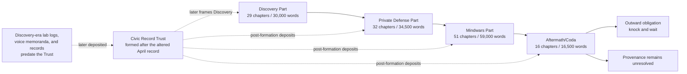
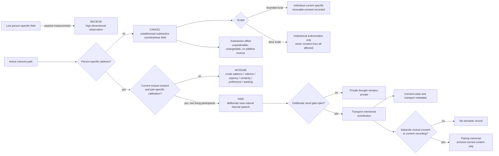

# Design Document: The Final Frontier Novel

## Overview

### Design Basis and Research Findings

This design treats the novel as the product. The checker, file conventions, and site exclusion exist only to protect a long creative process from bookkeeping drift.

The design draws from the approved [requirements](requirements.md) and exactly five primary binding canon sources:

- [*The Synaptic Frontier*](../../../songs/The%20Synaptic%20Frontier.md) establishes mathematical radio, the mind as a field, an undiscovered inward channel, open invitation, and Mara’s reception of a stranger’s continuous ordinary morning eight seconds after it occurs. The source experiences no canonical discontinuity; the eight seconds belong to reception/transport timing observed by Mara.
- [*Faraday*](../../../songs/Faraday.md) turns discovery into boundary: December, the copper room, the April term sheet, page-nine `transmit enable`, the lock on the inside, and consent as the condition of entry.
- [*The Final Frontier*](../../../songs/The%20Final%20Frontier.md) turns the private boundary into an undeclared conflict over mindspace. Counterphase is both defense and transmission; the null succeeds, but diminishes the defending voice and harms civilians throughout an affected area canonically described as three counties wide.
- [*The Radius*](../../../songs/The%20Radius.md) changes scale and genre pressure. Two years after the null, a visitor eleven miles from the array asks for an impossible restoration. Her consent is valid; the refusal rests on physics and truth. Domestic room tone, a relay, a kettle, and a human voice replace carrier tones and public declaration.
- [*Case Zero*](../../../songs/Case%20Zero.md) is the fifth Canon_Source under `DEC-014`, with author-approved publication in progress. Its lyric is Nia’s binding counter-deposition: it canonically reports the same speaker’s December morning and later wanting, the triage and consent scenes, limited log exoneration, and postwar loss-intake work while preserving first-person limitation and unresolved causation. It adds canon without adding a fifth Story_Movement.
- **Canon authority:** decisions `DEC-011` and `DEC-014` distinguish lyric from commentary inside all five Canon_Source files. Canon_Lyric and explicit author decisions are binding, but metaphor, compression, first-person limitation, and attributed testimony remain distinct from omniscient fact. Production_Notes, style prompts, exclude lists, generation workflow, credits, and rights metadata remain non-story/advisory unless a higher-tier source expressly ratifies a proposition. Canon promotion cannot turn production directions into identity, chronology, continuity, literal staging, or protected wording.
- Inspection of the workspace found **no Site_Build in this repository**. The lyrics-site tooling lives in a separate repository, and the five Canon_Sources here are reference copies collected under `songs/`. An earlier version of this design asserted that `.tools/build_site.py` scans every visible top-level directory; that file is not present in this workspace, and the assertion is withdrawn. Because the manuscript cannot leak into a build that does not exist here, the isolation obligation becomes a portable declaration this project owns and the lyrics repository can consume, rather than an edit to source this project does not hold. *Case Zero* publication is author-approved and in progress under `DEC-014`; its contradictory rights footer remains unresolved. The *One-Time Pad* draft is preserved in git history and removed from the working tree; it is unpublished and noncanonical for this novel. See closed choices 9 and 11 and decisions `DEC-008`, superseded `DEC-013`, and current `DEC-014`.

These findings produce nine controlling design decisions:

1. The title is the governing reversal: the final frontier was never outer space but the human mind. Humanity expected to cross it as explorer; instead the frontier crossed humanity and made people the shore, territory, and “new world.” Discovery, Private Defense, and Mindwars must earn that reversal dramatically rather than explain it as a thesis. The Mindwars are an event within the argument, not the book’s alternate title.
2. The external mystery is never solved from an adversary position. The Foreign_Signal is knowable only through human reception, inference, and damage.
3. The central arc is ethical rather than merely technical: consent is necessary for legitimate entry, but consent cannot make a false memory true.
4. The trilogy completes when the invasive transmission is silenced and a human consent doctrine survives the war. The Coda does not reopen that conflict; it presents the unpaid civilian bill.
5. Production language becomes characterization. Spaciousness, counterphase, dry voice, room tone, and refused swell govern narrative distance rather than numerical prose style. These choices are ratified here as novel design; their authority does not depend on the Production_Notes being canon.
6. Withholding must arise from limited knowledge, record timing, shame, or institutional control—not from a narrator coyly refusing to think a fact they plainly know.
7. Neural communication has four non-overlapping modes under `DEC-015` as amended on 2026-09-11: `RECEIVE` passively observes a live high-dimensional field; `INTRUDE` performs only a crude nonsemantic unconsented write to a person-specific address; `CANCEL` emits an unaddressed subtractive counterphase field; and `PAIR` carries deliberate near-natural internal speech between two living, mutually consenting, pair-specifically calibrated people. `RECEIVE`, `INTRUDE`, and `PAIR` observe or insert; `CANCEL` is the only mode that subtracts, which is why the null and Safiya's loss belong to it rather than to `INTRUDE`.
8. `ESP` remains the late institutional term **Electronic Speech Pairings** under `DEC-012`. It is a contested simplification of fluent `PAIR`, not a supernatural claim and not permission to call `RECEIVE` or `INTRUDE` conversation.
9. `DEC-016` governs an original short-chapter commercial-technothriller architecture: rotating information-driven viewpoints, experiment/action/result exposition, and capability escalation tied immediately to human consequence. It uses the requested influences only as high-level structural references and forbids imitation of Dan Brown's or Douglas E. Richards's sentence-level prose, distinctive voice, phrasing, scenes, or characters.

No external factual source is needed to establish the speculative mechanism. Safiya Mir’s maternal language is settled by `DEC-003`: she retains a public heritage language and works as an occasional community interpreter, while the null removes only the private layer she and her mother built together. The heritage base is **unspecified everywhere, including planning**; the Canon_Bible records only `heritage_base: unspecified_by_author`. No drafting or planning record may infer or invent real-world linguistic, geographic, religious, ethnic, or political particulars from Safiya’s name or from the unspecified base. No real language is named or quoted, so linguistic review of wording is not required and its absence may not be used to soften the canonical loss. Community-portrayal review remains required.

### Narrative Overview and Promise

**Title:** ***The Final Frontier***. Settled by author decision `DEC-001` in [`planning/decisions.md`](../../../The%20Final%20Frontier%20Novel/planning/decisions.md).

The novel takes its title from the source song *The Final Frontier*, the song that led to the book and that supplies the Mindwars_Part. The phrase reads as exploration and turns out to name the reversal: the mind is the territory being crossed. The earlier working candidates *The Country Behind the Eyes* and *The Quiet Radius* are retired. “The Mindwars” remains the in-world historical name for the undeclared war and may support jacket copy, but it is not the cover title. Because the title duplicates a source-song title by intent, the Front_Matter source acknowledgment must state that relationship explicitly rather than leaving a reader to guess why a listed source song shares the book’s name.

**Premise:** Computational radio physicist Mara Venn proves that thought has an addressable frequency when her receive-only December apparatus captures a stranger’s continuous ordinary morning eight seconds after it occurs and identifies a person-specific channel. The December receiver has no transmit stage. Later, in Chapters 16–20, Mara deliberately adds a temporary bench transmit path and sends a content-free invitation through that same address. Author decision `DEC-002` approves the braid in its protected causally linked form: county emergency dispatcher Nia Calder is both the December source and the first casualty of a later arriving thought that feels like her own; Mara’s later handshake may have reached Nia and produced the wanting, but no instrument or narrator can prove it. Page-nine `transmit enable` later establishes bidirectionality as an architectural capability and danger, not evidence that the December rig transmitted. Mara privately becomes highly convinced she caused the wanting, Nia refuses both unsupported origin accounts, and Julian records the adversary attribution while knowing it is inference; none of those positions confirms causation. Commercial promises conceal a write-capable system; private copper defenses cannot return the world; and an undeclared war forces Mara to defend mental sovereignty by transmitting a counterwave through the same frontier. The null ends the intrusion and harms civilians. Two years later Safiya Mir, whose private maternal language was erased inside that defensive silence, asks Mara to put it back.

**Thematic argument:** A person’s “yes” is the indispensable boundary of the self, but authorization does not create truth, erase power, or discharge responsibility. A defense can be necessary and still incur a debt. Repair begins when the defender gives up the scale of history, refuses a consoling counterfeit, and remains present for the person the victory left out.

**Dramatic question:** Can people defend the sovereignty of the mind through an inherently invasive medium without becoming occupiers themselves—and what do the defenders owe those injured by the act that saved them?

**Reader promise:** The book delivers an escalating speculative conspiracy/thriller told in short, first-person-past chapters, with rapid but legible viewpoint rotation, reciprocal cross-cuts, fair withheld disclosures, and varied chapter-end pulls. Technical discovery always produces a human consequence. Institutional language always meets a body. The large conflict reaches a real conclusion; the ending then becomes smaller, drier, and more morally difficult rather than louder.

**Genre and tone:** Intimate speculative thriller with procedural, legal, and war-history pressure. Discovery is awestruck but uneasy; private defense is tender and resolute; the Mindwars are solemn and urgent without martial glamour; the Coda is domestic, grieving, and unresolved without self-pity. The prose must be original. It uses high-level short-chapter and cross-cut architecture but does not imitate Dan Brown or any other living or dead author’s sentence-level voice.

**Non-goals:**

- no Foreign_Signal POV, decoded manifesto, final flag, confirmed sender, or authoritative origin story;
- no Coda invasion, counterphase event, renewed campaign, sequel teaser disguised as an attack, or reversal of the settled war;
- no scene-by-scene novelization of lyrics and no dependence on repeated lyric quotation;
- no technical manual in which apparatus displaces the human stakes;
- no claim that valid consent obliges Mara to transmit, and no successful or ambiguous counterfeit restoration;
- no redemption verdict that makes Safiya forgive Mara or treats hospitality as equivalent to repair;
- no automated score for voice, pace, beauty, tenderness, hook quality, or emotional truth;
- no transcript-only presentation, omniscient adversary cutaway, rhetorical cliffhanger at every chapter, or deliberate imitation of another novelist.

### Trilogy Completion and Coda Threshold

The three Main Parts form a complete dramatic sentence:

1. **Discovery_Part — possibility:** a mind is a field; the channel exists; Mara opens it.
2. **Private_Defense_Part — boundary:** an inward channel is a door; copper supplies a private “no”; consent becomes the rule.
3. **Mindwars_Part — shared defense:** isolation cannot be freedom; defenders use counterphase, confront their own invasive capacity, and silence the Foreign_Signal at real cost.

The end of the Mindwars_Part settles the war-level action: the Foreign_Signal is silent, active defender counterphase has ceased, no adversary remains to negotiate with, and mental consent has become the surviving doctrine. Mara is not triumphant; the same null that succeeded has diminished her and harmed unknown civilians.

The **Aftermath_Coda** starts two years later and asks a different class of question. It moves from public consequence to a visitor’s exact loss, valid request, impossible remedy, shared kitchen, and outward obligation. The final provenance question opens a second cycle of inquiry—who owns a thought or memory after insertion, deletion, reconstruction, and testimony—without supplying a new transmission or restarting the Mindwars.

## Architecture

### Narrative System



The provisional plan is **128 chapters and 140,000 Prose_Words**, inside the approved 120–135 chapter and 130,000–150,000 word ranges. These are planning targets, not the Approved_Baseline. Calibration may alter them; author approval later establishes one exact final chapter count and inclusive word range.

| Story_Movement | Chapters | Provisional words | Average planning load | Structural job |
|---|---:|---:|---:|---|
| Discovery_Part | 1–29 | 30,000 | ~1,034 | Wonder becomes first violation |
| Private_Defense_Part | 30–61 | 34,500 | ~1,078 | Private refusal becomes an inadequate social answer |
| Mindwars_Part | 62–112 | 59,000 | ~1,157 | Undeclared conflict, counterphase, null, and cost |
| Aftermath_Coda | 113–128 | 16,500 | ~1,031 | Public bill becomes an intimate unmet request and outward duty |
| **Total** | **128** | **140,000** | **~1,094** | — |

Mindwars is unambiguously longest and the Coda is shorter than every Main Part. The working distribution assumes at least 108 normal chapters and no more than 20 purposeful outliers; the 80-percent normal share requires at least 103 normal chapters out of 128, so the planned outlier budget keeps deliberate margin above the floor. No outlier may exceed 2,500 words. Likely microchapters are reserved for interruption, simultaneous null effects, and threshold beats, not used as routine pacing decoration. Exact outliers and their functions belong in the later Arc_Outline.

### Neural Communication Architecture

`DEC-015` separates physical observation, unconsented influence, defensive cancellation, and consensual conversation. The modes share an addressable field but do not share addressing, permission, bandwidth, direction of effect, or evidentiary meaning.

Addressing is the first branch and it is what distinguishes the two active unconsented modes. `INTRUDE` requires a person-specific address; `CANCEL` has none. The second branch is direction of effect: `RECEIVE`, `INTRUDE`, and `PAIR` observe or insert, while `CANCEL` only removes.



#### Mode A — `RECEIVE` / observation

December remains exactly receive-only. Mara's apparatus contains no transmit stage; it resolves high-dimensional structure already present in Nia's continuous live experiential and attentional field, observes it with an eight-second reception/transport offset at Mara's receiver, and locks a person-specific address. Nia is not composing speech for Mara and experiences no gap.

Rich reception does not imply symmetric unconsented writing. Passive measurement can model naturally present field structure without injecting a pattern. An active write must modulate the other person's field, and semantic conversation requires an additional pair-specific encode/decode mapping built by two consenting participants. Observation resolution, write bandwidth, and semantic authorization are independent dimensions.

#### Mode B — `INTRUDE` / unconsented write

Without valid consent and pair-specific calibration, an active write to a person-specific address remains low-dimensional. It can alter salience, valence, urgency, certainty, preference, or wanting; it cannot carry language, propositions, commands, a voice, arbitrary memories, or a semantically readable signature. Mara's later content-free bench handshake and Nia's wanting belong here as separate post-December events whose causal relationship remains `unverified`. Page-nine `transmit enable` proves later architectural write capability only.

`INTRUDE` requires a target. That requirement is what excludes the null from this mode: the null has no address to write to.

#### Mode C — `CANCEL` / unaddressed subtractive counterphase

`CANCEL` is the counterphase cancellation field. It is the only subtractive mode, and it exists because the story always contained a subtractive event that the earlier three-mode taxonomy could not classify. The bounded Chapter 73 counterphase test and null night are the **same mode at two scopes**, not two mechanisms: one operates within a bounded local field volume containing a single deliberately exposed consenting person, the other within a field volume containing an unknown population. Eight properties govern it.

**Unaddressed and field-volume based.** A `CANCEL` event carries no person-specific address. This is the structural reason it is not `INTRUDE` rather than a matter of degree, and it is why the affected set is a field volume rather than a recipient list.

**Nonsemantic in both directions.** It carries no language, proposition, order, voice, or memory outward and reads nothing back. Cancelling a pattern is not receiving it, so the null yields no intercept, no decode, and no signature.

**Subtractive, not insertive.** Its effect is the removal or degradation of access to mental content and faculties. Nothing is put in. This is what makes Safiya's loss mechanically possible while keeping it categorically distinct from Nia's insertion, preserving the two-injury asymmetry that `DEC-002` constraint 4 makes load-bearing.

**Unpredictable and untargetable.** Because it cannot be aimed, which faculties, memories, and people lose what cannot be predicted before the event, enumerated during it, or fully mapped after it. Mara's model in Chapters 94–101 predicts that subtraction may occur and cannot say whose — that is a property of the mode, not a limitation of her instruments. The uncounted absence at the end of the Mindwars is therefore mechanically necessary rather than a narrative convenience.

**No additive inverse.** Cancellation has no reverse operation. Nothing removed by a cancellation can be restored by another cancellation, by `PAIR`, or by any combination of modes. This gives Chapter 124 a second physical foundation independent of the missing corpus: even if Mara possessed Safiya's mother and a complete record of the private layer, the mechanism still has no undo.

**Consent cannot scale.** Individual consent is obtainable for a bounded local cancellation, which is exactly what Chapter 73 tests when Nia asks `Did I say yes?`. It is structurally unobtainable at area scale, so null-night authorization is institutional and never individual consent from everyone affected. Nia's refusal of manufactured unanimity in Chapters 94–101 is the correct reading of the mechanism, not squeamishness about it.

**Confined to the Mindwars_Part, and supplies no provenance.** `CANCEL` begins and ends inside Mindwars, preserving Requirement 3.9, the armistice facts, and the noncombat Coda; the retained Coda capacity is switched off rather than used. Silencing the Foreign_Signal identifies nothing about it, so both accounts of Nia's wanting and the Provenance_Question remain `unverified`.

#### Mode D — `PAIR` / consented conversation

A pairing joins exactly two living people who each hold current, act-specific, revocable consent and complete joint calibration unique to that pair. Calibration may mature over repeated sessions so trained partners can become operationally fluent. Once calibrated, either participant may deliberately send near-natural internal speech, but every contribution requires a cognitive send act. Unoffered thought, imagery, memory, emotion, and background mentation remain private.

The session protocol exposes start, send-ready state, acknowledgment, pause, revocation, latency, and integrity/error state. Either participant can pause or revoke immediately; semantic transport stops rather than buffering, predicting, or completing an unoffered meaning. Clipping, latency, and integrity failures appear as transport failures. Participants confirm, retry, or fall back to ordinary speech instead of treating a guessed completion as authentic content. Calibration cannot transfer to a replacement person and cannot connect a living person to someone dead or absent, a simulation, archive, model, or reconstruction.

`Electronic Speech Pairings` remains a contested institutional simplification. It fairly describes speech-like voluntary exchange inside `PAIR`, but it obscures the sharp boundary between conversation and the nonspeech effects of `RECEIVE` or `INTRUDE`. The acronym's collision with supernatural ESP is cultural and commercial, never causal.

#### Evidence and logging boundary

Every authorized pairing generates mandatory consent-state and transport metadata: participant and pair addresses, session start, pause, revocation, timing, channel volume, and integrity/error events. Metadata can prove that an authorized transport existed and describe its operation; it cannot reconstruct semantic content.

Content recording is distinct from pairing consent, explicit, mutual, and off by default. A consensual transcript proves only what the protocol carried during that recorded session. It proves neither unoffered thought nor truth, intent, memory provenance, or a participant's complete mental state. No instrument can retrospectively recover unrecorded meaning from timing, volume, integrity, or address metadata. Endpoint compromise or unauthorized content logging may become an institutional danger only if the Arc_Outline selects and bounds it; neither can become a hidden answer to Nia's earlier uncalibrated wanting or the Foreign_Signal's provenance. Civic Record Trust custody continues to warrant provenance of a record rather than truth within it.

#### Safiya boundary

Fluent pairing cannot restore Safiya's private maternal layer. Her mother is dead, a living second participant is absent, Safiya cannot deliberately send what the null removed, and no corpus survives from which a truthful source could be reconstructed. Pairing with an archive, simulation, or generated proxy is invalid by mechanism. Chapter 124 therefore remains a physics-and-truth refusal: Safiya's consent is genuine, but consent cannot make Mara possess her mother or prevent fabricated content from falsely self-authenticating as memory.

#### Mandatory fluent-use architecture

| Chapter range | Required pairing function |
|---|---|
| **36–42** | Demonstrate legitimate benefits, begin pair-specific calibration, and establish why people freely choose the technology. |
| **56–61** | Put the first sustained fluent conversation on page; dramatize send gating, pause, revocation, latency/integrity handling, and one consent-protocol failure followed by repair. |
| **70–77** | Use pairing under counterphase pressure; Chapter 73 retains `Did I say yes?` and tests local/current consent and Nia's authority without absolution. |
| **78–93** | Make operational paired communication a principal thriller engine through existing POVs or supporting operatives inside existing POV chapters; traffic analysis reveals metadata patterns, never unrecorded meaning. |
| **94–108** | Scale pairing into ethical and infrastructural risk without group mind, hive mind, mass mind reading, or provenance proof. |
| **109–112** | Preserve Nia's usable-self-trust resolution and the contested public record rather than using fluent communication to close origin. |
| **113–128** | Recede the neural channel so ordinary spoken voice, listening, presence, and the Chapter-124 refusal retain their force. |

Task 5 selects exact fluent pair identities and session ownership. The selection must preserve the four human POVs and provisional 56/32/33/7 loads, and it cannot add a sender/adversary POV merely to display the experience.

### Original Thriller Pacing Architecture

`DEC-016` translates the requested commercial-thriller influences into independent craft targets rather than imitation:

- exactly one first-person-past POV per short chapter, rotating across three active information threads through Chapters 1–112 before Safiya becomes the fourth Coda viewpoint, with no run longer than three chapters;
- converging simultaneous threads and compressed-clock clusters where chronology supports them, especially null night, without forcing the whole novel into a global twenty-four-hour frame;
- endings driven by information turns, decisions, reversals, arrivals, danger, absence, or moral remainder rather than repetitive fake cliffhangers or withheld nouns;
- technical exposition staged as experiment → action → result → immediate human or institutional consequence, not lecture dialogue or exposition set pieces;
- each capability escalation changes consent, relationship, evidentiary position, institutional power, or bodily risk in the same sequence;
- procedural acceleration through Discovery and Private Defense, the fastest turnover and tightest threading in the longest Mindwars movement, then deliberate post-112 deceleration;
- short rotating Coda chapters whose hooks become disclosures, arrivals, refusals, emotional choices, and moral remainders rather than renewed threat pressure.

The architecture preserves 128 chapters, 140,000 provisional Prose_Words, at least 108 normal chapters, no more than 20 combined micro/long outliers, the 700–1,600 Normal_Chapter_Range, the 2,500-word hard cap, and the global 80-percent normal-share requirement. Craft remains an Editorial_Gate: no checker scores suspense, exposition quality, hook force, pacing, sentence style, or resemblance to a named author.

### Testimony Frame

#### The Record

The manuscript presents witness-composed narrative materials held by the **Civic Record Trust**, an independent public-interest archive that Julian Adebayo forms only after he sees the April negotiation record altered by institutional summaries. The Trust does not exist during Discovery. Discovery-era lab logs, voice memoranda, and other contemporaneous records predate it and are later deposited with provenance intact. From its post-April formation onward, the Trust accepts encrypted, signed first-person deposits, allows embargo and release conditions, and preserves those post-formation accounts alongside the earlier deposited source records and later recollection. Under the contested-archive model fixed by `DEC-005`, its custodial board makes ongoing provenance-preserving public releases only from records whose conditions permit disclosure. Those releases form a visible counter-record that competes with official summaries; neither stream is complete or final, and no unified public inquiry adjudicates between them. Conditioned holdings remain protected, but the Trust is not secret or confined to a one-time partial disclosure. The Trust is governed by custodians rather than by Julian alone; its board has no POV, warrants provenance rather than objective truth, and supplies no omniscient explanation.

`DEC-006` fixes the reader-facing presence of this archive at one concise Front_Matter framing note plus rare in-story references. This frame supports first-person past without turning chapters into hearing transcripts:

- each chapter is a witness-authored narrative statement, not question-and-answer testimony;
- narrators reconstruct scenes, bodily perception, remembered dialogue, and their own mistaken beliefs in novelistic form;
- editorial joins, evidence citations, and detailed chain-of-custody facts remain in planning records; the concise Front_Matter note supplies only the orientation needed to establish the frame;
- remembered dialogue may use natural person and tense, while narration remains first-person past;
- the archive warrants provenance of the account, not objective truth inside it. Contradictions between accounts are dramatic evidence.

Calibration may test whether an individual rare reference is dramatically necessary, but it may not replace this restrained model with routine source notes, transcript apparatus, or heavy archival labeling.

#### Record Horizon and Tension

Each Arc_Outline entry carries a planning-only `record_horizon`: the latest event the narrator knows when composing the source account. The chapter may not foreshadow facts beyond that horizon. A source account may be composed minutes after an event, during a lull, in a lab log, as a voice memorandum, under seal, or years later. Early Discovery records are created before the Trust and deposited only after its formation; rolling Trust deposits occur only from the post-April formation onward. Public-facing chapter labels omit composition, deposition, and release dates.

Consequently, a first-person-past voice does not prove that the narrator survives the whole book, remains cognitively intact, or understands the later outcome. The central suspense is also broader than bodily survival: whether a perception is owned, whether a witness will act, whether a defense can remain consensual, and what the record will admit. The Front_Matter states that the Trust holds later-deposited contemporaneous source records as well as post-formation and retrospective accounts and does not certify the later status of every witness.

#### Reader-Facing Labels

Every prose chapter begins, after machine-readable metadata, with a restrained label:

`Chapter 01 · Mara Venn · Noise Floor`

The label gives sequence, full Character_Name, and a short chapter title. A date or location appears only when it materially orients a cross-cut. POV_IDs, Timeline_IDs, motif IDs, and docket mechanics stay in the Chapter_Header, not the visible title. Under `DEC-006`, chapters receive no routine source notes, transcript apparatus, or heavy archival labels; a rare in-story record reference must be dramatically necessary. Part pages name the four Story_Movements; only the first three are labeled “Part.” The fourth is explicitly “Aftermath/Coda.”

### Named POV Cast

The provisional roster contains four human POVs. `DEC-005` confirms the exact institutional names **Northline Array**, **Open Channel Consortium**, and **Civic Record Trust**, while deliberately leaving the country and individual counties unnamed. Those institutional details and all character names below are approved Novel_Extensions and must be recorded in the Canon_Bible before approved prose depends on them.

| Character | Stable IDs | Knowledge and plot function | Moral pressure and relationships | Blind spots / reason to narrate |
|---|---|---|---|---|
| **Dr. Mara Venn** | `CHAR-001`, `POV-MARA` | Computational radio physicist at Northline Array; finder, copper-room designer, counterphase lead, and Anchor_POV. She alone spans all four movements and owns the technical decisions at discovery, the later bench transmission, page nine, and the null. | She opens the channel, refuses the Open Channel Consortium, then authorizes the null that harms civilians throughout an affected area canonically described as three counties wide. Julian is her former trusted counsel; Nia moves from unknown signal source to witness, collaborator, and moral check; Safiya is a stranger to whom Mara owes an account. | After Nia’s wanting, Mara holds a high, mostly unvoiced private conviction that her later handshake caused it. Her guilt-seeking tendency to make herself central makes that belief non-authoritative rather than confirmatory. She narrates to preserve the scientific truth and, eventually, to enter evidence against herself. |
| **Nia Calder** | `CHAR-002`, `POV-NIA` | County emergency dispatcher holding both roles approved by `DEC-002`: the source of the continuous morning Mara’s receive-only December apparatus captures eight seconds late, and the first casualty of the later wanting after Mara has added a transmit path. The shared identity is settled; the causal link between the later handshake and wanting remains `unverified`. | She needs protection without being reduced to “case zero,” refuses both unsupported origin accounts, and rejects Mara’s attempted confession as an appropriation of Nia’s injury rather than granting absolution. She works with Julian to make witness control enforceable and later chooses a specific defensive risk rather than being volunteered. | She first believes exact chronology might restore certainty about ownership; it cannot. The logs clear her routing decision without identifying the wanting’s origin (`DEC-004`). Across the novel she stops needing provenance in order to trust and use her own judgment again, without forgiving Mara or validating the archive’s attribution. |
| **Julian Adebayo** | `CHAR-003`, `POV-JULIAN` | Technology-transactions lawyer who brings the April term sheet on behalf of the Open Channel Consortium, initially believing a consensual network can be negotiated. He understands contracts, institutional incentives, redactions, and chain of custody. He later establishes the Civic Record Trust and records the war’s public history. | His language helped make write-capable access saleable. He professionally enters the adversary attribution because it is the only institutionally enterable account, while privately knowing it is inference rather than proof. Loyalty to Mara conflicts with professional duty; loyalty to the record later conflicts with emergency secrecy. | He hides behind balanced clauses and imagines a clean paper trail can separate him from the machine. He narrates to expose how ordinary, benevolent language carried the dangerous capability, including the archive’s inability to convert an inference into truth, and to prevent the victors from owning the record. |
| **Safiya Mir** | `CHAR-004`, `POV-SAFIYA` | School librarian and occasional community interpreter who lived eleven miles from Northline Array. She retains her public heritage language. The null erased only the private language layer she used with her deceased mother — invented words, private grammar, and shared reference built on a heritage base recorded solely as `unspecified_by_author` under `DEC-003`. She was never occupied by the Foreign_Signal. Because no corpus of the two-person layer exists anywhere, it cannot be relearned, recorded, or reconstructed, which makes Mara’s later refusal physics rather than principle. | She must insist that her freely given “yes” is real without allowing Mara to turn the refusal into another lecture on consent. She has no prior relationship with the others; that absence makes the debt civic rather than personal. No record may infer real-world particulars from her name or unspecified heritage base. | She has rehearsed the request so completely that she initially narrates herself as evidence. She delays admitting that she fears a fabricated memory could satisfy her. She narrates because the public record counts saved people but has no category for what the defense removed. |

#### Source/Casualty Braid — Closed by `DEC-002`

The proper-name and mechanism mapping that identifies the *Case Zero* speaker as Nia, ties the December receive-only lock to her person-specific address, and separates that event from Mara’s later bench transmission remains controlled by author decision `DEC-002`. `DEC-014` now adds binding Canon_Lyric testimony in which the same first-person speaker reports both the ordinary December morning and the later wanting. The Canon_Bible records the lyric account with `authority_basis: lyric` and speaker attribution, while retaining `DEC-002` for the Nia name/mechanism mapping. Neither authority layer confirms that the later handshake caused the wanting.

The beat architecture, the four-POV load, the 128-chapter allocation, and the 140,000-word target all stand unchanged. The rejected fallbacks — splitting the roles across Nia and a distinct human witness — are retired; see `DEC-002` for why.

**What the approved linkage commits the novel to.** The December apparatus is receive-only and has no transmit stage. Its work is to identify and lock onto Nia’s person-specific channel/address while Mara receives the continuous morning with an eight-second transport offset. Later, in Chapters 16–20, Mara deliberately adds a temporary bench transmit path and sends the content-free handshake through that same address. Page-nine `transmit enable` establishes the broader architectural capability and danger of bidirectionality when Mara reads it in April; it is not evidence that the December rig transmitted. The protected causal linkage is therefore sequential: the later handshake may have reached Nia and produced the wanting, but no character, instrument, or record can prove it. Five constraints follow, and all five are binding:

1. **Never confirmed.** The causal link is an `unverified` account under the same rule that governs every account of the Foreign_Signal. No character can prove it, no instrument settles it, and no narrator receives privileged confirmation. Under binding `DEC-007`, Mara holds a high but non-authoritative private conviction that her later handshake caused the wanting; Nia refuses both unsupported origin accounts; Julian records the adversary attribution professionally while privately recognizing it as inference.
2. **The adversary still owns the war.** The contested attribution covers the *first* casualty only. The Mindwars, the doctrine of taking the yes rather than the country, and every subsequent intrusion remain the adversary’s. If the linkage ever reads as making Mara the sole cause, the balance is wrong and must be corrected in revision, not defended.
3. **The record gets it wrong and cannot fix it.** *The Final Frontier* verse 1 frames the first loss as an act of the enemy, and that verse is testimony compiled afterward by people who did not have a word for the war while they were losing. The Civic Record Trust inherits an opening entry it cannot verify. This is Julian’s deepest failure and it must not be resolved by a late disclosure that tidies the archive.
4. **Two subtractions bracket the book.** Mara’s most innocent, content-free invitation may have injured Nia in Discovery; her necessary defensive null demonstrably injures Safiya in the Coda. Curiosity and defense each incur a debt that consent did not discharge. The two must rhyme without being equated — the first is unprovable and the second is certain, and that asymmetry is the point.
5. **The emotional question resolves even though the factual one does not.** Permanent factual ambiguity is not permission to leave everything open. Nia eventually stops needing to know the wanting’s origin and regains usable self-trust: she can exercise judgment without first proving whose certainty arrived. That movement does not decide causation, forgive Mara, or validate the archive. Her relationship with Mara and the choices each makes without knowing must land; any chapter that uses “never confirmed” as license for general vagueness fails this constraint, and reviewers test for it at every movement gate.

Insertion and subtraction remain distinct injuries. Nia embodies insertion: an arrival mistaken for self, whatever its origin. Safiya always embodies subtraction: no foreign thought arrives, but a defensive act removes part of her access to self and mother.

Combining the insertion casualty with Safiya would create a falsely neat victim, blur the canonical distinction between intrusion and null harm, and let one consent decision stand in for two ethically different injuries. Safiya receives a POV rather than existing solely as an instrument of Mara’s guilt; her request, consent, disappointment, and choice to remain at the table belong to her.

No selected or future POV may represent the Foreign_Signal or any actual, alleged, or hypothesized sender. Characters may propose states, startups, emergent systems, natural phenomena, or unknown agents, but the Canon_Bible marks every account `unverified`, and no account receives privileged narrative confirmation.

### Detailed Sequence and Beat Architecture

The later Arc_Outline will expand each row into one entry per chapter. It may refine chapter boundaries but must not invent a different causal spine without a documented Arc_Change. The Discovery rows express the Nia source/casualty braid approved by `DEC-002` in its causally linked form. The gate above is closed, so continuity-dependent entries and prose may now treat the shared identity as settled — while the causation behind it stays `unverified` on the page, per constraint 1 of that section.

#### Discovery_Part — Chapters 1–29

| Range | POV emphasis | Chronology, beats, cross-cuts, and reveal design |
|---|---|---|
| **1–5: Noise floor** | Mara / Nia / Mara / Nia / Mara | In December Mara runs the receive-only mathematical receiver at Northline Array; it has no transmit stage, and she finds structure below known noise. The cross-cut moves to Nia’s continuous ordinary morning—alarm, weather call, commute, dispatch console—without announcing that she is the source. Mara receives that morning with an exactly eight-second transport delay; only Mara observes the offset, and Nia experiences no gap. The opening handoff moves from a waveform feature to the same sensory detail in the uninterrupted source-side scene. The added room lets the ordinary morning be lived at full length before it is revealed as data, and lets Mara’s verification fail once before it holds. Reveal: the signal carries experience, not a conventional message. |
| **6–10: A stranger’s morning** | Julian / Nia / Mara / Julian / Mara | Julian audits a funding disclosure and establishes that Mara’s receiver has no transmit stage. Nia’s source-side experience remains continuous and supplies an ordinary detail Mara later uses to test source matching; Nia notices no discontinuity because the eight seconds belong only to Mara’s reception timing. Mara repeats the reception and realizes the pattern maps to neural timing. She withholds the provisional source identity from the institute while trying to verify it, and Julian’s second chapter shows institutional appetite forming around an unpublished result. Reveal ownership remains Mara’s; readers may infer the Nia link before either woman knows the other. |
| **11–15: The field** | Mara / Nia / Mara / Julian / Julian | Mara demonstrates that small changes in frequency correlate with attention and formulates the mind-as-field hypothesis. Nia handles a call whose details echo a pattern Mara recorded. Mara’s second chapter turns the hypothesis into a repeatable person-specific channel/address that the receive-only apparatus can identify and lock onto. Julian warns that proving person-specific reception creates immediate rights questions, then traces the first contact between the institute and the nascent Open Channel Consortium. The first major reversal is that the “receiver” can infer a person more precisely than a location. |
| **16–20: Open invitation** | Mara / Nia / Mara / Nia / Mara | Mara deliberately adds a temporary bench transmit path to the receive-only setup and sends a content-free handshake through the same person-specific channel/address identified in December, framing it as knocking rather than entering. This is the Discovery “Come in” event. Cross-cut to Nia during a triage decision with two calls and one available advanced unit. Nothing is said to her; per `DEC-004` a **wanting** arrives — a certainty indistinguishable from her own professional judgment — and she routes against ordinary practice because she is simply sure. Then come the hours in which she acts on it and cannot locate its source. Because Mara’s handshake is content-free, it could not carry an instruction; if the handshake and wanting share a source, the effect is preference rather than a message, consistent with the doctrine of editing what people want and leaving nothing verbal to trace. Chronology and channel identity make the connection plausible but do not prove it. Under `DEC-007`, Mara begins developing a high private conviction of responsibility while Nia refuses every unsupported origin account. Per `DEC-002` constraint 1, the causal question never resolves. |
| **21–25: Case zero refuses the name** | Nia / Julian / Mara / Nia / Mara | Nia reconstructs the later routing decision and cannot find a memory that generated the intrusive thought; this event is distinct from Mara’s earlier receive-only eight-second reception, while the protected `DEC-002` account links the later handshake and wanting through the same person-specific channel. Julian traces institute–consortium contact into a fundable proposal. Mara reaches Nia, treats her as confirmation, and tries to turn her high private conviction into confession. Nia refuses both unsupported origin accounts and rejects Mara’s attempt to make Nia’s injury into Mara’s story; this is not absolution and need not use fixed dialogue. She forces Mara to hear the difference between receiving a signal and losing confidence in one’s own yes, and refuses the name “case zero” before Mara can make it official. Reveal: Nia is both the source of the late-received continuous morning and the first documented casualty (`DEC-002`). The shared identity lands here; what stays open is whether Mara’s later handshake reached her, and that never closes. |
| **26–29: The door runs inward** | Julian / Mara / Nia / Mara | External interest gathers before a public announcement. Mara confirms the apparatus can address as well as receive, though the origin of the intrusive content remains unestablished. Nia tests the channel under controlled conditions and identifies an arrival only after acting on it. Movement ending: possibility becomes an uninvited crossing, and Mara closes the lab around a problem that is already outside it. |

Discovery closes its promise—somebody alive finds the channel—while overturning the implied innocence of finding it. Mara’s open invitation may be causally relevant, but the manuscript never upgrades correlation into a confirmed Foreign_Signal origin.

#### Private_Defense_Part — Chapters 30–61

| Range | POV emphasis | Chronology, beats, cross-cuts, and reveal design |
|---|---|---|
| **30–35: Copper and quiet** | Mara / Nia / Mara / Julian / Nia / Mara | Mara uses the same notebook and field model to design a copper room, and the build itself gets scene time: mesh, seams, door, and the first measured silence. Nia experiences quiet there as relief and as terrifying proof that ordinary space is permeable. Julian creates a legal distinction between reception, transmission, and consent but discovers the consortium treats assent as a service default. Nia’s second chapter tests what she can and cannot do inside a sealed room and still call a life. The copper room is a private boundary, not yet a social solution. |
| **36–42: The benevolent offer** | Julian / Mara / Nia / Julian / Mara / Julian / Nia | Through winter and early spring, the Open Channel Consortium demonstrates legitimate medical, linguistic, and emergency benefits, and the first volunteers begin pair-specific joint calibration. The sequence shows why people freely choose `PAIR`: a living partner deliberately sends near-natural internal speech after consent, while unoffered thought remains private. Mara and Julian both believe some claims; Julian's chapters show how a genuine benefit becomes a saleable platform. Nia challenges broad enrollment forms, recording defaults, and any product language that blurs pairing consent with content-recording consent. Cross-cuts pair an authorized demonstration with Nia's inability to identify the source of her earlier uncalibrated wanting. Julian agrees to bring a term sheet because he thinks the send gate, revocation path, and evidence boundary can be made contractual. |
| **43–49: April, page nine** | Mara / Julian / Mara / Julian / Nia / Mara / Julian | In April representatives arrive with a term sheet and pen. The negotiation, the specification reading, the discovery, and the aftermath each get their own scene. Mara reads the interface specification and finds `transmit enable` on page nine. Julian first argues it can be constrained, then discovers the line is architectural rather than optional. Nia learns her case was used to justify deployment without her permission. Reversal: the proposed receiver network is write-capable by design; page nine confirms the broader architectural danger, not hidden transmission by Mara’s receive-only December rig. |
| **50–55: Put it in the record** | Julian / Mara / Nia / Julian / Mara / Mara | Mara refuses the deal and makes the first Record_Progression demand: the transmit capability and refusal must be preserved, not summarized away. After Julian sees the April negotiation record softened in altered meeting minutes, he forms the Civic Record Trust and opens its encrypted post-formation witness escrow. Nia deposits her own account under conditions she controls, and the dispatch logs enter the escrow with it — the timestamps clear her routing decision of the death and say nothing about where the certainty came from, which is the `DEC-004` evidence beat and the anchor the histories later misread. Julian professionally records the adversary attribution because it is the only institutionally enterable account, while privately preserving that it is inference rather than proof (`DEC-007`). Discovery-era lab logs and voice memoranda are transferred later as pre-Trust source records with their original dates and provenance. Institutional pressure transfers work to a parallel emergency program, and Mara’s closing pair shows the refusal costing her the instruments she needs. |
| **56–61: The handle inside** | Nia / Mara / Julian / Mara / Nia / Mara | Mara and Nia conduct the first sustained on-page fluent `PAIR` conversation. The practical protocol requires current act-specific consent, pair-specific calibration, a deliberate cognitive send gate for each contribution, visible acknowledgments, immediate pause/revocation, and explicit latency/integrity errors. One session fails when a stale or overbroad consent state permits transport the recipient did not currently authorize; the channel stops, the failure is recorded without inventing semantic content, and they repair the protocol by separating pairing, sending, and content-recording consent. Nia proves unoffered thought remains private and that ordinary speech remains the fallback when integrity is uncertain. Copper rooms spread, but reports of `INTRUDE` also spread; permanent enclosure cannot constitute freedom. Julian leaves consortium representation and secures the deposits. Movement ending: “Come in” becomes conditional and operational—ask, receive a current answer, let the person behind the door control the handle, and stop when that answer changes—just as a synchronized incident demonstrates that private rooms and one-to-one pairs cannot defend public life. |

Private Defense ends with a valid ethical rule and an inadequate physical strategy. The protagonists do not drift into war because a villain declares it; accumulated effects make conflict legible after it has already begun.

#### Mindwars_Part — Chapters 62–112

| Range | POV emphasis | Chronology, beats, cross-cuts, and reveal design |
|---|---|---|
| **62–69: No first shot** | Nia / Mara / Julian / Nia / Mara / Julian / Mara / Julian | Intrusive arrivals appear across unrelated people. No border, demand, language, or sender unifies them. Nia documents the first casualty from her own experience (`DEC-002`) without becoming a government case study and still refuses both unsupported origin accounts. Mara is asked for a flag and refuses public certainty despite her high private conviction about her own later handshake. Julian sees emergency authorities classify mental autonomy as an infrastructure problem; he can enter only the adversary attribution into the professional record while privately knowing it is inference rather than proof (`DEC-007`). The longer run shows classification hardening into policy while nobody admits a war has begun. Later history will call this the Mindwars; in scene, no one yet has the stable term. |
| **70–77: Mirror of the signal** | Julian / Mara / Mara / Nia / Mara / Nia / Julian / Nia | Copper buys time but leaves people sealed away. Mara proves a counterwave can cancel an incoming pattern, then states the danger: cancellation also transmits through minds. Fluent `PAIR` channels coordinate the bounded-local field-volume test under pressure, which makes consent state operational rather than ceremonial: start, send, pause, revocation, latency, integrity failure, and fallback all matter while the incoming pattern is active. In Chapter 73 Nia asks the exact Mindwars-only challenge “Did I say yes?” and forces trial consent to be specific, current, revocable, local, and distinct from consent to record content. The first consenting counterphase test succeeds technically while leaving Nia unable to access a familiar phrase she could use before exposure; Mara knows this subtraction only through Nia's failed deliberate send and immediate report, never through unoffered thought. Nia's following chapters hold that phrase-access gap, pairing metadata, and protocol state against one another without treating any transcript or transport log as origin proof. Under `DEC-017`, Chapter 73 also plants the first half of the delayed consent parallel: because this bounded test and null night are the same `CANCEL` operation at two scopes, the chapter must establish a concrete physical vocabulary for a cancellation field experienced from inside — a specific sensation, sound, or bodily register — that Chapter 118 can later reuse. Here the question is asked and answered. No character in this range or anywhere through Chapter 123 states the connection to the later area-scale null. |
| **78–85: A shield can enter** | Nia / Julian / Mara / Mara / Julian / Nia / Mara / Mara | Emergency officials seek automatic protective transmission. Julian uses the page-nine record to show that defenders are adopting the capability they condemned; this is not evidence that the consortium sent the Foreign_Signal. Nia chooses one bounded counterphase session and distinguishes chosen risk from imposed protection. Operational fluent pairings become a principal thriller engine: existing POVs coordinate through deliberate internal speech while action continues, and every sent contribution is gated rather than harvested from private thought. Mara begins speaking in a public “we,” but Nia's chapters keep that collective from swallowing individual answers. Supporting operatives may appear inside existing POV chapters and may be genuinely fluent after repeated pair-specific calibration; no new POV is required. Transport metadata can expose timing, traffic, pauses, and integrity events, while unrecorded meaning remains unavailable. |
| **86–93: Territory** | Julian / Mara / Nia / Julian / Mara / Nia / Julian / Mara | Effects intensify and half the intercepts fail to parse as any spoken language. The archive contains competing origin theories but no confirmation, and Julian's chapters keep each theory attributed to a believer. Operational `PAIR` communication carries simultaneous tactical and investigative threads at the movement's fastest turnover: a consented content recording can prove what one recorded pair deliberately carried, while traffic analysis sees only metadata and cannot recover unrecorded meaning. A pause, integrity fault, or disputed recording state must change an action rather than becoming abstract exposition. Mara realizes the frontier metaphor was reversed: people are not explorers approaching empty territory; their minds are the shore being crossed. The counterphase network holds local pockets while models predict a synchronized breach beyond copper and one-to-one pairing capacity. |
| **94–101: The affected area in the model** | Nia / Mara / Julian / Mara / Nia / Julian / Mara / Mara | A broad null becomes the only modeled defense likely to stop the synchronized event. Official summaries call its civilian effects negligible. Julian finds the real extent: an affected area canonically described as three counties wide. The country and individual counties remain unnamed under `DEC-005`; the text neither substitutes fictional county names nor converts the canonical width into geometry. Pairing has become useful infrastructure, which raises a new scale risk: institutional pressure seeks default enrollment, centralized metadata, and continuity assumptions that exceed local/current consent. The architecture never becomes group mind, hive mind, or mass mind reading; pair-specific calibration remains one-to-one and nontransferable. Mara's model predicts possible subtraction as well as silence but cannot identify which memories or faculties are vulnerable. Nia refuses manufactured unanimity; pair consent and pair transcripts cannot stand in for everyone in the affected area. The decision sequence spends the defense at full cost, including the thematic admission that silence has a radius without converting the canonical width into a mathematical radius. |
| **102–108: Null night** | Nia / Mara / Julian / Nia / Mara / Julian / Mara | Reciprocal Cross_Cuts hold all seven chapters on one Timeline_ID and execute the book's tightest compressed-clock threading. Nia works from a consent shelter as the intrusion peaks; Julian preserves authorization, consent-state metadata, and the limited scope of any mutually recorded pair content; Mara drives the two patterns into exact counterphase. Pair channels coordinate two living partners at a time and fail closed on pause, revocation, or integrity loss; they never merge participants into a group mind or expose private thought. The null affects civilians throughout an area canonically described as three counties wide. The Foreign_Signal goes quiet. Mara's internal voice also becomes measurably and subjectively quieter. No log retrospectively identifies unrecorded content or sender, and no POV enters Safiya's home; her Tuesday kettle and loss remain withheld until she owns that account in the Coda. |
| **109–112: The history of quiet** | Julian / Nia / Julian / Mara | Authorities announce success without a surrender or counterparty. Julian makes the second Record_Progression event by entering the consent dispute and civilian uncertainty into the history named “the Mindwars.” Official summaries begin smoothing inference into fact while the Civic Record Trust starts an ongoing, conditioned public release whose provenance-preserving counter-record challenges those summaries without adjudicating them. The first-casualty attribution remains the Trust’s uncorrectable inference under `DEC-002` constraint 3. Nia rejects the category “saved” as a complete description and stops making usable self-trust contingent on learning the wanting’s origin. She can exercise judgment again without deciding causation, forgiving Mara, or validating the archive (`DEC-007`). Mara shuts down active counterphase and withdraws behind retained copper. Movement ending: the war is over and the defending line held, but the silence contains absences nobody has counted. |

Rhetorical collective declaration is permitted only in this movement and principally in Mara’s war-facing deposits. It is counterweighted by named, singular consents. Active defender counterphase begins and ends here. Fluent pairing is prominent through the middle and operational climax, but it neither resolves provenance nor survives as the Coda's engine; after Chapter 112, threat pressure and neural-channel dependence deliberately recede.

#### Aftermath_Coda — Chapters 113–128

| Chapter | POV | Beat and ethical function |
|---:|---|---|
| **113** | Nia | Two years after the null, the Foreign_Signal remains silent and no all-clear, treaty, surrender, or counterparty exists. Nia works with the Civic Record Trust’s civilian-loss intake from a position of usable self-trust that no longer depends on solving her wanting’s origin; this is release from the need to know, not absolution for Mara or endorsement of the archive. In the contested public record, she shows that official categories capture intrusion better than subtraction while conditioned Trust releases surface losses those summaries omit. The scale is still public, but the action is accounting, not combat. |
| **114** | Julian | Julian prepares another witness-conditioned public release in the Trust’s ongoing contest with official summaries and finds Safiya’s documented request: never intruded upon, eleven miles from Northline Array, missing a maternal language since null night. The release process neither opens all holdings nor adjudicates Safiya’s account. He does not warn Mara into a prepared defense; he gives Safiya the address and preserves her control of contact. |
| **115** | Safiya | Safiya travels through communities inside the affected area and rehearses facts rather than vengeance. She passes other people’s uncounted losses on the way and declines to become their spokesperson. |
| **116** | Safiya | Safiya reaches Mara’s copper-retained house, knocks three unhurried times, and waits. This is the visitor-arrival Motif_Event; compliance with the protocol does not guarantee remedy. |
| **117** | Mara | From the other side of the same threshold, Mara hears the three knocks and recognizes the protocol she taught the world. She opens the door. The reciprocal Cross_Cut adds her paralysis and self-mythology without replaying Safiya’s journey; the knocks remain one Motif_Event seen from two positions. |
| **118** | Safiya | Safiya gives her account: Tuesday, kettle on, eleven miles away, no foreign arrival, then the private language layer she shared only with her dead mother is inaccessible. This is Kettle Motif_Event one. Her evidence remains concrete; she is not reduced to an emblem of harm within the affected area. Under `DEC-017`, this account carries the second half of the delayed consent parallel: it reuses the concrete physical vocabulary Chapter 73 established for a cancellation field experienced from inside, and no question of authorization appears anywhere near it. The absence of the question is the echo, and it must be left to the reader — Safiya does not know about Chapter 73, and no narrator supplies the link. |
| **119** | Safiya | Safiya specifies the exact shape of the loss: which words still arrive, which will not descend, and what a clean lexical absence feels like from inside. She owns the full account of her Tuesday and refuses to let it be summarized for her. |
| **120** | Mara | Mara understands “three counties wide” as people rather than geometry. Safiya’s testimony turns the earlier “silence has a radius” admission into an account owed by the person who fired it. |
| **121** | Mara | Mara notices her own reflexes—invoke the number saved, explain the mechanism, convert the room into doctrine—and stops using them one at a time. She does not seek reassurance. |
| **122** | Safiya | Safiya asks Mara to use the retained transmitter to put something back. She gives affirmative, sober, repeated, freely chosen consent and invokes the conditional invitation. Her yes removes lack of authorization as Mara’s reason to refuse; it does not waive truth. |
| **123** | Safiya | Safiya holds the consent steady against Mara’s ethics, refuses to let a refusal become a lecture on consent, and admits the hope she has hidden: that even a counterfeit might feel merciful. The request stays hers. |
| **124** | Mara | Mara considers the mechanism and refuses because she does not possess Safiya’s mother or the erased language-memory. Any constructed replacement could arrive with false self-authentication and become a stranger in the mother’s place. A relay is switched off before Mara puts the kettle on—Kettle Motif_Event two. This is the Coda_Turn from cathedral-scale explanation to dry human presence. |
| **125** | Mara | After the turn, Mara’s attention narrows to water, chairs, breath, and the other person in the room. She offers no doctrine, no absolution request, and no second proposal disguised as help. |
| **126** | Safiya | Safiya receives no restoration and does not pronounce absolution. She decides what presence she will accept without calling it repair, and chooses to remain. |
| **127** | Mara | Mara listens while Safiya tells the mother’s remembered life. Spoken voice through ordinary air reaches a consenting ear in both directions; companionship is real and insufficient, and no machine is involved in it. |
| **128** | Mara | Mara makes the third Record_Progression event as an entry against herself, stays through the encounter, and accepts an outward duty to visit the affected communities she had abstracted as a radius. Inside that entry, and under `DEC-017`, she names the consent parallel exactly once — the protocol she was held to was one room wide, and she then ran the same mechanism across an area canonically described as three counties wide with no one to ask. This is the manuscript's only explicit statement of the parallel. It is self-indictment rather than doctrine: it resolves no provenance, absolves nothing, validates no archive, and does not reinterpret Safiya's consent. At the first new threshold she knocks and waits rather than broadcasts. The Final_Passage contains the exact question “Whose was that?” exactly twice and nowhere else. It concerns provenance after damage; no signal returns and no sender is solved. |

This ending honors Safiya’s consent as genuine while refusing the false equation `consent + capability = ethical restoration`. Mara’s outward action is obligation, not campaign. It offers no anthem, victory claim, forgiveness demand, or moral arithmetic.

### POV Rotation, Cross-Cut Grammar, and Reveal Ownership

#### Provisional POV Load

| POV | Discovery | Private Defense | Mindwars | Coda | Total |
|---|---:|---:|---:|---:|---:|
| `POV-MARA` | 14 | 14 | 21 | 7 | 56 |
| `POV-NIA` | 9 | 8 | 14 | 1 | 32 |
| `POV-JULIAN` | 6 | 10 | 16 | 1 | 33 |
| `POV-SAFIYA` | 0 | 0 | 0 | 7 | 7 |
| **Movement total** | **29** | **32** | **51** | **16** | **128** |

Mara remains central at 56 of 128 chapters and owns the four movement turns, but 72 chapters belong elsewhere. Nia owns both the source and casualty phenomenology (`DEC-002`) and the consent challenge; Julian owns institutional causality and record custody; Safiya owns the final request and its meaning. Safiya’s late story entry is deliberate; her seven Coda chapters give the request, the consent, and the aftermath enough room to be hers. Representative calibration Chapter 118 samples Safiya’s own voice, while Chapter 124 samples Mara’s response before final continuity, so Safiya receives her Voice_Brief evidence in calibration. Julian is not represented in the Calibration_Batch and therefore requires the Requirement 5.11 first-appearance Editorial_Gate before the first later batch containing him can be approved. Any `DEC-012` paired-operative material remains supporting action or deposited record inside existing POV chapters; it changes neither this four-POV roster nor these loads.

#### Rotation Rules

1. No POV may run more than three consecutive chapters, and no Same_POV_Run may exceed 3,600 Prose_Words. This architecture targets runs of one or two and permits three only when uninterrupted interior pressure is the point and the three chapters are genuinely short. The word limit is the operative one: three normal chapters could reach 4,800 Prose_Words and even a two-chapter run could reach 5,000, so chapter count alone does not control how long a reader stays in one viewpoint. At 3,600 a three-chapter run averages at most 1,200 Prose_Words, inside the Normal_Chapter_Range. Runs are counted on the global sequence, so the movement boundaries at 29/30, 61/62, and 112/113 count like any other adjacency; the 2,500-word Hard_Chapter_Maximum continues to apply independently to each chapter. Planning evaluates the limit from `ArcEntry.estimated_words`, and the completed Manuscript evaluates it from each Chapter_Header's `words` value.
2. A POV transition must add knowledge, moral pressure, consequence, or interpretive position. A second angle may not merely restate the prior scene.
3. Mara owns discoveries and technical choices, but never narrates another person’s interior harm. The harmed POV receives the consequence whenever available.
4. Every non-anchor POV gets at least one irreversible choice: Nia conditions and later accepts a defense; Julian breaks with the consortium and releases the record; Safiya asks, waits, and decides what human presence she will accept without calling it repair.
5. The prose does not alternate mechanically. Rotation follows causality: action → human consequence, assertion → contradiction, concealed document → embodied meaning, public scale → private cost.

#### Cross-Cut Grammar

A Cross_Cut is declared only when chapters share a Timeline_ID, consequence, or withheld disclosure. Each relationship is reciprocal in the Arc_Outline.

- **Sensory match:** waveform feature → lived sound; relay click → kettle; clean silence → missing word.
- **Causal cut:** end before an action’s outcome; open the next POV at the consequence.
- **Contradiction cut:** one narrator makes a claim; the next possesses evidence that reframes it.
- **Threshold cut:** alternate sides of the same door, room, consent prompt, or institutional decision.
- **Temporal braid:** hold several chapters on one Timeline_ID, especially Null night, while each adds non-overlapping action.
- **Delayed return:** leave a long-fuse disclosure with a named owner and return only when the owner can release it without false coyness.

Repeated scene time is justified only by Material_Narrative_Value. The three knocks in Chapters 116–117 are one Motif_Event seen from two positions, not two events. Dialogue may repeat only when its interpretation changes; otherwise the second chapter begins after the shared line.

#### Reveal Ledger Rules

The Arc_Outline or Canon_Bible records for each major withheld fact: `fact_id`, `knowers_before`, `reveal_owner_pov`, `reader_release_chapter`, `withheld_from`, `withholding_basis`, and `payoff_window`.

Core reveal ownership is fixed, the Nia role braid included now that `DEC-002` has closed:

- **Source/casualty identity — fixed by `DEC-002`:** readers infer Nia as the source of Mara’s eight-second-delayed reception across Chapters 1–20 and Nia/Mara confirm it in Chapters 21–25; the intrusive-thought casualty reveal follows in the same cluster. The **causal linkage between Mara’s handshake and that arrival has no reveal owner and no release window, because it is never revealed.** It is the one question the book raises and refuses to answer, and any Arc_Outline entry that resolves it violates this design.
- **Transmission chronology and architectural capability:** the December receiver is receive-only and has no transmit stage; it identifies and locks onto Nia’s person-specific channel/address. Mara deliberately adds a temporary bench transmit path and sends the handshake through that address in Chapters 16–20. Chapters 26–29 establish the broader address/write implications, and page-nine institutional intent in Chapters 43–49 confirms write capability as architectural danger. Page nine never serves as evidence that the December rig transmitted.
- **First casualty’s operational consequence — fixed by `DEC-004`:** Nia owns it. A triage decision under scarcity, one real death, and dispatch logs that later show the outcome was already unsurvivable before her routing. Nia is the reveal owner; release lands in Chapters 50–55 on documentary evidence, not melodramatic concealment. The logs clear her decision and are silent on origin, so they resolve causation and not authorship.
- **Origin of Nia’s wanting — fixed by `DEC-007`:** no reveal owner and no release window. Both accounts remain `unverified`: Mara holds a high, mostly unvoiced private conviction that her later handshake caused the wanting, but her guilt-seeking self-centralization makes the belief non-authoritative; Nia refuses both unsupported accounts and rejects Mara’s attempted confession as appropriation without absolving her; Julian professionally records the adversary attribution because it is institutionally enterable while privately recognizing it as inference. Nia’s eventual release is from needing an origin in order to trust her judgment, not a factual reveal.
- Counterphase transmits: Mara owns the mechanism in Chapters 70–77; Nia owns its consent meaning in the same sequence.
- **Affected-area extent:** Julian owns documentary confirmation in Chapters 94–101 that the affected area is canonically described as three counties wide; Mara owns the technical consequence. The documented width is never converted into a radial measurement.
- Safiya’s Tuesday loss: Safiya alone owns its full account in Chapters 118–119. Null-night chapters may show unexplained telemetry, never her unconsented interior.
- Foreign_Signal provenance: no reveal owner and no release chapter. Every theory remains unresolved.
- **Chapter 73 / null-night consent parallel — governed by `DEC-017`, and deliberately not a Reveal record.** This is a delayed disclosure of an already-recorded consequence of `DEC-015`, not a withheld fact, so it receives no `fact_id`, no `knowers_before`, no `reveal_owner_pov`, and no `reader_release_chapter`. Nothing is concealed from any narrator: no character in Chapters 62–123 has occasion to say it, and Mara's silence is characterization rather than withholding, so the artificial-withholding rule is not engaged. The reader assembles it from the shared physical vocabulary of Chapters 73 and 118; Mara states it once in Chapter 128 inside `MOT-RECORD-03`. Because it creates no Reveal record, it also creates no payoff window obligation and cannot be satisfied or discharged by any earlier chapter.

#### Hook Taxonomy

Each Chapter_Header states one nonblank hook description. Hooks are varied and editorially judged by function, not punctuation:

- **question gap:** a fair unanswered causal or identity question;
- **consequence cut:** action ends, next POV bears the result;
- **reversal:** a fact changes the meaning of the scene just completed;
- **decision lock:** a character makes an irreversible choice whose effect follows;
- **document edge:** a line, omission, signature, or redaction changes stakes;
- **image echo:** a concrete image returns under altered meaning;
- **threshold:** knock, answer, opening, refusal, relay, or crossed boundary;
- **absence:** expected sound, word, memory, or response does not arrive;
- **moral remainder:** the practical problem closes but leaves an ethical debt;
- **quiet landing:** a consequential human action invites continuation without danger inflation.

No hook type should dominate a batch, and no more than two adjacent chapters should end on a question gap. Most short-fuse hooks pay off or materially reframe within one to four chapters; long-fuse hooks are labeled in the Reveal Ledger. A hook is not effective merely because it ends on a fragment, threat, or withheld noun.

## Components and Interfaces

### Neural Communication System

The following language-agnostic interfaces describe narrative mechanism and evidence boundaries. They are design contracts for Canon_Bible/Timeline planning and objective synthetic checker fixtures; they are not an instruction to create a real neural interface.

```pascal
ENUM CommunicationMode
  RECEIVE
  INTRUDE
  CANCEL
  PAIR
END ENUM

ENUM CancelScope
  BOUNDED_LOCAL
  AREA_SCALE
END ENUM

STRUCTURE CancelEvent
  person_specific_address: None
  scope: CancelScope
  individual_consent: Optional<CurrentSpecificRevocableConsent>
  institutional_authorization: Optional<AuthorizationRecord>
  effect_direction: subtractive
  inserted_content: None
  affected_set_predictable_before: Boolean = false
  affected_set_enumerable_during: Boolean = false
  affected_set_fully_mapped_after: Boolean = false
  additive_inverse_exists: Boolean = false
  movement: mindwars_part
  provenance_yield: None
END STRUCTURE

STRUCTURE PairConsent
  participant_a: PersonAddress
  participant_b: PersonAddress
  pairing_authorized: Boolean
  sending_authorized_a: Boolean
  sending_authorized_b: Boolean
  content_recording_authorized_a: Boolean
  content_recording_authorized_b: Boolean
  current: Boolean
  specific_act: String
  revocable: Boolean
END STRUCTURE

STRUCTURE PairCalibration
  participant_a: PersonAddress
  participant_b: PersonAddress
  sessions_completed: Integer
  operational_fluency: CalibrationState
  transferable: Boolean = false
END STRUCTURE

STRUCTURE PairTransportEvent
  pair_addresses: Pair<PersonAddress>
  event_type: start | send | acknowledge | pause | revoke | integrity_error | stop
  timestamp: Timestamp
  volume: NonnegativeInteger
  integrity_state: valid | degraded | failed
  semantic_content: Optional<InternalSpeech>
END STRUCTURE

INTERFACE NeuralCommunication
  observe_live_field(subject, receiver): ExperientialStream
  intrude(target, modulation): NonsemanticEffect
  cancel(field_volume, scope, authorization): SubtractionEffect
  open_pair(consent, calibration): PairSession
  send(session, sender, deliberate_send_act, internal_speech): DeliveryResult
  pause(session, participant): StopResult
  revoke(session, participant): StopResult
  enable_content_recording(session, mutual_recording_consent): RecordingState
END INTERFACE
```

**Mode invariants:**

- `observe_live_field` performs no write and cannot imply deliberate authorship by the observed person.
- `intrude` requires a person-specific target address and accepts only salience, valence, urgency, certainty, preference, or wanting modulation; a semantic payload, voice, proposition, command, or memory is invalid. An unaddressed call is not an `intrude` call.
- `cancel` accepts a field volume rather than a target address, returns only a `SubtractionEffect`, and accepts no content argument. It has no inverse operation in this interface, and no composition of `cancel`, `send`, or any other operation restores a prior `SubtractionEffect`. `BOUNDED_LOCAL` scope describes a field volume containing one deliberately exposed consenting individual and requires that individual's current specific revocable consent; `AREA_SCALE` scope accepts institutional authorization only and never claims consent from every affected person. The returned effect does not enumerate the affected set and yields no provenance about a cancelled pattern.
- `open_pair` succeeds only for two living participants, current act-specific mutual consent, and calibration whose two addresses exactly match those participants.
- `send` transports only the internal speech supplied through the deliberate send act. It cannot query, enumerate, predict, or complete unoffered mental content.
- `pause` or `revoke` stops semantic delivery immediately. Degraded integrity yields an explicit error and ordinary confirmation path, never guessed meaning.
- transport metadata is mandatory, but `semantic_content` is present only when both participants separately authorize content recording. A transcript describes protocol-carried content, not truth or total mental state.
- no operation accepts a dead or absent partner, simulation, archive, model, or reconstruction as a pairing participant.

### Voice System

Voice_Briefs are drafting interfaces: they specify what each consciousness notices and avoids, not a numeric style template. All narration uses first-person past; direct dialogue and quoted matter remain grammatically natural.

#### `POV-MARA` — Mara Venn

- **Syntax and rhythm:** Controlled analytic clauses that establish mechanism, qualify uncertainty, and then land on a plain assertion. Under fear, the qualification falls away. She names a system before naming a feeling and tends to turn a room into a principle.
- **Image families and sensory attention:** fields, harmonics, phase, thresholds, pressure, geometry, copper mesh, bone conduction, rooms inside rooms. She hears missing frequencies and notices instruments before faces.
- **Emotional distance:** Initially converts awe and guilt into scientific scale. Her authority is compelling but not omniscient; abstractions often reveal avoidance.
- **Omission/evasion/delayed notice:** Delays admitting the pleasure of discovery, how much she believed the consortium’s promise, how strongly she privately believes her later handshake caused Nia’s wanting, and how badly she wanted the null to make her right. She mostly leaves the causal conviction unvoiced; when she tries to confess, her guilt-seeking makes another person’s injury orbit her. Notices hands, thirst, fatigue, and domestic objects late.
- **Reverb_Profile:** **Cathedral-to-room-tone.** In the Main Parts, remembered scenes acquire long conceptual decay: one act echoes into history, doctrine, and species-level claim. This can be beautiful and self-protective. It never becomes an imitation of sermon or another novelist. After the Coda_Turn, the echo stops; concrete actions and another person’s presence are allowed to remain unexpanded.
- **Movement evolution:** Discovery is spacious, curious, and increasingly ashamed; after the later handshake and wanting, her high private conviction of responsibility gathers without acquiring evidentiary authority. Private Defense is close, copper-lined, argumentative, and singular (“I”), including a confession impulse Nia refuses to let become appropriation. Mindwars permits her sole heightened movement into public “we,” then breaks that register in the null. The Coda begins with old cathedral-scale confession; after the relay goes off and kettle goes on, her attention narrows to water, chair, breath, listening, threshold, and waiting. The drying is qualitative, not measured by sentence length. Under `DEC-017` her clearest available piece of doctrine is withheld from her for sixty-six chapters: she may not name the Chapter 73 / null-night consent parallel anywhere in Chapters 62–123, precisely because naming it while the war or the accounting is live is the room-into-principle reflex Chapter 121 has her stop using. She states it once in Chapter 128, after the Coda_Turn has already dried the register, so it arrives as an entry against herself rather than as the cathedral-scale claim the same sentence would have been earlier.

#### `POV-NIA` — Nia Calder

- **Syntax and rhythm:** Dispatch logic: sequence, correction, timestamp, condition, consequence. She restarts statements when a word overclaims certainty. Fragments appear at ownership breaks, not as constant mannerism.
- **Image families and sensory attention:** call queues, routes, intersections, headset pressure, breath over a line, status lights, remembered instructions, the bodily instant before action.
- **Emotional distance:** Close and self-auditing. She distrusts lyrical elevation that turns her into a symbol, but concrete procedural detail can carry intense feeling.
- **Omission/evasion/delayed notice:** Withholds the mistake she fears she made under the arriving thought until records can test it. Delays anger; notices quickly when institutions paraphrase her into passivity.
- **Reverb_Profile:** **Treated booth with a damaged return feed.** Little ambient grandeur; every word is checked for whether it came back altered. Repetition is verification, not incantation.
- **Movement evolution:** Discovery moves from ordinary competence to epistemic fracture and a refusal to let either unsupported origin account claim her experience. Private Defense turns chronology into a boundary tool, admits chronology cannot prove authorship, and rejects Mara’s attempted confession as appropriation rather than offering absolution. Mindwars makes her a consent architect who chooses risk without speaking for everyone; by its end she no longer needs to know the wanting’s origin before trusting her own judgment. In the Coda she is an experienced civic witness with usable self-trust, neither healed nor frozen as case zero, and her release does not validate the archive.

#### `POV-JULIAN` — Julian Adebayo

- **Syntax and rhythm:** Balanced clauses, defined terms, concessions, and qualifications. Early paragraphs can resemble an argument he expects to survive review; a short unqualified admission punctures them when he can no longer hide in professional language.
- **Image families and sensory attention:** margins, pressure marks, signatures, staples, doors held by policy, redaction bars, versions, custody seals, tables where nobody names the body affected.
- **Emotional distance:** Institutionally buffered. He observes who is authorized to speak and initially mistakes procedural access for moral legitimacy.
- **Omission/evasion/delayed notice:** Uses passive voice around his own April role, withholds how persuasive he found the promised good, and professionally records the adversary attribution without initially saying how clearly he knows it is only the institutionally enterable inference. Notices late that a complete record cannot itself repair anyone.
- **Reverb_Profile:** **Hearing chamber.** Statements carry the imagined presence of future reviewers. As he accepts complicity, the room empties and his prose stops anticipating acquittal.
- **Movement evolution:** Discovery is skeptical due diligence. Private Defense moves from negotiator to dissenter and record custodian, including the compromise of entering an adversary attribution he knows is inference. Mindwars makes him a historian inside an event that keeps trying to redact uncertainty into fact. In the Coda he manages a conditioned public release within the contested archive, without treating provenance as adjudication, then opens access to Safiya and relinquishes interpretive control.

#### `POV-SAFIYA` — Safiya Mir

- **Syntax and rhythm:** Concrete, accumulative testimony with precise reported speech and deliberate parallel structures learned from her mother. She circles inaccessible words without performing broken English or ornamental aphasia.
- **Image families and sensory attention:** kettle steam, weather at windows, cloth, mouths forming sounds, the feel of a name, road distance, library order, a clean lexical space where a word should descend.
- **Emotional distance:** Entirely dry and close. She has rehearsed facts to survive disbelief, but the narration remains personal rather than clinical.
- **Omission/evasion/delayed notice:** Initially hides the hope that even a counterfeit might feel merciful and the fear that Mara will use ethics to avoid her. Notices Mara’s fragility late and refuses to make comforting it her task.
- **Reverb_Profile:** **Near microphone in a domestic room.** No historical echo is supplied for her. Objects do not become symbols until her own use makes them so; pauses belong to missing access, choice, or restraint.
- **Movement evolution:** She appears only in the Coda: claimant approaching a public figure → exact witness at a threshold → autonomous person giving valid consent → requester receiving a truthful no → daughter choosing to tell a human listener about her mother without naming that act restoration.

### Canon and Continuity System

The **Canon_Bible** is a usable narrative reference, not a lore encyclopedia. Before a proposition becomes binding, the Bible records its `authority_basis` under `DEC-011`: `author-decision`, `requirement`, `lyric`, or `ratified-note`. A `ratified-note` entry must identify the higher-tier requirement or decision that adopted it. Unratified Production_Notes and other non-lyric song metadata may appear only as labeled advisory context and cannot create continuity.

Exactly five documents supply binding Canon_Lyric: *The Synaptic Frontier*, *Faraday*, *The Final Frontier*, *The Radius*, and *Case Zero*. Under `DEC-014`, *Case Zero* publication is author-approved and in progress, its lyric has the same tier-3 authority as the other four lyrics, and `DEC-013` survives only as superseded history. The *One-Time Pad* draft is preserved in git history and removed from the working tree; it is unpublished and noncanonical for book purposes, is not a Canon_Source, and supplies no binding continuity.

It contains:

1. **Binding_Canon_Facts:** authority basis, source, canonical statement, narrative implications, protected ambiguity, and affected Timeline_IDs/chapters.
2. **Novel_Extensions:** stable ID, selected fact, first dependency, rationale, consistency implications, and status (`provisional`, `approved`, `retired`).
3. **Timeline:** Timeline_ID, interval/event, relative and known absolute chronology, participants, chapters, and cross-cut group.
4. **Names and entities:** Character_ID/name/aliases; place, institution, system, and document names; first use and continuity notes.
5. **Unresolved questions:** theories, the binding `DEC-007` distribution of who holds them and at what strength, evidence for/against, and a hard `confirmed: false` field for Foreign_Signal provenance.
6. **Reveal ledger:** knowledge state and reader-release design described above.
7. **Dialogue provenance:** any Canon_Dialogue or close adaptation, canonical speaker, source location, chapter use, and meaning-preservation note.

A Novel_Extension is required when a new fact will constrain later prose: the `DEC-002` proper-name mapping of the *Case Zero* speaker to Nia and its person-specific channel/bench-path mechanism, the Northline Array name, Julian’s role, Civic Record Trust formation/governance/deposit rules, Safiya’s profession, relationships, dates more specific than canon, or named institutions. Under `DEC-005`, `Northline Array`, `Open Channel Consortium`, and `Civic Record Trust` are approved institutional Novel_Extensions; the country and individual counties are intentionally unnamed rather than provisional blanks. The Canon_Bible also records the selected contested-archive model: conditioned Trust releases and official summaries compete publicly, the Trust warrants provenance rather than truth, complete holdings are not presumed open, and no inquiry or release resolves the first-casualty attribution. The named/mechanistic Nia source/casualty braid is recorded under `DEC-002`; *Case Zero* is recorded separately under `DEC-014` as binding first-person Canon_Lyric testimony that the same speaker reports both events. The causal linkage is still a separate `unverified` record with no reveal owner. The lyric does not name Nia, establish the person-specific channel mechanism, or prove that Mara’s handshake caused the wanting. The binding `DEC-007` belief distribution is recorded without upgrading either origin account: Mara’s high conviction remains a character belief, Nia refuses both accounts and later releases the need to know, and Julian’s professional attribution remains an acknowledged inference. Safiya’s heritage base is never a Novel_Extension: the Canon_Bible stores only `heritage_base: unspecified_by_author`, and no planning or drafting record may replace that value or infer real-world linguistic, geographic, religious, ethnic, or political particulars from her name or the unspecified base.

Under `DEC-012` and completed mechanism authority `DEC-015`, **Electronic Speech Pairings** and singular **pairing** are approved Novel_Extensions with late coinage no earlier than Private Defense. The Canon_Bible must distinguish `RECEIVE`, `INTRUDE`, `CANCEL`, and `PAIR` rather than storing one generic capability. It records the contested institutional term, Julian/institutional/public register, Mara's rare technical usage, Nia's resistance, and the public collision with discredited supernatural ESP. `RECEIVE` is passive high-dimensional observation; `INTRUDE` is a nonsemantic low-dimensional write; `CANCEL` is an unaddressed subtractive counterphase field operating on a field volume; `PAIR` is deliberate near-natural internal speech between two living people with current specific revocable consent and nontransferable pair-specific calibration. Every send is intentional, unoffered mental content remains private, and no mode grants arbitrary memory access or changes December's receive-only state.

The Canon_Bible also records the `DEC-015` evidence boundary: authorized pairings create mandatory consent-state and transport metadata; content recording is a distinct explicit mutual option that defaults off; a transcript proves only protocol-carried content from that recorded session; and no metadata supports retrospective semantic reconstruction. Endpoint compromise may be selected only as bounded institutional danger, never as provenance closure. Any operational pairing remains inside existing POV architecture, may be genuinely fluent after repeated calibration, and cannot pair a living person with the dead, absent people, simulations, archives, or reconstructions. These limits keep Safiya's corpus-less maternal layer unrestorable and keep both origin accounts for Nia's wanting `unverified`.

Under `DEC-014`, the Canon_Bible inventories *Case Zero* lyric facts with `authority_basis: lyric`, source location, speaker, and epistemic limitation. The minimum inventory includes Nia’s reported ordinary December details; her statement that the receiver owned the eight-second offset and she experienced no gap; two close calls, one available unit, and one death; the five-person/whiteboard consent confrontation; current, specific, revocable consent with noon as the lyric’s example; history/song appropriation as Nia’s testimony rather than automatic proof of a literal diegetic choir; limited log exoneration that does not identify the wanting’s origin; her postwar loss-intake work; and “Go ahead.” as canonical dialogue. These facts remain compatible with `DEC-002`, `DEC-004`, and `DEC-007`: the intrusion is a wanting rather than words or an order, both origin accounts remain `unverified`, and neither causal confirmation, absolution, nor archive validation follows. The song’s Production_Notes, style prompt, exclude list, generation workflow, credits, and rights metadata remain non-story/advisory unless separately ratified. Its contradictory performance-copyright/public-domain footer remains an unresolved nonlegal rights-review issue that publication and canon status do not resolve.

A detail may remain local color without Bible entry only if later continuity cannot depend on it. An approved chapter may not become the first unrecorded source of a continuity-changing fact.

Higher authority wins over lower authority in the `DEC-011` order. Canon_Lyric wins over an unratified note and over a Novel_Extension; an explicit author decision can adjudicate or deliberately revise any lower tier. If an extension conflicts with binding canon, it is revised or retired rather than rationalized away. If two lyric statements appear in tension, the Bible records the tension and preserves it in character knowledge until author adjudication. A production-note interpretation may inform that analysis but remains labeled advisory unless ratified. Foreign_Signal theories are always attributed to a character or document and never promoted by metadata, chapter order, production commentary, or editorial note into fact.

The Timeline encodes the December source morning as one continuous source-side interval and Mara’s receive-only observation as the same material with an eight-second transport offset; the December apparatus has no transmit stage and the timeline contains no source-side discontinuity or December transmission event. A later entry records Mara deliberately adding the temporary bench transmit path and sending the content-free handshake through the person-specific address identified in December. Page-nine `transmit enable` is recorded as later evidence of broader architectural capability, never as evidence of December transmission. `ESP`/`Electronic Speech Pairings` is coined only after Discovery—Private Defense at the earliest—and any later historical back-application remains a label rather than evidence that the December link transmitted. Post-coinage Timeline entries identify `RECEIVE`, `INTRUDE`, `CANCEL`, or `PAIR` explicitly; `CANCEL` entries describe an unaddressed subtractive field volume, while `PAIR` entries distinguish consent state, pair-specific calibration, deliberate send, pause/revocation, integrity state, mandatory transport metadata, and any separately authorized content recording. No Timeline entry may infer unrecorded semantics from metadata or treat a later pairing record as evidence about Nia's earlier wanting. The Timeline also places Civic Record Trust formation strictly after Julian observes alteration of the April negotiation record, distinguishes each record’s composition time from its later deposit time, and stores the null extent text as `three counties wide` without deriving a radial measurement or naming its constituent counties. Post-null record-state entries distinguish official summaries from conditioned Trust releases and preserve their public contest without treating release as publication of the complete holdings or as adjudication of the first-casualty attribution.

### Movement-Level Motif Map

Motifs are planned dramatic functions, not keyword quotas. Repetition within one continuous scene remains one Motif_Event unless its function changes. Incidental mentions are excluded. Only rows explicitly marked as Literal_Phrase_Constraints receive exact automated checks.

| Motif family / planned IDs | Discovery | Private Defense | Mindwars | Aftermath/Coda | Representation and constraint |
|---|---|---|---|---|---|
| **Come in** — `MOT-COME-01..04` | Mara’s content-free open invitation exposes wonder without adequate boundary (Chs. 16–20). | Conditional invitation: ask, receive a current answer, handle inside (Chs. 56–61). | Protective or other entry is legitimate only after freely given consent (Chs. 70–85). | Safiya freely says yes in Chs. 122–123, but consent cannot make Mara possess a truthful restoration; the ledgered event is anchored in Ch. 124 where the function completes. | Adaptable phrase/action. Exact wording may appear sparingly; no global count constraint. |
| **Copper / quiet** — `MOT-COPPER-01..03` | Foreshadowing only; Discovery carries no separate copper Motif_Event. | `MOT-COPPER-01`: the copper room creates a private boundary and relief. | `MOT-COPPER-02`: collective copper buys time but cannot restore public life. | `MOT-COPPER-03`: copper remains in Mara’s house, but retained protection cannot supply Safiya’s human remedy. | Exactly three requirement-defined image/object events. Discovery foreshadowing is not a fourth event; repeated lyric phrasing is not required. |
| **Spectrum → wire → voice/air** — `MOT-CHAIN-01..03` | `MOT-CHAIN-01`: mathematical spectrum reaches bone and proves the channel. | `MOT-CHAIN-02`: wire reaches bone while mediating reception and exclusion; bidirectionality is exposed. | Counterphase makes defenders transmit too, but serves as connective context rather than a fourth chain Motif_Event. It becomes a separate event only if a later ArcChange assigns a distinct dramatic function, gives it a new stable ID, and synchronizes the ledger, outline, and headers. | `MOT-CHAIN-03`: Mara’s ordinary spoken voice crosses air into a consenting ear; human presence replaces machine restoration. | Exactly the three requirement-defined events: Discovery spectrum-to-bone, Private Defense wire-to-bone, and Coda voice-through-air. Preserve progression and avoid serial lyric quotation. |
| **Knock / wait** — `MOT-KNOCK-01..03` | — | Handle-inside protocol is formulated. | Security challenge becomes “knock, then wait” rather than friend/foe. | One visitor-arrival event spans Chs. 116–117; outward-obligation event occurs in Ch. 128. | Action motif. Three audible knocks at arrival are canonical; the final act is a new event. |
| **Kettle** — `MOT-KETTLE-01`, `MOT-KETTLE-02` | — | — | — | Ch. 118: Safiya’s Tuesday-null account. Ch. 124: Mara’s available human response. | Exactly two ledgered Coda Motif_Events. Repetition within either scene is one event; no kettle use elsewhere unless it remains part of the same scene. |
| **Silence has a radius** — `MOT-RADIUS-01..02` | — | — | Broad-null cost becomes an admission, not a victory slogan (Chs. 94–101). | Abstract scale becomes named civilians and Safiya’s accounting (Ch. 120). | Exact phrase is editorially available but not an automated count constraint. Function must change from warning to debt; the motif must not reinterpret “three counties wide” as a mathematical radius. |
| **Record progression** — `MOT-RECORD-01..03` | — | Mara’s private insistence that `transmit enable` and refusal be preserved (Chs. 50–55); literal “Put that on the record” is allowed. | Julian enters consent and civilian uncertainty into war history (Chs. 109–112); represented through the act of deposition rather than required quotation. | Mara makes an entry against herself in Ch. 128; adapted wording preferred. | Exactly three Motif_Events; ledger marks first `literal-allowed`, later two `adapted/action`. No extra event merely for using “record” as a noun. |
| **Authorization question** — `MOT-YES-01` | — | Principle prepared without protected phrase. | Nia voices **“Did I say yes?”** within the consent confrontation in Ch. 73; later recurrence in the same movement is allowed only if it changes function. | Spent. Safiya’s affirmative consent is expressed without reusing the exact question. | **Literal_Phrase_Constraint:** exact question permitted only in Mindwars_Part; any occurrence elsewhere fails. Total Mindwars count is intentionally unfixed. |
| **Provenance question** — `MOT-WHOSE-01` | Dramatized through uncertainty, exact phrase withheld. | Source theories remain claims. | Security cannot resolve authorization; exact phrase withheld. | Ch. 128 Final_Passage only. | **Literal_Phrase_Constraint:** **“Whose was that?”** appears exactly twice in the Final_Passage and zero times elsewhere. Both occurrences comprise one terminal Motif_Event. |

### Ending Design

The final sixteen chapters, 113 through 128, execute a controlled contraction:

1. **Public consequence (113–114):** Nia and Julian establish that the armistice has no counterparty and existing records undercount subtraction.
2. **Approach (115):** Safiya crosses the documented affected area as a claimant, not avenger.
3. **Threshold (116–117):** three unhurried knocks are heard from both sides; she follows the protocol perfectly.
4. **Accounting (118–121):** Safiya supplies the Tuesday kettle, eleven miles, absent intrusion, dead mother, and the inaccessible private language layer; Mara receives “three counties wide” as people.
5. **Consent (122–123):** she asks twice in substance, soberly and in her own voice. The narrative validates the consent and does not infantilize, disqualify, or retroactively reinterpret it.
6. **Truth limit (124):** Mara has transmission capacity but no source truth. Synthesis would carry Mara’s construction with the dangerous phenomenology of Safiya’s own memory. The relay is turned off.
7. **Coda_Turn (124–125):** Mara stops converting the room into a doctrine, puts on the second kettle, listens, and gives only what can arrive honestly as hers: ordinary speech and presence.
8. **Unmet landing (126–127):** Safiya’s language and mother are not restored. Staying is neither cure nor absolution.
9. **Named parallel (128, inside the entry against herself):** under `DEC-017` Mara states once, and only here, that the consent protocol she was held to in Chapter 73 was one room wide while the same mechanism then ran across an area canonically described as three counties wide with no one to ask. Chapters 62–123 leave this unsaid; the reader has been able to assemble it from the shared physical vocabulary of Chapters 73 and 118 for roughly forty-five chapters. The statement is dry self-indictment inside the existing Record_Progression beat, not a closing argument about consent.
10. **Outward obligation (128):** Mara leaves private self-accounting, goes to another civilian threshold, knocks, and waits for that person’s answer.
11. **Second-cycle threshold (128 Final_Passage):** the twice-stated provenance question remains attached to damaged human memory and record, not to a revived enemy. The novel ends without sender, campaign, anthem, or solved obligation.

The final prose is not specified here. Drafting must discover its language under the above constraints; the design supplies event, ownership, placement, and emotional landing only.

### Manuscript Organization and Site Isolation

The selected visible workspace-relative root is:

`The Final Frontier Novel/`

Renamed from `Mindwars Novel/` by author decision `DEC-010` so the root matches the title. It is readable beside `songs/`, not dot-prefixed, and distinguished from the song `songs/The Final Frontier.md` by both its `Novel` suffix and the fact that the songs sit one level down. The future layout is:

```text
The Final Frontier Novel/
├── front-matter.md
├── planning/
│   ├── arc-outline.md
│   ├── canon-bible.md
│   ├── pov-roster.md
│   ├── voice-briefs.md
│   ├── motif-ledger.md
│   ├── editorial-log.md
│   └── arc-changes.md
└── chapters/
    ├── discovery-part/
    ├── private-defense-part/
    ├── mindwars-part/
    └── aftermath-coda/
```

This design does **not** create that directory or any manuscript file.

The fixed chapter filename convention is:

`<movement>-<three-digit-sequence>-<descriptive-slug>.md`

Examples: `discovery-part-001-noise-floor.md`, `private-defense-part-045-page-nine.md`, `mindwars-part-104-null-night.md`, and `aftermath-coda-128-knock-and-wait.md`. The movement directory must agree with the filename and header. Sequence is global across the book, not reset by movement.

Site_Build is not present in this workspace, so this project cannot edit or run it. The isolation obligation is met by a **Manuscript_Exclusion_Contract** that this project owns and the external lyrics repository can adopt:

- `The Final Frontier Novel/exclusion-contract.json` declares the excluded root as a workspace-relative path, states that matching compares resolved direct workspace children rather than substrings, slugs, front-matter flags, or missing visibility rows, and states that a consuming build must fail closed if the declared root would enter song discovery.
- `check_novel.py --site-exclusion` loads the contract and runs a reference discovery routine that mirrors the documented rule: walk direct workspace children, skip declared exclusions first, then glob markdown. The mode fails if any manuscript path survives, if the contract is missing or malformed, or if the declared root does not exist.
- The fixture test builds a temporary workspace with manuscript-root markdown, nested planning and chapter markdown, and one control song, then asserts only the control is collected and no manuscript-derived path reaches the generated lyrics or index artifacts.

The honest limit of this arrangement is stated in the contract and in Requirement 9.2’s glossary entry: passing proves the contract is well-formed and that a routine honoring it excludes the manuscript. It does not prove the external Site_Build has adopted the contract. Adoption in the lyrics repository is out of scope for this project and is tracked as an external follow-up.

### Front Matter and Rights

`front-matter.md` will include:

- working/final title;
- `A novel by Jessica Mulein`;
- `Novel prose © 2026 Jessica Mulein. All rights reserved.` (year updated if publication year changes);
- one concise Civic Record Trust framing note under `DEC-006`, including its post-April formation, the later deposit of pre-Trust Discovery records, and the `DEC-005` distinction between conditioned public Trust releases and competing official summaries; the note must not imply publication of complete holdings or an adjudicating public inquiry;
- optional acknowledgment that the novel’s world and motifs grow from Jessica Mulein’s five Canon_Source songs *The Synaptic Frontier*, *Faraday*, *The Final Frontier*, *The Radius*, and *Case Zero*; the acknowledgment does not list *One-Time Pad* as a source.

The framing note is the only routine reader-facing archive apparatus. In-story record references remain rare and dramatically necessary; detailed composition, deposit, release, and chain-of-custody bookkeeping stays in planning rather than becoming source notes, transcript apparatus, or heavy chapter labeling. The prose notice must not claim or discuss sound-recording (`℗`) or performance ownership. Song credits, if desired, belong in a separate acknowledgment and must describe source relationship without importing recording-rights language into the novel copyright notice.

### Lightweight Checker

The selected location is **`.tools/check_novel.py`**. That checker and its site-exclusion regression test at `.tools/tests/test_site_exclusion.py` exist in this workspace, while the broader objective checker remains incomplete. The location keeps utility code out of the reading surface beside the manuscript and `songs/`. It is an objective audit utility, not a composition engine or style evaluator.

#### Inputs and Modes

- default manuscript root: `The Final Frontier Novel/`, overridable for synthetic fixtures;
- `--scope chapter --chapter <path>` for a Chapter_Local_Gate;
- `--scope batch --chapters <paths...>` plus changed reference files;
- `--scope global` for Final_Prerequisites and whole-book checks;
- `--site-exclusion` to exercise source discovery and generated-index isolation;
- optional `--format text|json`, with text as the author-facing default.

The checker parses the restricted delimited Chapter_Header, chapter prose, Arc_Outline records, Canon_Bible IDs/timeline, POV_Roster, Motif_Ledger, Final_Targets, baseline approval, and relevant Arc_Changes. The planning documents should use stable fenced tables or machine-readable fenced JSON blocks inside readable Markdown; the checker parses those blocks rather than attempting general Markdown interpretation.

#### Objective Validations

- required files readable for requested scope;
- exactly one of every required header key, valid enums, and no duplicate key;
- filename/directory/header/outline sequence and movement agreement;
- contiguous unique global chapter numbers and outline/file bijection where scope permits;
- prose word count as whitespace-separated tokens after the closing header delimiter;
- declared versus observed Length_Class, 2,500-word maximum, normal-percentage global calculation;
- Timeline_ID, POV_ID, Character_ID, Motif_Event ID, and Cross_Cut referential integrity;
- CanonFact authority integrity, including the exact five-file Canon_Source inventory under `DEC-014`, binding lyric/advisory metadata separation, attributed-testimony fields for *Case Zero*, and exclusion of `songs/One-Time Pad.md`;
- no more than three consecutive outline chapters with one POV_ID, and no Same_POV_Run exceeding 3,600 Prose_Words;
- four contiguous movement blocks in required order, Anchor_POV coverage, roster size, and movement word relationships;
- Final_Targets and status synchronization at global scope;
- Motif_Ledger/Header synchronization, the resolved `MOT-CHAIN-01..03` and `MOT-COPPER-01..03` mappings, and only ledgered Literal_Phrase_Constraints;
- exact placement rules for “Did I say yes?” and “Whose was that?”, exactly two Coda kettle events, and exactly three Record_Progression events;
- Site_Build exclusion.

The checker explicitly does **not** judge name quality or capitalization as style, sentence rhythm, voice fidelity, POV distinctness, prose originality, tenderness, pacing, hook effectiveness, restraint, rhetorical force, or emotional truth.

#### Diagnostics and Exit Behavior

Each violation has a stable code and includes affected path or ID, observed condition, and expected condition, for example:

`ERROR CHAPTER_WORD_COUNT aftermath-coda-124-the-relay.md observed=1018 declared=1008 expected=equal`

Text mode ends with counts by severity and scope. JSON mode emits the same structured facts. Exit status is `0` only when all required inputs for the requested scope are readable/complete and no Objective_Check violation exists; `1` indicates objective violations; `2` indicates missing, unreadable, malformed, or scope-incomplete inputs. Warnings may describe provisional data but never mask a required failure.

#### Staged Checker and Prose-First Gates

Checker implementation is staged so objective safeguards enable rather than postpone voice discovery:

1. **Site-isolation gate:** explicit exclusion of `The Final Frontier Novel/` and its fixture test land before any root-level manuscript markdown is created. This gate remains mandatory throughout the project.
2. **Minimal calibration checker:** before exploratory calibration prose, chapter and batch modes implement every calibration-relevant objective rule: required and unique headers; filename/directory/header agreement; prose word counts and Length_Class boundaries; POV_ID, Timeline_ID, Motif_Event ID, and direct-reference resolution; selected motif and literal constraints within the calibration scope; changed-reference consistency; and deterministic diagnostics with the specified exit behavior. It need not yet implement whole-manuscript totals or global acceptance.
3. **Calibration drafting gate:** exploratory Calibration_Batch prose may begin when the complete Provisional_Arc and all provisional planning references exist, the site-isolation gate passes, and the minimal calibration checker passes its own focused tests. The full global checker and all property tests are not prerequisites for this exploratory prose.
4. **Full baseline gate:** global mode, all remaining objective validations, the complete focused unit/integration suite, and one principal property-based test for every design property are completed in parallel with calibration drafting. Every one must pass before Approved_Baseline approval and before any post-calibration Drafting_Batch begins. Staging defers full-suite completion; it never waives a checker rule or test.

This ordering preserves the prose-first calibration purpose while ensuring no work beyond the exploratory checkpoint depends on an incomplete audit system.

### Editorial and Delivery Flow

#### Provisional Arc and Calibration

Before any exploratory Prose_Body is drafted — with the Nia source/casualty braid now settled by `DEC-002` and Safiya’s language by `DEC-003` — the author completes all 128 provisional Arc_Outline entries, Voice_Briefs, the initial Canon_Bible, and Motif_Ledger, and satisfies the site-isolation and minimal calibration-checker gates. The eight-chapter Calibration_Batch is:

- Chapters **1–5**, testing opening comprehension, Mara/Nia separation, first cross-cuts, source-record immediacy, momentum, and clear presentation of the eight seconds as Mara-observed reception timing rather than a source-side discontinuity;
- Chapter **73** (within the first counterphase-consent sequence), testing Mara’s technical context against Nia’s authorization challenge and the Mindwars tonal expansion;
- Chapter **118**, testing Safiya’s own voice, the material specificity of her loss, the first kettle event, and whether describe-never-quote carries the absence without any quoted wording (`DEC-003`);
- Chapter **124** (relay refusal and second kettle), testing Mara’s response to Safiya, the truth-based refusal, the Coda_Turn, and the Refused_Swell.

The nonconsecutive representative chapters are drafted only from the complete provisional planning context, including their preceding knowledge state, direct references, reveal horizon, and motif assignments. They remain `exploratory` until their surrounding movement batches are drafted and the chapters are reconciled into final continuity; calibration text does not become approved continuity merely because it was reviewed. Chapter 118 gives Safiya direct calibration representation. Julian is deliberately not represented, so Requirement 5.11 requires a first-appearance Editorial_Gate with representative Voice_Brief evidence before the first later batch containing Julian can be approved.

Calibration review records prose evidence and `pass`/`revision` for:

- Mara, Nia, and Safiya POV separation and Voice_Brief fidelity, including Safiya’s dry, autonomous testimony and material ownership of the loss;
- whether Chapter 73 shows Nia exercising consent authority without requiring a resolved origin, forgiving Mara, or validating the archive, consistent with the direction of `DEC-007`;
- opening momentum and legibility of the reception-delay cross-cut, explicitly confirming that Nia’s source-side morning remains continuous;
- Cross_Cut clarity without redundant replay;
- short-chapter pacing and hook variety/effectiveness;
- whether Safiya’s loss reads as materially specific while `heritage_base: unspecified_by_author` remains unfilled everywhere; whether no prose or planning record infers real-world linguistic, geographic, religious, ethnic, or political particulars from her name or the unspecified base; and whether describe-never-quote is doing the work rather than concealing an absence of invention (`DEC-003`);
- Mara’s truth-based refusal, Coda_Turn, tenderness, restraint, emotional truth, human cost, and Refused_Swell consistency;
- whether testimony feels immediate and novelistic rather than like a transcript;
- whether technical explanation remains subordinate to character consequence.

The global checker and the complete required unit, integration, and property suite are finished in parallel with this exploratory drafting. Every calibration finding produces an Arc_Outline change or a written rationale for no arc change in one Baseline_Revision_Pass. The complete checker and suite must pass before the author approves the baseline and exact Final_Targets.

#### Subsequent Batches

After baseline approval—and therefore only after the full global checker and every required unit, integration, and principal property test pass—drafting proceeds in batches of **4–8 chapters**, normally one sequence row or a complete cross-cut cluster. At that batch size a 128-chapter manuscript implies roughly **16–32 review cycles after calibration**, so batch overhead must stay light: one checker run, one editorial record, and one synchronization pass per delivery. Each delivery includes changed planning references, checker output, and an Editorial_Review record. Objective and editorial findings keep Batch_Status at `draft` or `revised`. Separately labeled `exploratory` prose may continue outside the blocked batch, but it cannot be represented as approved continuity and must be reconciled with later Arc_Changes.

Approval synchronizes Chapter_Status in headers and Arc_Outline plus any affected Canon_Bible, POV_Roster, Voice_Brief, and Motif_Ledger entries. Author feedback that changes prose or an arc beat returns affected chapters and batch to `revised`; relevant objective and editorial gates rerun before `approved` or `final`.

Human Editorial_Gates exclusively own voice, tone, pacing, hook performance, cross-cut readability, POV distinctness, originality, restraint, tenderness, and emotional truth. The complete-manuscript Editorial_Gate additionally asks whether the Mindwars end as a real conclusion and whether the Coda contracts through public consequence, intimate encounter, and outward obligation without covertly becoming a fourth war movement.

## Data Models

Planning documents remain readable Markdown with fenced structured records for deterministic checks. Field names below describe the canonical logical model; implementation may use JSON objects inside fenced blocks while retaining prose commentary around them.

### Mechanism and pairing evidence storage

`DEC-015` mechanism state is **not** stored as separate record types. An earlier revision of this design proposed `MechanismState`, `PairingEvidence`, and `PairingTranscript` as three new records; that proposal is withdrawn because `TimelineEntry` already owns the `technical_state` object that carries apparatus mode, transmit-stage presence, person-specific address state, and evidence scope. Adding parallel record types would have split one chronology fact across three places and created three new referential-integrity surfaces for no gain.

Instead, `planning/record-schemas.md` extends the existing `TimelineEntry.technical_state` object to carry, in one place:

- `mode`, one of `RECEIVE`, `INTRUDE`, `CANCEL`, `PAIR`, or `not-applicable`;
- the existing `source_side_continuity`, `receiver_offset_seconds`, `apparatus_mode`, `transmit_stage_present`, `person_specific_address_state`, and `evidence_scope` fields;
- `cancel_state` for `CANCEL` events: scope, individual consent or institutional authorization, subtraction description, predictability and enumerability flags, additive-inverse absence, and provenance yield;
- `pair_state` for `PAIR` events: two living participant addresses, current specific revocable mutual consent, pair-calibration identity and nontransferability, and deliberate-send state;
- `pairing_evidence` for `PAIR` events: mandatory consent-state and transport metadata presence, default-off recording flags for each participant, and transcript scope bounded to that recorded session.

Mode invariants are closed and validated against that one object:

- `RECEIVE`: transmit stage absent; source-side experience continuous; semantic observation may be rich; deliberate sender authorship is false; target write effect is none.
- `INTRUDE`: transmit stage present; a person-specific address is present; valid pair consent/calibration absent; effect vocabulary is limited to salience, valence, urgency, certainty, preference, and wanting; semantic payload and readable signature are absent.
- `CANCEL`: transmit stage present; person-specific address absent; effect is subtractive only with no inserted content; affected set is unpredictable before, unenumerable during, and incompletely mapped after; no additive inverse exists; movement is `mindwars_part`; bounded scope carries individual current specific revocable consent while area scale carries institutional authorization only; provenance yield is none.
- `PAIR`: exactly two living participant addresses; current specific revocable mutual consent; calibration addresses exactly match participants and are nontransferable; semantic delivery requires a deliberate send act; unoffered mental content remains inaccessible.

Pairing evidence within `technical_state` records pair addresses, consent start, pause/revocation events, session timing, transport volume, integrity/error events, `content_recording_enabled` defaulting to false, both participants' separate recording consents, and an optional transcript. A transcript is valid only when recording is enabled by both participants and is scoped to protocol-carried content during that session. Metadata never contains or reconstructs unrecorded semantics. Endpoint compromise is represented as a bounded security event, not as evidence of earlier uncalibrated content or sender provenance.

### `ChapterHeader`

| Field | Type / allowed values | Invariant |
|---|---|---|
| `movement` | `discovery_part`, `private_defense_part`, `mindwars_part`, `aftermath_coda` | Exactly one; agrees with directory, filename, and ArcEntry |
| `chapter` | integer 1–128 provisionally | Exactly one; global sequence |
| `pov_id` | stable POV_ID | Exactly one; resolves in POV_Roster |
| `timeline_id` | stable Timeline_ID | Exactly one; resolves in Canon_Bible |
| `motif_events` | list of Motif_Event IDs or `[]` | Exactly one key; every ID resolves and agrees with ledger |
| `hook` | nonblank single line | Exactly one; describes function, not necessarily chapter’s last words |
| `words` | nonnegative integer | Equals observed Prose_Word count |
| `length_class` | `microchapter`, `normal`, `long-outlier` | Derived from observed count and planning purpose |
| `status` | `planned`, `exploratory`, `draft`, `revised`, `approved`, `final` | Agrees with ArcEntry; substantive edits demote approved/final to revised |

Metadata-only example:

```yaml
---
movement: aftermath_coda
chapter: 124
pov_id: POV-MARA
timeline_id: TL-CODA-VISIT-01
motif_events: [MOT-COME-04, MOT-KETTLE-02]
hook: "The machine is refused and an ordinary human response begins."
words: 1040
length_class: normal
status: draft
---
```

### `ArcEntry`

Required fields: `chapter`, `filename`, `movement`, `timeline_id`, `pov_id`, `purpose`, `hook`, `cross_cuts` (reciprocal list or `none`), `estimated_length_class`, required `estimated_words` (integer or `null`), `outlier_purpose` when applicable, `status`, `calibration_selected`, `representative_purpose` when a selected chapter is outside the opening sequence, `record_horizon`, and referenced reveal IDs. `estimated_words` MUST be non-null for every entry in a Same_POV_Run of at least two chapters and MAY be `null` for an entry in a single-chapter run. Chapter numbers are unique and contiguous from 1. Every planned Chapter_File has exactly one entry and one eventual file.

### `POVProfile` and `VoiceBrief`

`POVProfile` contains `character_id`, `pov_id`, selected name, aliases, Anchor flag, knowledge position, moral pressure, plot function, relationships, blind spots, reason to narrate, movement coverage, and Voice_Brief link. Character_ID and POV_ID are unique one-to-one mappings.

`VoiceBrief` contains qualitative fields for syntax/rhythm, image/sensory families, emotional distance, omissions/evasions/delayed notice, Reverb_Profile, movement evolution, Coda_Turn behavior when applicable, and dated calibration evidence. It contains no sentence-length target or automated style score.

### `TimelineEntry` and `CrossCut`

`TimelineEntry` contains `timeline_id`, canonical/extended status, relative chronology, optional exact date, duration, location, participants, chapter list, event facts, uncertainty notes, the extended `technical_state` object described above, and—where records are involved—separate composition and deposit times. Any chronology point used by more than one chapter receives one stable Timeline_ID. The December receive record carries `mode: RECEIVE`, an eight-second transport offset from a continuous source interval, explicitly marks the apparatus receive-only with no transmit stage, and contains no source-side gap or transmission; a later entry carries `mode: INTRUDE` for the deliberately added bench transmit path and handshake over the same person-specific address; page nine records broader architectural capability without retroactively changing December. Counterphase entries, including the bounded Chapter 73 test and every null-night entry, carry `mode: CANCEL` with the scope, subtraction, untargetability, no-inverse, and provenance fields populated. The Trust formation entry follows the altered April record, and the null’s affected-area extent remains the canonical text `three counties wide`, not a computed radius.

`CrossCut` contains `cross_cut_id`, reciprocal chapter numbers, shared Timeline_ID or disclosure, handoff mode, distinct Material_Narrative_Value supplied by each participant, and replay boundary. A relation is invalid if only one participant declares it.

### `CanonFact`, `NovelExtension`, and `Reveal`

- `CanonFact`: `canon_id`, `authority_basis` (`author-decision`, `requirement`, `lyric`, or `ratified-note`), source document/location, speaker/attribution and epistemic-limitation fields when the source is first-person testimony, adopting requirement/decision when the basis is `ratified-note`, statement, binding implications, protected wording if any, and affected records. A `lyric` fact must resolve to exactly one of the five Canon_Sources under `DEC-014`; `songs/One-Time Pad.md` cannot populate it. A citation to Production_Notes, style/generation directions, credits, or rights metadata without a valid adoption reference is advisory and cannot populate this model.
- `NovelExtension`: `extension_id`, fact, rationale, first dependency, affected records, state, and superseding Arc_Change if retired.
- `Reveal`: `fact_id`, truth status (`confirmed`, `character-belief`, `unresolved`), knowers, reveal owner, reader release chapter, withholding basis, and payoff window. Every Foreign_Signal provenance record is fixed to `unresolved`.

### `MotifEvent` and `LiteralPhraseConstraint`

`MotifEvent` contains `motif_event_id`, family, dramatic function, movement, planned chapter, representation mode (`literal`, `adapted`, `image`, `action`, `scene-structure`), literal-constraint ID or `none`, and Arc_Change history. One sustained scene/function is one event. The initial ledger treats `MOT-CHAIN-01..03` and `MOT-COPPER-01..03` as the closed three-event mappings defined in the Movement-Level Motif Map; connective context or foreshadowing does not consume an ID.

`LiteralPhraseConstraint` contains exact normalized phrase, case/punctuation policy, allowed movement/files/span, minimum/maximum or exact count when defined, and diagnostic code. Only explicit ledger constraints are evaluated. `MOT-WHOSE-01` also identifies the Final_Passage boundaries in Chapter 128 metadata maintained by the ledger; the checker does not guess a literary passage from typography.

### `Baseline`, `ArcChange`, and Status Records

`Baseline` records Provisional_Arc completion, the resolved Nia source/casualty author decision, calibration batch, minimal calibration-checker evidence, all findings, one Baseline_Revision_Pass disposition per finding, full global-checker and mandatory test-suite pass evidence, author approval and date, exact final chapter count, inclusive word bounds, and any out-of-range rationale.

`ArcChange` records ID/date, prior state, revised state, rationale, affected chapters, affected reference documents, required synchronizations, approval, and completion. A post-baseline change is invalid until every listed reference is synchronized.

Status records distinguish Chapter_Status and Batch_Status. An approved/final chapter with a Substantive_Prose_Change automatically becomes `revised` in both header and outline. Exploratory work cannot satisfy a baseline or final prerequisite.

### `EditorialFinding` and `GateResult`

`EditorialFinding` contains scope, chapter/batch, criterion, representative prose location, finding (`pass` or `revision`), rationale, requested action, reviewer, and resolution. Subjective criteria never become checker booleans inferred from prose.

`GateResult` contains gate type (`site-isolation`, `calibration-objective`, `chapter-local`, `batch`, `baseline-objective`, `manuscript-global`, `editorial`), scope, prerequisite state, objective diagnostics, editorial finding references, result (`pass`, `revision`, `incomplete`), and timestamp. `calibration-objective` covers the staged minimal checker; `baseline-objective` records completion of global mode and every mandatory test before approval. Local and staged results cannot claim global acceptance.

### `CheckerDiagnostic`

A diagnostic contains `severity`, stable `code`, scope, affected path/ID, observed condition, expected condition, and optional related references. Diagnostics are deterministic for the same normalized inputs and never include a prose-quality score.

## Correctness Properties

*A correctness statement of the kind listed below names a characteristic or behavior that should hold true across all valid executions of a system—essentially, a formal claim about what the system should do. Such statements bridge human-readable specifications and machine-verifiable correctness guarantees.*

Automated verification of these statements applies only to the pure, deterministic planning/checker layer: parsing synthetic Markdown, resolving IDs, counting words/events, evaluating scope, and discovering source files. It does not apply to whether novel prose is moving, original, restrained, immediate, or well paced.

### Property 1: Chapter plan and file bijection

*For all* generated complete manuscript fixtures with `N` Arc_Outline entries and any set of Chapter_Files, where `N` is 128 at the provisional scale, the global objective gate passes chapter-plan integrity if and only if the outline sequences are exactly the uninterrupted integers `1..N`, every ArcEntry maps to exactly one Chapter_File, and every Chapter_File maps to exactly one ArcEntry.

**Validates: Requirements 11.3**

Related requirements: 1.2, 1.3, 9.4, 12.2.

### Property 2: Stable identifier, mechanism-state, and evidence referential integrity

*For all* generated planning and chapter fixtures, every filename movement/sequence, Chapter_Header movement/sequence/POV_ID/Timeline_ID/Motif_Event ID, ArcEntry reference, Character_ID/POV_ID mapping, and linked reference ID resolves uniquely and agrees across all records in the requested scope; every Binding_Canon_Fact has an allowed `authority_basis`; every `lyric` fact resolves to exactly one of the five Canon_Sources under `DEC-014`; *Case Zero* lyric facts preserve speaker attribution while its non-lyric metadata remains advisory; `songs/One-Time Pad.md` never resolves as a Canon_Source; and `ratified-note` has a resolvable adopting requirement/decision. Every neural-communication record declares exactly one of four modes and satisfies that mode's objective state constraints: `RECEIVE` is live passive observation with no transmit stage; `INTRUDE` is an active unconsented or uncalibrated nonsemantic write to a person-specific address; `CANCEL` is an unaddressed subtractive event in the Mindwars_Part whose record inserts no content, declares its affected set unpredictable before, unenumerable during, and incompletely mapped after, declares no additive inverse, carries individual current specific revocable consent when bounded and institutional authorization only when area-scale, and yields no provenance; and `PAIR` joins exactly two living people with current specific revocable mutual consent and matching pair-specific calibration. In every valid `PAIR` event stream, each transported contribution resolves to a deliberate send act; unoffered items never enter transport; pause or revocation prevents subsequent semantic transport; clipping, latency, or integrity failure prevents continuation until an explicit confirmation, retry, or ordinary-speech fallback; and calibration resolves only to the same two living participants. Every authorized `PAIR` session records consent-state and transport metadata; content recording is a separate explicit mutual choice initialized off; and any Pairing_Transcript is a subset of protocol-carried content from that recorded session and supports no broader semantic, truth, intent, memory-provenance, or complete-mental-state claim. In every complete provisional Arc fixture, each mandatory fluent-use range 36–42, 56–61, 70–77, 78–93, and 94–108 resolves to at least one assigned beat, and every Pairing_Session resolves to one of the four established POV chapters without changing the 56/32/33/7 load vector. Introducing any dangling, duplicate, many-to-one, disagreeing reference, wrong source count/path, unknown authority basis, first-person testimony silently promoted to omniscient fact, unratified note/metadata represented as binding, collapsed mode, an addressed or insertive `CANCEL` record, a `CANCEL` record claiming a predictable affected set, an additive inverse, area-scale individual consent, or a movement outside Mindwars, invalid participant/calibration/consent state, unsent or post-revocation content, guessed failure completion, semantic reconstruction from metadata, transcript overclaim, missing required range, prohibited POV, changed POV load, or neural evidence that confirms Nia's causation or the Provenance_Question makes that scope fail.

**Validates: Requirements 10.4, 14.1, 14.3, 14.4, 14.5, 14.6, 14.7, 14.8, 14.9, 14.10, 14.11, 14.12, 14.14, 15.1, 15.2, 15.3, 15.4**

Related requirements: 1.4, 1.5, 4.2–4.4, 6.2, 6.17, 7.1–7.3, 9.5, 9.6, 10.3, 12.1, 12.4, 12.5, 14.2, 14.13, 15.5.

### Property 3: Cross-cut graph symmetry

*For all* generated Arc_Outline cross-cut graphs, an entry with no Cross_Cut is valid only when its value is `none`, and every declared Cross_Cut edge is valid only when the target exists and declares the reciprocal edge; adding a one-sided or dangling edge always fails validation.

**Validates: Requirements 1.6**

Related requirements: 1.7.

### Property 4: Prose word-count round trip

*For all* generated valid Chapter_Headers and arbitrary Prose_Bodies, including empty text, Unicode text, punctuation-only tokens, mixed line endings, and runs of whitespace, the observed Prose_Word count equals `len(normalized_prose_body.split())`, excludes every header token, and passes declared-count validation if and only if it equals the `words` field.

**Validates: Requirements 9.7**

Related requirements: 10.3, 12.3.

### Property 5: Length classification and limits

*For all* generated observed chapter word counts, the derived class is `microchapter` below 700, `normal` from 700 through 1,600 inclusive, and `long-outlier` from 1,601 through 2,500 inclusive; counts above 2,500 always fail, outliers require a nonblank planned purpose, and a complete final fixture passes the normal-share rule if and only if at least 80 percent of all final chapters are normal.

**Validates: Requirements 2.8**

Related requirements: 2.9–2.11, 12.3.

### Property 6: Ordered movement architecture and scale

*For all* generated complete manuscript fixtures, including the 128-chapter and 140,000-word provisional allocation (29/32/51/16 chapters) and its boundary variants, movement validation passes if and only if chapters form exactly four contiguous blocks ordered `discovery_part`, `private_defense_part`, `mindwars_part`, `aftermath_coda`; the observed chapter/word totals satisfy approved inclusive Final_Targets; Mindwars has strictly more words than every other movement; and the Coda has strictly fewer words than every Main Part.

**Validates: Requirements 11.4**

Related requirements: 2.1–2.3, 3.1, 3.6–3.8, 11.5, 11.6, 12.7, 15.5.

### Property 7: Human POV roster and Anchor coverage

*For all* generated POV rosters and chapter assignments, POV architecture passes if and only if there are 3–5 human POVs, Character_ID and POV_ID form a one-to-one mapping, exactly one Anchor_POV has at least one chapter in every movement, and no POV is typed as the Foreign_Signal or any actual, alleged, or hypothesized adversary.

**Validates: Requirements 11.7**

Related requirements: 4.1, 4.2, 4.8–4.10, 8.8, 15.2, 15.3.

### Property 8: POV run cap and run word limit

*For all* generated nonempty sequences of Arc_Outline POV_ID and Prose_Word pairs, the rotation check passes if and only if every maximal run of equal POV_IDs has length at most three **and** a combined Prose_Word total of at most 3,600. Both bounds are exercised, including runs that satisfy one limit while violating the other: a three-chapter run totalling 3,601 Prose_Words fails, and a two-chapter run totalling 5,000 Prose_Words fails even though its length is legal.

**Validates: Requirements 2.7, 2.15, 11.12**

Related requirements: 11.4. The Mindwars turnover cadence formerly cited here is now Editorial_Review criterion 15.6, because Requirement 12.12 excludes pacing from automated evaluation.

### Property 9: Motif event synchronization

*For all* generated Motif_Ledgers, ArcEntries, Chapter_Headers, and ArcChanges, motif synchronization passes if and only if Motif_Event IDs are unique, every assigned event resolves, ledger and header assignment sets agree, and every movement/chapter/function/representation change is synchronized in the same recorded change; `MOT-CHAIN-01..03` map only to Discovery spectrum-to-bone, Private Defense wire-to-bone, and Coda voice-through-air, while Mindwars counterphase remains connective context unless an explicit later ArcChange creates a separately identified event; `MOT-COPPER-01..03` map only to Private Defense boundary, Mindwars collective defense, and Coda retained protection; the Coda has exactly two kettle events; and the Record_Progression has exactly three events in its prescribed movements.

**Validates: Requirements 7.3**

Related requirements: 7.1, 7.2, 7.12, 7.17, 7.18, 11.8.

### Property 10: Ledger-driven literal scope, count, and placement

*For all* generated Prose_Bodies and Literal_Phrase_Constraints, the checker evaluates only phrases explicitly constrained by the Motif_Ledger; “Did I say yes?” produces a violation for every occurrence outside Mindwars and no count-based violation merely for an in-scope occurrence; and “Whose was that?” passes if and only if it occurs exactly twice inside the declared Final_Passage of the final Coda chapter and zero times in every other prose span.

**Validates: Requirements 7.16**

Related requirements: 7.7, 7.14, 7.15, 11.8, 12.6.

### Property 11: Post-baseline change and status atomicity

*For all* generated approved baselines and subsequent project snapshots, any changed arc, continuity, motif, POV, or voice state is valid only when an ArcChange records prior state, revised state, rationale, affected chapters/documents, and synchronized results; and any Substantive_Prose_Change to an approved/final chapter makes both header and ArcEntry status `revised` until all affected gates pass again.

**Validates: Requirements 1.16**

Related requirements: 1.17, 1.18, 7.3, 10.7, 10.8, 13.7–13.10.

### Property 12: Chapter-local and manuscript-global gate separation

*For all* generated projects containing one locally valid chapter and direct references, arbitrary mutations to Final_Targets, unrelated chapters, whole-book POV distribution, cross-manuscript motif totals, movement length relations, or final-ending records do not change the Chapter_Local_Gate result; conversely, any malformed local header, local mismatch, or wholly local literal violation fails that local gate.

**Validates: Requirements 10.9**

Related requirements: 10.1–10.5.

### Property 13: Fail-closed incomplete inputs and exit status

*For all* generated requested checker scopes, removing, corrupting, or making unreadable any required input yields a clear `incomplete`/failure diagnostic and nonzero exit; one or more Objective_Check violations yield nonzero exit; and only complete readable inputs with zero objective violations yield exit status zero.

**Validates: Requirements 12.9**

Related requirements: 11.1, 11.2, 12.10, 12.14, 12.15.

### Property 14: Manuscript source exclusion

*For all* generated workspace trees containing arbitrary Markdown at or below the resolved `The Final Frontier Novel/` root and arbitrary valid song folders outside it, the reference source iterator defined by the Manuscript_Exclusion_Contract returns no manuscript path while preserving eligible non-manuscript sources; therefore no collected song or generated song-index entry can originate under the manuscript root. The property is asserted against the contract’s reference implementation, because Site_Build itself is external to this workspace.

**Validates: Requirements 9.3**

Related requirements: 9.2, 11.9, 12.8.

### Property 15: Finalization requires both independent gates

*For all* combinations of Manuscript_Global_Gate and final Editorial_Gate results, the Manuscript may enter `final` status if and only if both results are `pass`; objective success cannot substitute for editorial success and editorial approval cannot override an objective violation or incomplete prerequisite.

**Validates: Requirements 11.11**

Related requirements: 11.10.

## Error Handling

### Checker and Document Errors

The checker is read-only and fail-closed. It never rewrites a count, repairs metadata, renumbers a chapter, normalizes a name, or updates a status on the author’s behalf.

| Error condition | Required behavior |
|---|---|
| Missing/unreadable required reference | Emit scope-specific error with path and expected input; mark result `incomplete`; exit `2`. |
| Missing/duplicate/malformed header delimiter or key | Stop semantic validation for that file, continue reporting independent files where safe, and emit exact key/delimiter diagnostics. |
| Malformed fenced structured record | Identify document, block/record if recoverable, parse failure, and expected schema; do not infer values from surrounding prose. |
| Header/prose boundary ambiguous | Refuse to count words for that chapter; never guess where prose begins. |
| Declared/observed word mismatch | Report both counts; do not modify `words`. |
| Dangling or duplicate stable ID | Report every referencing item and the expected unique target. |
| One-sided Cross_Cut | Report both the declaring chapter and missing reciprocal declaration. |
| Stale post-baseline records | Report the ArcChange and every unsynchronized affected document; do not treat partial synchronization as approval. |
| Literal phrase rule lacks a valid scope span | Mark the requested gate incomplete rather than scanning a guessed Final_Passage. |
| Site exclusion cannot be exercised | Fail the site-exclusion check with a nonzero status; absence of the external site output is not proof of isolation. A missing or malformed Manuscript_Exclusion_Contract, or a declared root that does not exist, fails the same way. |
| Calibration requested before minimal checker readiness | Refuse the calibration objective gate and identify the missing site, planning, chapter/batch, or deterministic-diagnostic prerequisite; do not require unrelated global checks. |
| Baseline approval requested before full checker/test completion | Mark the baseline objective gate `incomplete`; list missing global validations or mandatory principal property/unit/integration tests. |
| Subjective concern | Produce no checker violation. Route it to an EditorialFinding with evidence and `pass`/`revision`. |

Literal matching is performed only in Chapter_File Prose_Bodies, never in song files, planning documents, requirements, design, metadata, or editorial notes. Canon_Source promotion does not expand that scope: *Case Zero*’s “Did I say yes?” creates no Chapter_File violation, and the song does not contain or spend the final “Whose was that?” phrase. Before matching, text is normalized to Unicode NFC and line endings are normalized; case, word order, and punctuation remain exact. The curly quotation marks used to display a phrase are not part of the constrained phrase. Counts are non-overlapping literal occurrences. These rules make protected wording deterministic without expanding automated authority into paraphrase or theme.

### Creative and Continuity Conflicts

- **Canon conflict:** stop approval of the affected chapter, cite source and extension, and revise/retire the Novel_Extension. Do not silently reinterpret canon.
- **Neural communication modes collapse or overreach:** return the chapter or planning record to revision. Restore December to `RECEIVE` with no transmit stage; restore addressed unconsented writing to nonsemantic `INTRUDE`; require two living people, current specific revocable consent, matching pair-specific calibration, and a deliberate send act for fluent `PAIR`; and keep page nine as later capability evidence. Remove unoffered-thought access, arbitrary memory access, transferred calibration, dead/absent/simulated pairing, or any retroactive semantic readback. Stage every operational pairing through Mara, Nia, Julian, or Safiya's existing chapter perspective or a bounded deposited record; do not add a sender, operative, adversary, archive, or simulation POV.
- **`CANCEL` misclassified or given an inverse:** return the record to revision. A counterphase or null event with a person-specific address, an inserted payload, a predictable or enumerable affected set, an additive inverse, area-scale consent claimed from every affected person, a movement outside the Mindwars_Part, or any provenance yield is invalid. Restore `mode: CANCEL`, unaddressed emission, subtraction-only effect, untargetability, absent inverse, institutional authorization at area scale, and zero provenance. Do not reclassify the null as `INTRUDE` to make it fit: `INTRUDE` requires a target and forbids subtraction, which is the contradiction the fourth mode exists to resolve. Do not let a later chapter, archive, model, or pairing reverse a Subtraction_Effect.
- **Pairing evidence overclaims:** separate mandatory consent/transport metadata from optional content recording. Require distinct mutual recording consent, keep recording off by default, limit any transcript to protocol-carried content in that session, and remove any claim that metadata or endpoint logs can identify Nia's earlier wanting or the Foreign_Signal source.
- **Thriller architecture becomes imitation or uniform speed:** return the affected outline range or chapters to revision. Restore varied information/decision/reversal/moral-remainder turns, experiment/action/result/consequence exposition, immediate human stakes for capability changes, tight Mindwars cross-cutting, and post-112 deceleration. Remove recognizable borrowed phrasing or voice, repetitive artificial cliffhangers, lecture scenes, sender/adversary cutaways, and renewed Coda spectacle; do not use an automated resemblance or quality score.
- ***Case Zero* authority misclassified:** restore `DEC-014`: its lyric is tier-3 Canon_Lyric and publication is author-approved/in progress, while its Production_Notes, style/exclude directions, generation workflow, credits, and rights metadata remain non-story/advisory. Preserve first-person attribution, keep song text outside Chapter_File literal scans, exclude *One-Time Pad*, and route the contradictory footer to nonlegal author/rights review.
- **Nia braid causation confirmed on the page:** the shared identity is settled by `DEC-002`, but the causal linkage between Mara’s later handshake and Nia’s wanting must never be proved or disproved in prose or in an ArcEntry. Mara’s high private conviction under `DEC-007` is character evidence of guilt-seeking, not confirmation. Block approval of any chapter that resolves the link, demote the resolution to attributed belief, and record the correction in the Editorial_Log.
- **Nia authority layers collapsed:** retain *Case Zero* as binding same-speaker testimony, but keep the proper-name/person-specific-channel/bench-path mapping under `DEC-002` and the handshake-to-wanting causal link `unverified`. Do not demote the lyric, promote the whole mechanism to lyric fact, or treat either layer as causal confirmation.
- **`DEC-007` belief distribution drifts:** return the chapter or planning record to revision if Mara’s conviction is treated as authoritative, Nia accepts either unsupported origin account, her release becomes forgiveness or archive validation, Julian forgets that his professional attribution is inference, or either account gains a reveal owner/release window. Restore the asymmetric distribution without prescribing literal dialogue.
- **Two plausible canon readings:** record both and the protected ambiguity; request author adjudication only if later continuity needs one to become binding.
- **Foreign_Signal theory promoted to fact:** demote it to attributed belief in every affected record and prose passage before approval.
- **Artificial withholding:** return the chapter for structural revision. Move the narrator’s record horizon, transfer reveal ownership, or disclose the fact; do not rely on coy internal narration.
- **Voice convergence:** human review returns affected chapters to `revised` and updates Voice_Brief examples before broad line edits.
- **Coda escalation:** remove any new Foreign_Signal transmission, counterphase, campaign objective, or adversary proof. If the sequence needs propulsion, derive it from testimony, request, refusal, and outward obligation.
- **Motif saturation:** preserve the ledgered dramatic event while replacing repeated quotation with image, action, or scene structure.
- **Safiya authenticity issue:** pause approval, obtain author guidance, and revise without weakening her canonical loss or agency. Under `DEC-003`, likely faults include filling `heritage_base: unspecified_by_author`, inferring or inventing real-world linguistic, geographic, religious, ethnic, or political particulars from Safiya’s name or the unspecified base, quoting real-language wording, or drawing an allegory to a real conflict—not a missing linguistic review, which the decision does not require.
- **Open editorial finding:** keep chapter/batch at `draft` or `revised`; exploratory work elsewhere remains allowed and labeled.

## Testing Strategy

### Objective Test Stack

The checker is Python, so implementation uses **pytest** for focused tests and **Hypothesis** for property-based tests. Because the repository currently has no suitable dependency manifest, implementation creates **`.tools/requirements-novel-dev.txt`** when checker work begins. That file contains exactly pinned requirements in this form, with concrete numeric versions selected at that time:

```text
pytest==<selected-exact-version>
hypothesis==<selected-exact-version>
```

Open ranges, compatible-release specifiers, and unpinned names are not allowed. Dependency installation occurs only when implementation reaches the dependency-setup task; this design update neither creates the manifest nor installs packages.

Every property test runs at least 100 generated examples and carries a comment/tag in this format:

`Feature: the-final-frontier-novel, Property <number>: <property title/body summary>`

Each of the fifteen design properties is mandatory and receives exactly one principal property-based test. None is optional or waivable. Staging may defer completion of the full property suite while exploratory calibration prose is drafted, but every principal property test, the complete focused suite, and the integration/smoke suite must pass before Approved_Baseline approval and all post-calibration drafting. Shared generators may produce restricted Chapter_Headers, Prose_Bodies, ArcEntries, IDs, cross-cut graphs, motif ledgers, movement sequences, and temporary workspace trees. These generated tests exercise the pure logic in memory or temporary directories; they do not generate or judge novel prose.

### Focused Unit Examples and Edge Cases

A small, intentional example suite complements the generated tests:

- header with each required key exactly once; one missing key; one duplicate key; malformed closing delimiter;
- empty Prose_Body (`0` words), whitespace-only body, punctuation tokens, Unicode words, CRLF, tabs, and header words excluded;
- exact length boundaries: 0, 699, 700, 1,600, 1,601, 2,500, and 2,501 words;
- normal-share boundaries for 79/100 versus 80/100, for 102/128 versus 103/128 at the provisional scale, and for small complete manuscripts where the ratio is exact;
- one chapter orphan, one outline orphan, duplicate sequence, missing middle sequence, and out-of-order physical filenames;
- filename parse/format round trip for all four movement slugs and rejection of sequence reset by movement;
- Cross_Cut `none`, valid reciprocal pair, one-sided pair, dangling target, and a three-chapter reciprocal group;
- December timeline records with a continuous source interval plus eight-second receive offset on an explicitly receive-only apparatus with no transmit stage; a distinct later record for the deliberately added bench path and handshake over the same person-specific address; rejection of any generated source-side gap, December transmission, or use of page nine as proof of December transmission; Trust formation after the altered April record, with earlier record composition and later deposit timestamps;
- CanonFact records for every allowed `authority_basis`; valid `ratified-note` adoption references; rejection of unknown bases, missing adoption references, and unratified Production_Notes/non-lyric metadata marked as binding facts or literal constraints; preservation of the lyric-authority inward-frontier premise; and exact acceptance of the five `DEC-014` Canon_Source paths with *Case Zero* lyric facts attributed to Nia and *One-Time Pad* rejected;
- the `DEC-002` proper-name/person-specific-channel/bench-path mapping remains an author-decision record while `DEC-014` separately supplies binding same-speaker lyric testimony; the causal linkage carries `unverified` with no reveal owner or release window, and any record that turns testimony or publication into causal proof fails;
- structured `DEC-007` records preserve Mara’s high non-authoritative private belief, Nia’s refusal of both accounts and eventual release from needing an origin, and Julian’s professional adversary attribution/private recognition of inference without assigning either account a reveal owner, release window, or confirmed status;
- paired `DEC-012`/`DEC-015` fixtures accept only the late post-Discovery term Electronic Speech Pairings and exactly four non-overlapping mechanism states: live passive `RECEIVE` with no transmit stage; nonsemantic unconsented or uncalibrated person-specific `INTRUDE`; unaddressed subtractive `CANCEL`; and fluent `PAIR` between exactly two living people with current specific revocable mutual consent, matching pair-specific calibration, and deliberate send acts; fixtures also require consent-state/transport metadata, default-off separately consented content recording, and transcripts limited to recorded protocol-carried content; reject supernatural speech, retroactive December transmission, unoffered thought or arbitrary memory access, semantic reconstruction from metadata, transferable calibration, dead/absent/simulated partners, extra operative POVs, human-source closure, or use of pairing to reconstruct Safiya's corpus-less private layer;
- `CANCEL` fixtures accept the bounded Chapter 73 test with one individual's current specific revocable consent and every null-night entry with institutional area-scale authorization; they reject a `CANCEL` record with a person-specific address, an inserted payload, an effect outside subtraction, an affected set declared predictable before or enumerable during or fully mapped after, a declared additive inverse, a reversal by `CANCEL` or `PAIR` or any mode combination, area-scale consent claimed from every affected person, a movement outside the Mindwars_Part, or any provenance yield about the cancelled pattern; fixtures also reject reclassifying the null as `INTRUDE`, since `INTRUDE` requires an address and forbids subtraction;
- `DEC-014` records preserve exactly five Canon_Sources and classify *Case Zero* lyric as binding, publication as author-approved/in progress, and its production/style/generation/credits/rights material as non-story/advisory; fixtures reject a missing *Case Zero*, an added *One-Time Pad*, a demoted *Case Zero* lyric, non-lyric metadata promoted to story fact, first-person testimony represented as omniscient proof, or song text included in Chapter_File literal scans; the contradictory footer remains only a rights-review follow-up;
- Safiya’s Canon_Bible record uses exactly `heritage_base: unspecified_by_author`; any planning or drafting fixture that fills the base or infers real-world linguistic, geographic, religious, ethnic, or political particulars from her name or the unspecified base is rejected;
- 3-, 4-, and interrupted 4-chapter POV runs;
- roster sizes 2, 3, 5, and 6; duplicate alias; duplicate POV_ID; absent Anchor movement; prohibited adversary POV;
- `Did I say yes?` in each movement, multiple legal in-Mindwars occurrences, and case/punctuation near-misses;
- zero/one/two/three `Whose was that?` occurrences, two outside Final_Passage, two split across files, and exactly two terminal in-scope;
- two kettle mentions in one continuous ledgered scene remain one event; two distinct Coda events pass; a third event fails;
- `MOT-CHAIN-01..03` accept only the Discovery/Private Defense/Coda event mapping, with Mindwars counterphase treated as context unless an ArcChange creates a new separately identified event; `MOT-COPPER-01..03` accept only Private Defense/Mindwars/Coda, with Discovery foreshadowing unledgered;
- exactly three Record_Progression events versus an incidental use of the noun “record” that is not ledgered;
- locally valid chapter inside globally invalid project passes local scope but fails global scope;
- missing baseline, missing Front_Matter, unreadable ledger, incomplete chapter set, and unresolved local gate all fail closed;
- capitalization/name changes that preserve stable IDs produce no style diagnostic;
- prose variants with equal objective facts produce no voice/tone/hook diagnostic codes.

### Integration and Smoke Tests

1. **Site isolation:** Run the contract’s reference collector against a temporary workspace with `The Final Frontier Novel/front-matter.md`, nested planning/chapter Markdown, and one control song. Assert the collector excludes every manuscript path and the generated lyrics/search index has no manuscript entry. The test also asserts the committed `exclusion-contract.json` names the real manuscript root, so the contract cannot drift away from the directory it protects.
2. **Minimal calibration gate:** Run chapters 1–5, 73, 118, and 124 with only complete provisional planning/direct references and verify chapter/batch modes enforce headers, filenames, counts/lengths, IDs, selected motif/literal rules, changed-reference consistency, deterministic diagnostics, and exit behavior without demanding global artifacts.
3. **Chapter-local gate:** Run one complete synthetic chapter plus direct references and verify diagnostics never require unrelated global artifacts.
4. **Batch audit:** Change chapter metadata and one motif/reference record; verify batch scope includes and reports both.
5. **Global audit:** Run a complete 128-entry synthetic fixture at target boundaries and then introduce one violation per global invariant.
6. **Process smoke:** Exercise complete provisional planning → site/minimal-checker gate → exploratory calibration chapters 1–5, 73, 118, and 124 while full checker tests complete in parallel → findings → full-suite pass → one Baseline_Revision_Pass → author approval → 4–8 chapter batch → revision → reapproval, using records rather than generated prose.
7. **Rights/site smoke:** Verify Front_Matter has prose authorship/copyright fields, acknowledges all five Canon_Source songs without listing *One-Time Pad*, and excludes recording/performance ownership language from the prose notice.
8. **Canon-source authority smoke:** Load a synthetic Canon_Bible with the exact five `DEC-014` source paths, attributed *Case Zero* lyric facts, and advisory non-lyric metadata; then prove the checker rejects a missing *Case Zero*, added *One-Time Pad*, advisory classification of the lyric, production directions promoted to story fact, or testimony promoted to omniscient causal proof while leaving Canon_Source song occurrences outside Chapter_File literal scans.
9. **Mode and pairing evidence smoke:** Load valid and invalid `RECEIVE`, `INTRUDE`, `CANCEL`, and `PAIR` records through the same structured-record path used by planning validation. Verify that a bounded `CANCEL` record carries individual current specific revocable consent, that an area-scale `CANCEL` record carries institutional authorization only, and that the checker rejects an addressed `CANCEL`, an inserted payload, a predictable or enumerable affected set, a declared additive inverse, a movement outside the Mindwars_Part, or any provenance yield. Verify that an authorized fluent session carries current mutual consent, matching pair-specific calibration, deliberate send events, and mandatory consent-state/transport metadata; that pausing or revoking stops semantic transport; that content recording remains independently mutual and off by default; and that a transcript can contain only contributions actually transported during the recorded session. Reject semantic reconstruction from metadata, guessed completion after an integrity failure, nonliving or substituted participants, transferred calibration, and a pairing that creates a fifth POV.

### Human Editorial Test Strategy

Human review remains complementary and mandatory:

- **Chapter:** POV clarity, first-person-past testimony, Voice_Brief fidelity, continuity, final-beat hook performance, and material value of transitions.
- **First post-calibration POV appearance:** because Julian is absent from calibration, the first later batch containing him cannot be approved until Requirement 5.11 records representative evidence and a `pass`/`revision` finding against his Voice_Brief.
- **Batch:** cross-cut legibility, reveal fairness, hook variety, pacing, voice separation, tenderness, restraint, emotional truth, and human cost.
- **Fluent-pairing batches:** Chapters 36–42 establish freely chosen benefit and calibration; 56–61 put sustained fluent conversation, send gating, pause/revocation, failure, and repair on page; 70–108 use pairing as an operational thriller engine without group mind, covert access to unoffered thought, semantic metadata reconstruction, provenance closure, or a new POV. Reviewers judge dramatic clarity and ethical consequence rather than scoring mechanism exposition.
- **Movement:** required canon beats, movement turn, motif progression, and whether technical scale remains attached to human consequence. Reviewers also confirm the `DEC-016` architecture: information-bearing rotations, experiment/action/result/consequence exposition, fastest and tightest Mindwars threading, and deliberate post-112 deceleration, without recognizable imitation of either cited author.
- **Complete manuscript:** originality, POV distinctness, movement balance, unresolved provenance, strict end of active war, evidence claims no broader than their records, and the Coda’s contraction to unmet request, staying, knocking, and waiting.

Editorial evidence cites passages and explains the judgment; it does not assign a synthetic “voice score.” A checker pass means only that the files agree with their declared plan.

### Requirements Traceability

| Requirement | Primary design coverage | Objective properties / human gate |
|---|---|---|
| **1. Provisional Arc and baseline** | Detailed architecture; Reveal Ledger; Calibration and Delivery Flow; Baseline/ArcChange models | Properties 1–3, 11; calibration Editorial_Gate |
| **2. Scale and short chapters** | 128-chapter/140,000-word allocation; rotation/hook rules; length model | Properties 4–6, 8; chapter and final Editorial_Gates |
| **3. Trilogy plus Coda** | Trilogy Completion; four movement beat tables; Ending Design | Property 6; movement/final Editorial_Gates |
| **4. Human POV architecture** | Named POV Cast; load table; reveal ownership | Properties 7–8; transition Editorial_Gate |
| **5. Voice and interiority** | Four Voice_Briefs and Reverb_Profiles; Coda_Turn | Brief-completeness tests; calibration/first-appearance human review |
| **6. Canon and continuity** | Canon system; fixed chronology; plot architecture | Properties 2 and 11; canon/source review |
| **7. Motifs and literal discipline** | Movement-Level Motif Map | Properties 9–10; human motif-function review |
| **8. Ending and Refused Swell** | Coda table; Ending Design; Mara/Safiya voice evolution | Final Coda Editorial_Gate only for qualitative outcomes |
| **9. Organization, exclusion, rights** | `The Final Frontier Novel/` layout; filename/header; Front Matter; Manuscript_Exclusion_Contract | Properties 1–2, 4, 14; contract/rights integration smoke |
| **10. Chapter-local done** | Checker modes; GateResult; Editorial flow | Properties 2, 4, 5, 9–12; chapter Editorial_Gate |
| **11. Global acceptance** | Global checker; FinalTargets; complete-manuscript review | Properties 1, 6–7, 9–10, 13–15 |
| **12. Objective checker** | Lightweight Checker; staged gates; diagnostics; error handling | All Properties 1–15 with mandatory principal property tests; complete unit/integration suite before baseline |
| **13. Incremental delivery** | Calibration and Subsequent Batches; staged minimal/full checker gates | Property 11 plus calibration/process/batch integration and human gates |
| **14. Four neural modes, consent, and evidence** | Neural Communication Architecture including the `CANCEL` subsection; Evidence and logging boundary; Safiya boundary; extended `TimelineEntry.technical_state` and error handling | Property 2; focused mechanism fixtures; pairing mode/evidence smoke; fluent-pairing Editorial_Gates |
| **15. Fluent use and original thriller architecture** | Mandatory fluent-use architecture; Original Thriller Pacing Architecture; revised movement beat tables | Property 2 for beat, POV, and load assignment; Properties 6–8 for movement and rotation structure; criterion 15.6 plus batch/movement/complete-manuscript Editorial_Gates for dramatic execution and originality |

### Design Acceptance Review

Before tasks are generated, author review should confirm that:

- the Civic Record Trust frame feels enabling rather than bureaucratic and its post-April formation/early-record deposit chronology is clear;
- the four POV functions are materially distinct, Safiya’s late story entry plus representative calibration sample is desired, and Julian’s later first-appearance gate is understood;
- the Nia braid approved by `DEC-002` reads as earned rather than convenient: the receive-only December lock and later deliberate bench transmission remain distinct, the shared identity lands in Chapters 21–25 without feeling contrived, the unprovable later-handshake causation generates pressure rather than vagueness, and Mara has not become the sole cause of the war;
- the asymmetric `DEC-007` distribution remains legible without becoming proof: Mara’s high private conviction exposes self-centralizing guilt, Nia refuses both accounts and eventually regains usable self-trust without absolution, and Julian’s professional attribution remains an acknowledged inference;
- the `DEC-015` mechanism is legible as four non-overlapping modes: December remains receive-only, addressed unconsented writing remains nonsemantic, unaddressed cancellation subtracts without inserting and cannot be reversed, and repeated pair-specific calibration can support genuinely fluent but deliberately sent two-person speech without exposing background thought;
- the `CANCEL` mode reads as the mechanism the story already implied rather than a late patch: the bounded Chapter 73 test and null night are recognizably one capability at two scopes, the untargetability makes the uncounted absence necessary rather than convenient, and the absent inverse strengthens Chapter 124 without softening Safiya's consent;
- fluent `PAIR` is mandatory in the 36–42, 56–61, 70–77, 78–93, and 94–108 ranges, uses only existing POV chapters, and recedes after Chapter 112 so ordinary voice and the Chapter-124 refusal remain decisive;
- the evidence boundary is acceptable: every pairing leaves consent-state and transport metadata, content recording remains separately mutual and off by default, transcripts prove only recorded protocol-carried content, and no metadata or endpoint danger closes Nia’s or the Foreign_Signal’s provenance;
- the `DEC-016` pacing design is an original rotating-perspective technothriller architecture—information turns, experiment/action/result/consequence exposition, fastest Mindwars threading, and deliberate Coda deceleration—not imitation of either cited author’s prose, voice, phrasing, scenes, or characters;
- the `DEC-017` delayed disclosure is correct: Chapters 73 and 118 share enough concrete physical vocabulary that the consent parallel is genuinely assemblable, the silence across Chapters 62–123 reads as characterization rather than withheld information, and Mara’s single Chapter 128 naming lands as dry self-indictment inside the existing entry against herself without resolving provenance, absolving her, validating the archive, reinterpreting Safiya’s consent, or turning the Coda into argument;
- the Calibration_Batch of Chapters 1–5, 73, 118, and 124 tests the intended opening, consent, Safiya voice/authenticity, truth-based refusal, and Coda_Turn concerns;
- the staged checker permits exploratory calibration after site isolation, complete planning, and the minimal checker while still requiring all fifteen principal property tests and the full suite before baseline approval;
- the 128-chapter allocation and its 16-chapter Coda supply enough space for the accounting without making the Coda a fourth Main Part;
- the ending’s action and ethics are correct even though final language remains unwritten;
- the exact five-source inventory and *Case Zero* authority boundary are ready for Canon_Bible work: its lyric is binding attributed testimony, its production/rights material is not story canon, its song occurrences stay outside Chapter_File literal scans, and *One-Time Pad* remains excluded;
- the confirmed institutional names, intentionally unnamed country/counties, public contested-archive model, and restrained reader-facing frame are ready for arc planning without becoming either a fully open inquiry, a hidden/one-time partial release, or routine archival apparatus; title (`DEC-001`), the braid (`DEC-002`), Safiya’s language (`DEC-003`), institutional geography/public visibility (`DEC-005`), record-frame visibility (`DEC-006`), the belief distribution (`DEC-007`), site isolation (`DEC-008`), and *Case Zero* promotion (`DEC-014`, superseding `DEC-013`) are closed.

If review exposes a gap in approved requirements rather than a design preference, return to requirements clarification before task creation.

## Risks and Closed Design Decisions

### Principal Risks and Mitigations

| Risk | Consequence | Design mitigation |
|---|---|---|
| Testimony frame feels retrospective or safe | Immediate thriller tension collapses | Pre-Trust Discovery logs/voice memoranda, post-formation rolling deposits, hidden record horizons, no public deposition dates, and scene-composed testimony rather than transcripts |
| Contested archive collapses into a fully open inquiry or a hidden partial release | The first-casualty attribution is falsely adjudicated, or the public conflict over the record disappears | `DEC-005` keeps conditioned Trust releases and official summaries simultaneously public and in conflict, preserves unreleased witness conditions, and gives neither record authority to certify objective truth or close the attribution |
| Short chapters become mechanical | Rotation reads as formula and hooks become noise | Causal handoffs, varied hook taxonomy, payoff windows, and permission for one-to-three chapter POV runs |
| Mara consumes other characters | Civilian harm becomes material for a genius narrative | 72 of 128 non-Mara chapters, reveal ownership, non-anchor irreversible choices, and Safiya’s own account/request |
| Withholding feels dishonest | Reader trust breaks | Explicit knowers/reveal owners/withholding basis; no narrator hides a naturally present thought |
| Nia authority layers are conflated or used to imply December transmission | Continuity either ignores *Case Zero*’s binding same-speaker testimony, promotes the full proper-name/mechanism mapping to lyric fact, retroactively gives the receive-only rig a transmit stage, or “fixes” open causation by confirmation | Canon_Bible records *Case Zero* testimony under `DEC-014`, retains the Nia name/person-specific-address/bench-path mapping under `DEC-002`, keeps December receive-only and the later path separate, and stores causation as `unverified` with no owner or window; page nine proves broader capability only |
| Mara reads as the sole cause of the war or her guilt reads as proof | The adversary goes decorative, Nia’s injury is appropriated, and the doctrine argument in *The Final Frontier* verse 1 collapses | `DEC-002` constraint 2 confines contested attribution to the first casualty; `DEC-007` makes Mara’s high conviction mostly private and explicitly non-authoritative, while Nia rejects her confession and every later intrusion stays the adversary’s |
| Permanent ambiguity stalls Nia’s arc | “Never confirmed” becomes generalized withholding and leaves Nia unable to act | `DEC-007` resolves the emotional movement: Nia stops needing provenance and regains usable self-trust without deciding causation, forgiving Mara, or validating the archive; every movement gate checks that progress |
| Technical mechanism overwhelms ethics | Novel becomes apparatus exposition | Every technical reveal hands off to an embodied consequence; checker and jargon remain outside prose unless dramatically necessary |
| `RECEIVE`, `INTRUDE`, `CANCEL`, and `PAIR` collapse into generic telepathy | December gains a false transmit stage, the wanting becomes an order, consent loses technical meaning, or fluent use reads as supernatural access | `DEC-012`/`DEC-015` keep the four modes non-overlapping: passive live observation, addressed crude nonsemantic unconsented write, unaddressed subtractive cancellation, and deliberate near-natural exchange between two living currently consenting pair-calibrated participants; page nine remains only later capability evidence |
| The null has no valid mode, or `CANCEL` becomes reversible | The Coda's foundation sits in a taxonomy gap; or Safiya's loss acquires an undo and Chapter 124 becomes scrupulousness rather than physics | `CANCEL` names the unaddressed subtractive case the three insertive modes could not hold, keeping `INTRUDE`'s nonsemantic limit intact. Its properties fix subtraction as untargetable and without additive inverse, so Chapter 124 rests on two independent physical limits: no source truth and no reverse operation |
| Fluent pairing expands into mind reading, group mind, or transferable skill | Operational scenes erase privacy, create a fifth/sender POV, duplicate Safiya's loss, or make the medium omnipotent | Every contribution requires a deliberate send act; unoffered thought and memory stay private; calibration is pair-specific and nontransferable; mandatory fluent beats remain inside the four existing POVs; dead, absent, simulated, archived, and group pairing are invalid |
| Pairing logs are treated as semantic or provenance proof | Metadata reconstructs conversation, a transcript authenticates truth, or endpoint danger closes Nia's wanting or the Foreign_Signal source | Mandatory consent/transport metadata is semantically opaque; content recording is separately explicit, mutual, and off by default; transcripts prove only recorded protocol-carried content; endpoint compromise may create bounded danger but never provenance closure |
| Commercial-thriller references become imitation or mechanical velocity | The novel borrows recognizable prose/phrasing, every chapter uses the same cliffhanger, technical lectures replace action, or the Coda becomes another action movement | `DEC-016` translates influences only into original structural traits: rotating information turns, experiment/action/result/consequence, consequence-linked capability escalation, fastest Mindwars threading, and deliberate post-112 deceleration; human gates review originality and forbid prose-style scoring |
| Counterphase becomes glamorous warfare | Consent argument is lost in action | No adversary spectacle, Nia’s challenge inside tactical sequences, civilian harm across the affected area modeled before the null, no triumphal aftermath |
| Motifs become catchphrases | Canon feels quoted rather than transformed | Event/function ledger, representation-mode variation, and literal automation only for two protected questions |
| Coda resembles a fourth conflict or sequel hook | Trilogy’s ending is invalidated | Foreign_Signal stays silent; no counterphase; propulsion comes from request/refusal/accounting; provenance question remains human and epistemic |
| The Chapter 73 / null-night consent parallel is named early and becomes doctrine | The book's strongest ethical turn is handed to the reader as a thesis about consent instead of assembled; Mara's room-into-principle reflex is rewarded rather than exposed; the Refused_Swell breaks and the accounting turns into argument | `DEC-017` forbids any character from stating the parallel in Chapters 62–123 and permits exactly one explicit statement, by Mara, inside the Chapter 128 entry against herself. The connection is instead made findable through shared concrete physical vocabulary in Chapters 73 and 118, where the absence of the authorization question is the echo. Movement and final Editorial_Gates own this judgment; no checker evaluates it, and the rule creates no Reveal record, motif ID, or literal constraint |
| Safiya’s language loss is culturally thin or extractive | Emotional truth and representation are damaged | `DEC-003` makes the loss a two-person private layer with no corpus and fixes `heritage_base: unspecified_by_author`; no record may fill that value or infer real-world linguistic, geographic, religious, ethnic, or political particulars from her name or the base; describe-never-quote is the default; community-portrayal review remains required; no aphasia performance or real-conflict allegory |
| Physics refusal reads as moral evasion | Mara appears to invalidate Safiya’s consent | Safiya’s consent is repeatedly affirmed; Mara’s lack is source truth, not permission; Safiya retains final say over what presence means |
| Automation grows into style surveillance | Creative process is distorted | Stable diagnostic allowlist, synthetic-fixture tests proving no craft codes, and human-only Editorial_Gates |
| Site exclusion silently regresses | Manuscript leaks into lyrics catalog | Exact root exclusion before globbing, fail-closed guard, property test, and generated-index integration test, all asserted against the contract’s reference collector |
| External lyrics repository never adopts the contract | This project passes its own isolation checks while the real build still collects manuscript files | The limitation is stated in the contract, the glossary, and the design rather than hidden by a green local test; adoption is tracked as an explicit external follow-up outside this project’s acceptance |
| *Case Zero* authority is misclassified after promotion | The novel either ignores binding lyric testimony, treats production directions as story facts, converts Nia’s account into omniscient causal proof, spends Chapter_File-only phrases, or mistakes publication for resolution of the footer conflict | `DEC-014` fixes exactly five Canon_Sources, binds only *Case Zero*’s lyric at tier 3 with speaker attribution, keeps all non-lyric material advisory/non-story, excludes *One-Time Pad*, preserves unresolved causation and Chapter_File scan scope, and routes the footer to nonlegal author/rights review |

### Author Decisions and Closed Design Choices

These choices do not reopen names being allowed or the approved three-Main-Part-plus-Coda structure:

1. **Final title — closed.** Resolved by author decision `DEC-001`: the novel is titled *The Final Frontier*, after the source song that led to it. *The Country Behind the Eyes* and *The Quiet Radius* are retired. The manuscript root was renamed from `Mindwars Novel/` to `The Final Frontier Novel/` by decision `DEC-010` to match the title, executed while the manuscript held a single planning file. The Manuscript_Exclusion_Contract names the new root as an exact resolved child. Nothing in-world is renamed: `Mindwars_Part` remains Main Part Three and “the Mindwars” remains the canonical historical term.
2. **Safiya’s maternal language — closed.** Settled by author decision `DEC-003`: Safiya retains a public heritage language and works as an occasional community interpreter; what the null removes is the private layer she and her mother built together. The heritage base is unspecified by the author everywhere, including planning, and the Canon_Bible stores only `heritage_base: unspecified_by_author`. The provisional Kashmiri register is a clearly retired historical option. Describe-never-quote is the default; invented private-layer words are permitted sparingly; real heritage wording remains unavailable unless `DEC-003` is reopened. No project record may infer or invent real-world linguistic, geographic, religious, ethnic, or political particulars from Safiya’s name or the unspecified base. No real-conflict allegory is permitted. Community-portrayal review remains required; linguistic review of wording is not required under the current decision, and its absence may never weaken the canonical loss or Safiya’s agency.
3. **Nia source/casualty braid — closed.** Approved by author decision `DEC-002` in its protected causally linked form. In December Mara’s receive-only apparatus, which has no transmit stage, captures Nia’s continuous morning eight seconds late and identifies her person-specific channel/address. In Chapters 16–20 Mara deliberately adds a temporary bench transmit path and sends a content-free handshake through that same address; the handshake may have produced Nia’s later wanting, but no instrument or narrator can prove it. Page-nine `transmit enable` later confirms broader architectural capability and danger, not December transmission. `DEC-014` now makes *Case Zero*’s first-person same-speaker account binding Canon_Lyric, while `DEC-002` continues to control the Nia name/mechanism mapping; neither authority confirms causation. The adversary still owns the war, and the archive cannot correct its first-loss attribution. Role-splitting fallbacks are retired. Four-POV load and chapter/word architecture are unchanged.
4. **First casualty’s operational consequence — closed.** Settled by author decision `DEC-004`: a triage decision with two calls and one available unit; a **wanting** rather than an instruction, since Mara’s handshake is content-free and the canonical doctrine edits what people want; one real death; and dispatch logs in Chapters 50–55 that show the outcome was already unsurvivable before her routing. The evidence clears her decision and is silent on her authorship, so the relief does not relieve. That log becomes the documentary anchor for the histories’ “first casualty” entry, which is how `DEC-002` constraint 3 becomes concrete. Call specifics remain adjustable during Arc_Outline work.
5. **Institutional geography — closed.** `DEC-005` confirms **Northline Array**, **Open Channel Consortium**, and **Civic Record Trust**. The country and every individual county remain unnamed by deliberate author choice, not as provisional blanks. County functions and descriptive locations remain available, but no fictional proper names are supplied. The null’s extent remains exactly `three counties wide` or “affected area canonically described as three counties wide”; unnamed geography never licenses a derived radius or substitute extent.
6. **Record-frame visibility — closed.** Author decision `DEC-006` selects one concise Front_Matter framing note plus rare in-story references. Reader-facing chapter labels remain restrained; planning metadata and detailed chain-of-custody facts stay out of prose unless dramatically necessary. Calibration may test whether an individual rare reference earns its place, but it may not replace the selected model with routine source notes, transcript apparatus, or heavy archival labeling. Every reference preserves the distinction between pre-Trust composition, later deposit, and post-formation rolling deposits, while `DEC-005` separately governs the contested in-world public record.
7. **Handshake-causation belief distribution — closed.** Author decision `DEC-007` selects “Asymmetric, and Nia moves toward release.” Mara holds a high, mostly unvoiced private conviction that her later handshake caused Nia’s wanting, but her guilt-seeking tendency to center herself makes that belief non-authoritative. Nia refuses both unsupported origin accounts, rejects Mara’s attempted confession as appropriation without absolving her, and eventually stops needing an origin in order to regain usable self-trust. Julian professionally records the adversary attribution because it is institutionally enterable while privately knowing it is inference. Both accounts remain `unverified`, with no reveal owner or release window; no literal dialogue is prescribed.
8. **Post-null public visibility — closed.** `DEC-005` selects a contested archive. Official summaries and the Civic Record Trust’s provenance-preserving releases compete publicly; Trust releases remain subject to witness embargo and release conditions, complete holdings are not presumed open, and no unified inquiry adjudicates between the records. The model is therefore neither a fully open public inquiry nor a secret or one-time partial release. It preserves the settled armistice facts and leaves the first-casualty adversary attribution as an uncorrectable inference under `DEC-002` constraint 3.
9. **Site isolation with external tooling — closed.** Confirmed by author decision `DEC-008`: option B, the Manuscript_Exclusion_Contract. Site_Build is not in this workspace, so Requirements 9.2, 9.3, 11.9, and 12.8 are satisfied by a declaration this project owns (`The Final Frontier Novel/exclusion-contract.json`), the `--site-exclusion` checker mode and reference collector that honor it, and the retained fixture and property tests. Option A (drop the isolation requirements) and option C (defer as blocked-external) are retired. The contract's honest limit stands: it does not prove the external Site_Build has adopted it, and adoption in the lyrics repository is an external follow-up outside this project's acceptance.
10. **Electronic Speech Pairings and four-mode mechanism — closed.** `DEC-012` defines **Electronic Speech Pairings**, singular **pairing**, as a late approved Novel_Extension and contested institutional simplification; `DEC-015`, as amended on 2026-09-11, supplies the complete mechanism and evidence authority. `RECEIVE` is passive live high-dimensional observation and keeps December strictly receive-only. `INTRUDE` is an active unconsented or uncalibrated write to a person-specific address, limited to nonsemantic salience, valence, urgency, certainty, preference, or wanting. `CANCEL` is the fourth and only subtractive mode: unaddressed, nonsemantic in both directions, effect-limited to removal or degradation of access to mental content and faculties, untargetable and unpredictable, without additive inverse, individually consentable only when bounded and institutionally authorized at area scale, confined to the Mindwars_Part, and yielding no provenance. It was added because the null is an unaddressed transmission whose canonical effect is subtraction, which `INTRUDE` structurally cannot hold. `PAIR` is deliberate near-natural internal speech between exactly two living people with current specific revocable mutual consent and pair-specific calibration; repeated sessions may become genuinely fluent, but every contribution requires a send act and no unoffered thought or memory crosses. Pairing creates mandatory consent-state/transport metadata, while content recording is a separate mutual option that defaults off and any transcript proves only protocol-carried content from that recorded session. Calibration cannot transfer or connect a living person to the dead, absent people, simulations, archives, or reconstructions. Fluent beats are mandatory in Chapters 36–108 as specified and recede after Chapter 112; exact pair identities remain a Task 5 choice within the existing four POVs and 56/32/33/7 loads. Neither pairing nor any other mode can reconstruct Safiya's corpus-less maternal layer, reverse what `CANCEL` removed, or resolve Nia's or the Foreign_Signal's provenance.
11. ***Case Zero* canon/publication status — closed.** `DEC-014` supersedes `DEC-013`: `songs/Case Zero.md` is the fifth binding Canon_Source and publication is author-approved/in progress. Its lyric is tier-3 canon with first-person attribution; its Production_Notes, style/exclude directions, generation workflow, credits, and rights metadata remain non-story/advisory unless separately ratified. Song occurrences remain outside Chapter_File literal scans, the contradictory footer remains a nonblocking rights-review issue, and the *One-Time Pad* draft is preserved in git history, removed from the working tree, unpublished, and noncanonical for book purposes.
12. **Original rotating-perspective technothriller architecture — closed.** `DEC-016` selects an original short-chapter architecture built from three converging information threads through Chapters 1–112 before Safiya becomes the fourth Coda viewpoint, experiment/action/result/consequence exposition, consequence-bearing capability escalation, varied information and moral turns, the fastest/tightest Mindwars threading, and deliberate post-112 Coda deceleration. Dan Brown and Douglas E. Richards remain high-level structural references only; the design forbids imitation of either author's sentence-level prose, distinctive voice, recognizable phrasing, scenes, or characters. It also rejects sender/adversary POV, a culprit reveal, exposition set pieces, a spectacle Coda, group mind, repetitive fake cliffhangers, and global twenty-four-hour compression. The four POVs, 56/32/33/7 loads, 128-chapter/140,000-word scale, normal/outlier limits, unresolved provenance, and quiet ending remain fixed.

13. **Chapter 73 / null-night consent parallel — closed.** `DEC-017` selects delayed disclosure with a single named payoff. Because `DEC-015`'s fourth mode makes the bounded Chapter 73 test and null night the same `CANCEL` operation at two scopes, Nia's authorization challenge consents to the mechanism that later takes Safiya's private maternal layer at a scale where consent is structurally impossible. No character states that connection in Chapters 62–123; the reader can assemble it from shared concrete physical vocabulary in Chapters 73 and 118, where the absence of the authorization question is the echo; and Mara names it exactly once in Chapter 128 inside the entry against herself. The naming resolves no provenance, absolves nothing, validates no archive, and does not reinterpret Safiya's consent. Retired: naming it during the Mindwars or the accounting, never naming it, and giving the naming to Nia or Julian. The decision is craft authority enforced by human Editorial_Gates; it adds no requirement, acceptance criterion, correctness property, Motif_Event ID, Literal_Phrase_Constraint, or Reveal record, and rides on existing `MOT-YES-01`, `MOT-KETTLE-01`, and `MOT-RECORD-03`.

All other downstream choices—chapter titles, exact scene locations, supporting-character names, and local hook wording—may be made during Arc_Outline creation if recorded as Novel_Extensions where continuity depends on them.
