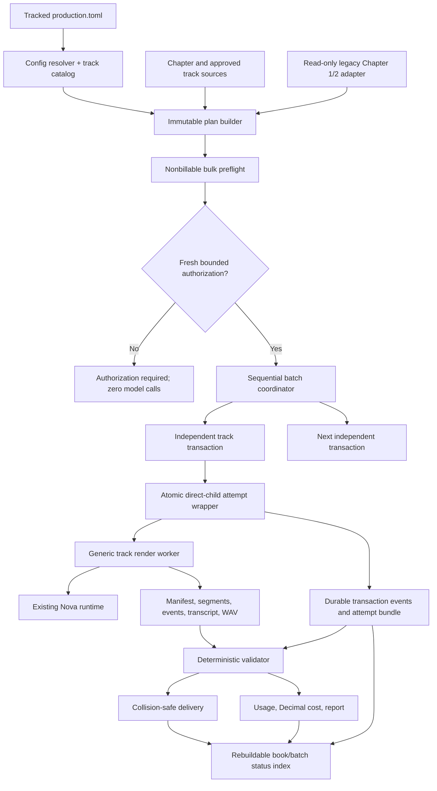

# Design Document: Reusable Audiobook Production Workflow

## Document Status and Governance

This document defines the reusable production workflow that will govern future normal audiobook track execution after implementation and pilot acceptance. It supersedes the need to create an operational specification for each chapter. The existing `.kiro/specs/chapter-2-audio-proof/` and `.kiro/specs/chapter-3-audio-proof/` directories remain unchanged as historical pilot inputs; they are not migrated, rewritten, or deleted. The governing novel specification at `.kiro/specs/The-Final-Frontier-novel/` also remains unchanged.

Creating or approving this specification authorizes planning only. It does **not** authorize tests, AWS identity access, pricing retrieval, Bedrock model calls, narration, paid execution, delivery, or a Chapter 3 pilot run.

## Overview

The feature adds one tracked, parameterized production layer to the existing Python 3.12 `frontier_audiobook` runtime. A single book production configuration, generic CLI operations, immutable per-run plans, and independent per-track transaction directories replace chapter-specific helper scripts and chapter-specific operational specs. Chapter source hashes, token counts, segment counts, call bounds, reuse decisions, and cost evidence are computed from the selected sources at plan/preflight time and frozen into generated artifacts; none are hard-coded into this master specification.

The production layer supports individual chapters, bounded inclusive chapter ranges, and book-level tracks such as opening credits, dedication, epigraph, approved narratable front matter, and closing credits. Paid execution remains fail-closed. A chapter or special track is an independent transaction even when included in a batch. Batch execution is sequential by default and stops on the first nonzero exit, charge uncertainty, source drift, authorization mismatch, or fidelity failure.

The design reuses existing repository capabilities: restricted manuscript parsing, spoken-text transformation, safe segmentation, normalized exact-transcript comparison, content-addressed artifact validation, complete Nova event replay, WAV assembly, strict JSON, no-follow reads, SHA-256, atomic durable writes, directory `fsync`, and exclusive file locking. The implementation may refactor those capabilities behind generic track interfaces, but it must not create `chapterN_proof.py` files or routine per-chapter code.

## Goals

- Replace approximately 128 chapter-specific operational specs with one reusable implementation and configuration.
- Keep every paid track independently authorized, recoverable, auditable, and collision-safe.
- Support single-track and bounded-batch planning, preflight, execution, validation, delivery, reporting, status, and resume inspection.
- Preserve current production defaults while allowing explicit book-, track-kind-, and track-level overrides.
- Derive book status from independent durable transaction directories so one corrupt aggregate file cannot erase progress.
- Keep exact journal-derived service cost separate from Cost Explorer or invoice confirmation.
- Preserve Chapter 1 and Chapter 2 artifacts and recognize their current output conventions read-only.
- Use Chapter 3 as the first acceptance run only after implementation and nonbillable gates pass.
- Minimize recurring Kiro/agent work: normal chapters become command-and-data execution, not specification generation.

## Non-Goals

- Editing manuscript prose, written-edition title/copyright layout, or the governing novel spec.
- Replacing the existing Amazon Nova runtime, exact normalization, event replay, or audio stitching algorithms unless a generic refactor is needed to expose them safely.
- Automatically retrying a launched paid attempt.
- Treating a preflight estimate as an invoice, credit guarantee, or absolute account spending control.
- Mastering, chapter leveling, MP3/M4A encoding, retailer packaging, deployment, or distribution unless added by a later approved feature.
- Rewriting or normalizing historical Chapter 1/2 artifacts into the new layout.

## Existing Runtime Context

The current CLI exposes `frontier-audiobook audition ...` and `audition narrate --chapter N`. The existing implementation already supplies:

- strict TOML configuration and pinned runtime values;
- exact chapter discovery under `The Final Frontier Novel/chapters/`;
- restricted-header parsing and declared word-count enforcement;
- `markdown_to_spoken`, `frontier-word-sequence-v1`, and safe segment planning;
- content-addressed segment reuse with artifact/hash/fidelity revalidation;
- source-drift checks before each paid call and before stitching;
- exact transcript comparison, complete correlated event replay, partial-turn rejection, and LPCM/WAV binding;
- atomic writes, same-filesystem durable replacement, `fsync`, strict JSON, and exclusive file locks.

The generic production layer must call or extract these functions rather than duplicate chapter algorithms. The existing audition workflow remains available and backward compatible.

## Architecture



### Paid batch sequence

```mermaid
sequenceDiagram
    participant O as Operator
    participant P as Production CLI
    participant B as Batch Coordinator
    participant T as Track Transaction
    participant W as Attempt Wrapper
    participant C as Direct Child Worker
    participant N as Nova Runtime

    O->>P: plan selectors (single, range, special tracks)
    P-->>O: immutable plan digest
    O->>P: preflight plan
    P-->>O: source/reuse/calls/rates/estimate digest
    O->>P: authorize exact plan + preflight bounds
    P-->>O: one-shot authorization digest
    O->>B: execute with authorization
    loop exact authorized order, sequential by default
        B->>T: acquire track lock and revalidate frozen inputs
        T->>W: consume track authorization once
        W->>C: direct child exact argv
        loop each nonreusable segment within authorized maximum
            C->>N: at most one new call
            N-->>C: events, FINAL transcript, LPCM, usage
            C->>C: exact fidelity and partial-turn checks
        end
        C-->>W: structured summary + native exit
        W->>T: atomic attempt bundle
        T->>T: deterministic validation and state transition
        alt nonzero, uncertain, drift, or fidelity failure
            T-->>B: stop batch; preserve remaining authorizations unused
        else rendered
            T-->>B: continue
        end
    end
    B-->>O: partial/complete batch status
```

## Components and Interfaces

This index identifies the reusable interfaces already specified in detail below; the linked sections remain the authoritative behavioral contracts.

| Component or interface | Existing contract |
|---|---|
| Production CLI | The public `frontier-audiobook production` operations and selector/file arguments in [Stable CLI Contract](#stable-cli-contract). |
| Config, catalog, and planner | Strict configuration resolution, ordered Track catalog construction, and `create_production_plan(...)` in [Book Production Configuration](#book-production-configuration), [Front-Matter and Credits Handoff](#front-matter-and-credits-handoff), and [Planning and Nonbillable Bulk Preflight](#planning-and-nonbillable-bulk-preflight). |
| Preflight | `preflight_plan(...)` and its `PreflightRecord` output in [Planning and Nonbillable Bulk Preflight](#planning-and-nonbillable-bulk-preflight). |
| Authorization and batch coordinator | The `authorize`/`execute` boundary and ordered Track coordination in [Paid Authorization Semantics](#paid-authorization-semantics) and [Batch Execution](#batch-execution). |
| Transaction ledger | `LedgerEvent`, state reduction, locking, and derived status contracts in [Transaction State Machine](#transaction-state-machine) and [Concurrency, Ledger, and Idempotency](#concurrency-ledger-and-idempotency). |
| Atomic attempt wrapper and worker | `run_atomic_paid_attempt(...)` and the hidden generic Track worker in [Atomic Direct-Child Paid Attempt Wrapper](#atomic-direct-child-paid-attempt-wrapper) and [Generic Track Execution](#generic-track-execution). |
| Validator and cost calculator | Deterministic validation plus journal-derived Decimal accounting in [Deterministic Postflight Validation](#deterministic-postflight-validation) and [Usage and Cost Accounting](#usage-and-cost-accounting). |
| Deliverer, reporter, and status | The `deliver`, `report`, and `status` interfaces in [Delivery, Reporting, and Status](#delivery-reporting-and-status). |
| Resume inspector and manual resolver | The `inspect-resume` and `resolve` interfaces in [Resume Inspection and Manual Resolution](#resume-inspection-and-manual-resolution). |
| Legacy adapter | Read-only Chapter 1/2 discovery, validation, and reuse classification in [Legacy Compatibility and Migration](#legacy-compatibility-and-migration). |

## Repository and Artifact Layout

### Tracked reusable implementation

```text
.audiobook/
├── config/
│   └── production.toml                 # one book production configuration
├── src/frontier_audiobook/
│   ├── cli.py                          # adds stable `production` command group
│   ├── production_config.py            # strict schema and override resolution
│   ├── production_models.py            # typed plans, authorization, ledger records
│   └── production.py                   # generic orchestration; no chapter-specific code
├── tests/
│   ├── test_production_config.py
│   └── test_production.py
└── README.md                            # reusable operator commands and boundaries
```

The exact module split may be adjusted during implementation to keep cohesive code, but the result is one generic production subsystem. No file may be named for a routine chapter.

### Generated run data

```text
.audiobook/build/production/<book-id>/
├── plans/<plan-id>/
│   ├── plan.json                        # immutable, prose-free frozen plan
│   ├── preflight.json                   # immutable nonbillable evidence
│   └── authorizations/<authorization-id>.json
├── transactions/<track-id>/<transaction-id>/
│   ├── events/000001-*.json             # independent hash-chained state events
│   ├── attempts/attempt-001/             # atomic console/result bundle
│   ├── runtime/                          # manifest, events, transcripts, segment WAVs
│   ├── validation/                       # prose/transcript-free evidence
│   ├── delivery/                         # copy decision and hashes
│   └── report.md                         # sanitized track report
├── batches/<plan-id>/report.md           # derived aggregate report
└── indexes/status.json                   # rebuildable cache, never source of truth
```

Runtime transcripts and raw Nova event journals are confined to `runtime/` because they are required to validate fidelity and usage. They are not Evidence_Artifacts and are never copied into plans, validation evidence, reports, authorizations, or indexes. Generated plans store source/segment hashes, counts, and boundaries, not prose bodies.

### Delivery layout

Delivery roots and file templates are configuration values. The default production naming contract is collision-safe and sequence-aware:

```text
.audiobook/dist/audiobook/<book-id>/<sequence>-<track-slug>-<voice>.wav
```

Opening credits, front-matter tracks, chapters, and closing credits share one ordered catalog. Existing `voice-samples/chapter-1-*`, `voice-samples/chapter-2-*`, and `.audiobook/build/narration/chapter-001-*` / `chapter-002-*` paths remain read-only legacy inputs.

## Stable CLI Contract

The implementation adds a top-level `production` command group while preserving current `audition` behavior.

```bash
# Freeze one chapter or a finite set; no AWS/model call
frontier-audiobook production plan --chapter 3
frontier-audiobook production plan --chapter-range 3:12
frontier-audiobook production plan --track opening-credits --track dedication

# Run affected tests, snapshots, reuse/collision checks, identity, rates, estimate; no model call
frontier-audiobook production preflight --plan /absolute/path/plan.json

# Create one one-shot chapter or bounded-batch authorization; no model call
frontier-audiobook production authorize \
  --plan /absolute/path/plan.json \
  --preflight /absolute/path/preflight.json \
  --expires-at 2027-01-01T00:00:00Z \
  --max-estimated-pre-tax-usd 5.00 \
  --confirm-plan-sha256 <sha256> \
  --confirm-paid-scope

# First command capable of model calls
AWS_PROFILE=frontier-audiobook frontier-audiobook production execute \
  --authorization /absolute/path/authorization.json

# Nonbillable postflight and operations
frontier-audiobook production validate --plan /absolute/path/plan.json
frontier-audiobook production deliver --plan /absolute/path/plan.json
frontier-audiobook production report --plan /absolute/path/plan.json
frontier-audiobook production status --plan /absolute/path/plan.json
frontier-audiobook production status --book
frontier-audiobook production inspect-resume --transaction /absolute/path/transaction
frontier-audiobook production resolve --transaction /absolute/path/transaction --disposition <value>
```

Selector rules:

- `--chapter N` is repeatable and selects exact chapter tracks.
- `--chapter-range START:END` is inclusive and rejected when reversed, empty, duplicated, or above the configured maximum tracks per plan.
- `--track TRACK_ID` is repeatable and selects configured special tracks or chapter track IDs.
- Every selector resolves to a unique ordered finite track list before a plan is written.
- A single-track plan and a batch plan use the same schema and transaction machinery.

`authorize` is intentionally separate from `execute`. It must display scope, command hashes, maximum new calls, estimate basis, approved maximum estimated pre-tax amount, and expiration before accepting an explicit confirmation. In agent-driven execution, the agent must obtain a fresh interactive user confirmation naming the authorization/plan before invoking `authorize` or `execute`. A spec, task selection, old confirmation, or generic approval is not authorization.

## Book Production Configuration

The tracked configuration is strict UTF-8 TOML with duplicate/unknown-key rejection and a schema version. Values resolve in this order:

1. required global defaults;
2. optional track-kind overrides;
3. optional exact track/chapter overrides.

Later layers replace only explicitly present keys. The resolver records every value and provenance layer in the frozen plan.

```toml
schema_version = 1
book_id = "the-final-frontier"
manuscript_root = "The Final Frontier Novel"
build_root = ".audiobook/build/production"
delivery_root = ".audiobook/dist/audiobook"
max_tracks_per_plan = 16

[defaults]
voice = "tiffany"
model_id = "amazon.nova-2-sonic-v1:0"
region = "us-east-1"
profile_label = "frontier-audiobook"
target_segment_words = 5
fidelity_policy = "exact"
normalization = "frontier-word-sequence-v1"
output_template = "{sequence:03d}-{track_slug}-{voice}.wav"

[defaults.audio]
sample_rate_hz = 24000
sample_size_bits = 16
channels = 1

[estimate]
rate_max_age_hours = 24
preflight_max_age_hours = 24
# Conservative modality envelopes are validated and recorded as estimate inputs.
input_speech_tokens_per_call = 0
input_text_tokens_per_call = 8192
output_speech_tokens_per_call = 8192
output_text_tokens_per_call = 8192

[track_kinds.chapter]
# Optional overrides only.

[[tracks]]
id = "opening-credits"
kind = "opening_credits"
sequence = 1
source_path = ".audiobook/config/tracks/opening-credits.md"
render_once = true

[[tracks]]
id = "dedication"
kind = "front_matter"
sequence = 2
source_path = "The Final Frontier Novel/front-matter.md"
source_section = "dedication"
render_once = true

[[tracks]]
id = "epigraph"
kind = "front_matter"
sequence = 3
source_path = "The Final Frontier Novel/front-matter.md"
source_section = "epigraph"
render_once = true

[[tracks]]
id = "closing-credits"
kind = "closing_credits"
sequence = 132
source_path = ".audiobook/config/tracks/closing-credits.md"
render_once = true
```

The example demonstrates shape, not approved final track text or ordering. The implementation task must reconcile actual special-track IDs and sequence values with the approved publishing handoff before production use.

### Effective configuration model

```python
from dataclasses import dataclass
from enum import StrEnum

class TrackKind(StrEnum):
    OPENING_CREDITS = "opening_credits"
    FRONT_MATTER = "front_matter"
    CHAPTER = "chapter"
    CLOSING_CREDITS = "closing_credits"

class FidelityPolicy(StrEnum):
    EXACT = "exact"

@dataclass(frozen=True)
class EffectiveTrackConfig:
    track_id: str
    track_kind: TrackKind
    sequence: int
    voice: str
    model_id: str
    region: str
    profile_label: str
    target_segment_words: int
    fidelity_policy: FidelityPolicy
    normalization: str
    output_path: str
    resolution_provenance: dict[str, str]
```

`exact` is the only initially supported fidelity value. A future policy requires a separately approved design and cannot be enabled through an unknown configuration string.

## Front-Matter and Credits Handoff

Written-edition title, copyright, front-matter layout, typography, and pagination remain owned by the publishing workflow. Audiobook production consumes only explicitly approved narratable text:

1. Publishing approves a source file and named section or a dedicated spoken-text file.
2. `production.toml` records the source path, section identifier, sequence, track kind, and `render_once = true`.
3. Planning reads the approved text using no-follow strict UTF-8 rules, computes source/spoken hashes and segments, and freezes only hashes/counts in the plan.
4. A changed publishing source invalidates the prior plan; production never silently follows layout edits.
5. Each opening/front-matter/closing track is one catalog item and one transaction, not repeated for each chapter.

An optional `approved_sha256` configuration field may pin a publishing handoff. When present, planning requires an exact match. The generated plan always records the actual source hash whether or not a handoff pin is configured.

## Data Models

### Source and segment snapshots

```python
@dataclass(frozen=True)
class SegmentSnapshot:
    segment_id: str
    ordinal: int
    paragraph_index: int
    text_sha256: str
    spoken_token_count: int
    narration_only_punctuation: bool

@dataclass(frozen=True)
class SourceSnapshot:
    track_id: str
    source_path: str
    source_kind: str
    raw_sha256: str
    normalized_body_sha256: str
    spoken_sha256: str
    declared_word_count: int | None
    normalized_word_count: int
    spoken_token_count: int
    segment_count: int
    segments: tuple[SegmentSnapshot, ...]
```

Snapshots contain no prose. Chapter-specific values are computed when the plan is created.

### Immutable plan

```python
@dataclass(frozen=True)
class FrozenTrackPlan:
    transaction_id: str
    track_id: str
    sequence: int
    effective_config: EffectiveTrackConfig
    source: SourceSnapshot
    command_argv: tuple[str, ...]
    command_sha256: str
    maximum_new_calls: int
    legacy_candidates: tuple[str, ...]
    protected_inventory_sha256: str

@dataclass(frozen=True)
class FrozenBatchPlan:
    schema_version: int
    plan_id: str
    created_at_utc: str
    book_id: str
    config_path: str
    config_sha256: str
    selectors: tuple[str, ...]
    tracks: tuple[FrozenTrackPlan, ...]
    canonical_sha256: str
```

Canonical hashing uses strict JSON encoded as UTF-8 with sorted keys, compact separators, `ensure_ascii=False`, and non-finite numbers forbidden. The `canonical_sha256` field is calculated over the document with that field omitted. Plans are created with exclusive semantics and never edited in place.

### Preflight record

```python
@dataclass(frozen=True)
class PreflightRecord:
    plan_sha256: str
    checked_at_utc: str
    expires_at_utc: str
    targeted_checks_sha256: str
    identity_profile_label: str
    identity_resolved: bool
    identity_checked_at_utc: str
    official_rates: dict[str, str]
    official_rate_provenance: dict[str, str]
    reusable_segment_ids: dict[str, tuple[str, ...]]
    maximum_new_calls_by_track: dict[str, int]
    maximum_new_calls_total: int
    estimated_pre_tax_usd: str
    estimate_inputs: dict[str, object]
    delivery_collisions: dict[str, str]
    per_file_inventory_sha256: str
    canonical_sha256: str
```

Preflight performs no Bedrock model call. Identity persistence contains exactly the fixed profile label, resolution boolean, and timestamp. The raw identity response is discarded in memory.

### Authorization

```python
@dataclass(frozen=True)
class PaidAuthorization:
    schema_version: int
    authorization_id: str
    plan_sha256: str
    preflight_sha256: str
    exact_transaction_ids: tuple[str, ...]
    exact_track_ids: tuple[str, ...]
    exact_command_sha256s: tuple[str, ...]
    maximum_new_calls_by_track: dict[str, int]
    maximum_new_calls_total: int
    estimated_pre_tax_usd: str
    operator_approved_max_estimated_pre_tax_usd: str
    issued_at_utc: str
    expires_at_utc: str
    one_shot: bool
    canonical_sha256: str
```

The authorization is cryptographically hash-bound with SHA-256; it is not represented as a digital identity signature. File ownership, explicit interactive confirmation, plan/preflight hashes, one-shot consumption, and expiry form the local authorization boundary. Adding a signing system would require a separate security design.

### Attempt result

```python
@dataclass(frozen=True)
class AttemptResult:
    schema_version: int
    attempt_id: str
    transaction_id: str
    authorization_sha256: str
    working_directory: str
    argv: tuple[str, ...]
    command_sha256: str
    profile_label: str
    started_at_utc: str
    ended_at_utc: str
    child_launched: bool
    native_return_code: int
    termination_signal: int | None
    console_path: str
    console_sha256: str
    automatic_retry_performed: bool
    environment_persisted: bool
```

A committed result requires an integer `native_return_code`. A launched attempt without a valid committed result is Charge_Uncertain.

### Ledger event

```python
class TransactionState(StrEnum):
    DISCOVERED = "discovered"
    PLANNED = "planned"
    PREFLIGHT_PASSED = "preflight-passed"
    AUTHORIZATION_REQUIRED = "authorization-required"
    RUNNING = "running"
    CHARGE_UNCERTAIN = "charge-uncertain"
    RENDERED = "rendered"
    VALIDATED = "validated"
    DELIVERED = "delivered"
    BLOCKED = "blocked"

@dataclass(frozen=True)
class LedgerEvent:
    schema_version: int
    transaction_id: str
    sequence: int
    event_type: str
    state_before: str | None
    state_after: str
    occurred_at_utc: str
    payload_sha256: str
    previous_event_sha256: str | None
    event_sha256: str
```

Payloads are separate immutable sanitized JSON files. Each event binds the prior event, sequence, payload hash, and resulting state. The state reducer rejects gaps, duplicate sequence numbers, invalid transitions, broken hashes, unknown fields, and noncanonical values.

## Transaction State Machine

```mermaid
stateDiagram-v2
    [*] --> discovered
    discovered --> planned: immutable plan created
    planned --> preflight-passed: all nonbillable gates pass
    planned --> blocked: source/config/test/collision failure
    preflight-passed --> authorization-required: preflight frozen
    authorization-required --> running: fresh matching authorization consumed
    authorization-required --> blocked: expired/mismatched/over-budget authorization
    running --> rendered: native exit 0 + worker summary
    running --> charge-uncertain: missing/incomplete/ambiguous attempt evidence
    running --> blocked: known nonzero/fidelity/source-drift failure
    rendered --> validated: deterministic postflight passes
    rendered --> blocked: postflight fails
    validated --> delivered: absent or identical destination accepted
    validated --> blocked: destination collision or isolation failure
    charge-uncertain --> rendered: manual local recovery proves complete artifacts
    charge-uncertain --> blocked: operator abandons retained attempt
    blocked --> planned: new immutable plan/transaction only
```

There is no transition from `charge-uncertain` or a launched `blocked` attempt back to `running` under the same authorization. A new paid attempt requires explicit manual resolution, a new immutable transaction/plan, a fresh authorization, and—when duplicate charging is possible—an explicit duplicate-charge acknowledgement. No operation performs that transition automatically.

## Concurrency, Ledger, and Idempotency

- Each transaction has its own directory and append-only event chain. Track progress does not depend on one global mutable ledger.
- `indexes/status.json` and batch reports are derived caches. Deleting or corrupting a cache cannot erase transaction truth; `status --book` rebuilds it from valid transaction directories.
- Mutating operations acquire an exclusive lock scoped to `<book-id>/<track-id>`. A second writer fails before mutation and reports the lock owner metadata allowed by the privacy policy.
- Different tracks may be planned or validated concurrently. Paid batch execution remains sequential by default. Implementing parallel paid execution requires a separate opt-in design.
- Every immutable file uses exclusive creation. Every mutable cache uses atomic durable replacement. Attempt directories use same-filesystem staging plus atomic rename.
- Repeating `plan` with the same explicit plan ID validates the existing bytes and returns them only when identical; otherwise it fails.
- Repeating preflight, validate, deliver, report, status, or inspect-resume either returns the same result or advances through a valid transition. It never creates another paid attempt.
- A corruption in one transaction marks only that transaction blocked or uncertain. Other valid transaction chains remain readable and executable if their batch stop rules permit.

## Planning and Nonbillable Bulk Preflight

### Plan algorithm

```python
def create_production_plan(
    config_path: Path,
    selectors: tuple[str, ...],
    *,
    plan_id: str | None = None,
) -> Path:
    """Create one immutable prose-free plan and make no network/model call."""
```

**Preconditions**

- Configuration is strict, schema-valid, and inside the workspace.
- Selectors resolve to at least one and at most `max_tracks_per_plan` unique tracks.
- Every source resolves inside an approved source root without following unsafe links.
- Output templates resolve inside configured build/delivery roots and are collision-free within the plan.

**Postconditions**

- The plan contains exact ordered track IDs, effective configuration, source/segment hashes and counts, command hashes, protected-inventory binding, and call ceilings.
- Concatenating planned segment token sequences in memory equals the selected Spoken_Text token sequence.
- No prose body, segment text, transcript, credential, or identity response is persisted.
- No AWS or model call occurs.

### Preflight algorithm

```python
def preflight_plan(plan_path: Path) -> PreflightRecord:
    """Run bounded local/external non-model checks and freeze authorization inputs."""
```

Preflight performs:

1. plan/config/source hash revalidation;
2. targeted affected tests with AWS disabled;
3. per-file protected-artifact inventory;
4. read-only discovery and content-addressed validation of current and legacy reusable artifacts;
5. destination collision classification;
6. disk-space and same-filesystem checks;
7. one non-model identity resolution per unique profile label;
8. current official four-modality Nova rate retrieval with source URL, publication/retrieval/effective dates, model, region, purchase option, unit, and currency;
9. maximum new-call calculation per track and for the batch;
10. conservative estimated pre-tax cost from planned call/token envelopes and the current rates.

The estimate is an authorization input, not exact cost or billing confirmation. It records all assumptions. If a defensible finite envelope cannot be calculated, authorization is blocked. If a reusable artifact becomes invalid before execution and would increase calls beyond the authorized maximum, execution stops rather than expanding scope.

## Paid Authorization Semantics

Authorization may cover one transaction or the exact finite transaction list in a batch plan. It must bind:

- immutable plan and preflight SHA-256 values;
- exact track and transaction IDs in execution order;
- exact per-track child command SHA-256 values;
- maximum new calls per track and in total;
- preflight computed estimate and estimation inputs;
- operator-approved maximum estimated pre-tax USD amount;
- issue and expiration timestamps;
- one-shot semantics.

Authorization creation fails when preflight is stale, any track is blocked/uncertain, the operator maximum is below the computed estimate, command hashes differ, or the scope is not exact. Execution revalidates every bound field before consuming the authorization. Consumption is recorded durably before child launch. An authorization permits no retry and no unlisted track or extra call.

For an unstarted later transaction after a batch stop, the authorization remains recorded but cannot be resumed implicitly. The operator must inspect status and create a new current preflight/authorization for any future execution. This avoids treating an old batch approval as standing consent.

## Atomic Direct-Child Paid Attempt Wrapper

```python
def run_atomic_paid_attempt(
    transaction: FrozenTrackPlan,
    authorization: PaidAuthorization,
    *,
    exact_environment: dict[str, str],
) -> AttemptResult:
    """Launch exactly one direct child and atomically retain definitive evidence."""
```

**Preconditions**

- Track lock is held.
- Plan, preflight, source, protected runtime, command hash, authorization digest, expiry, and remaining call ceiling all match.
- No committed attempt, staging attempt, ambiguity marker, or consumed attempt ID exists.
- The exact environment passed to the child contains the fixed profile selection but is not persisted or logged.

**Algorithm and invariants**

1. Create `attempt-001.staging-<nonce>` on the same filesystem as the final attempt directory.
2. Durably record authorization consumption and transition to `running` before launch.
3. Spawn the exact worker argv as a direct child with `subprocess.Popen`; do not use a shell pipeline.
4. Tee combined stdout/stderr to the operator and a structured, prose-free `render-console.log`.
5. Capture the native integer status from `Popen.wait()`.
6. Write `attempt.json` with exact argv, command hash, working directory, fixed profile label, timestamps, child-launched fact, native status, termination signal, console hash, authorization hash, and no-retry/no-environment facts.
7. Flush and `fsync` log/result files and the staging directory.
8. Atomically rename staging to `attempt-001` on the same filesystem and `fsync` the parent.

**Postconditions**

- Exactly one committed attempt bundle exists, or retained staging/ambiguity evidence causes `charge-uncertain`.
- A missing native status, missing file, hash mismatch, wrapper interruption after launch, or inconsistent bundle is never inferred as success.
- A nonzero native status is definitive failure and blocks the transaction without automatic retry.
- The wrapper never persists environment values, credentials, account identifiers, ARNs, role/user identifiers, or source/transcript bodies.

## Generic Track Execution

The direct child invokes a hidden generic worker command bound into the plan. The worker adapts a `TrackSource` to the existing segmentation/render/verification/assembly pipeline. Chapter sources use current manuscript discovery and header validation. Special tracks use approved-source adapters with the same spoken transformation and exact fidelity policy.

For each segment:

1. Re-read and hash the source; block on plan drift.
2. Validate every candidate reusable artifact by text hash, audio hash, transcript policy, event replay, LPCM equality, source/effective-config binding, and zero partial turns.
3. Reuse an intact accepted artifact with zero current-execution calls/tokens.
4. Otherwise make at most one model call in the authorized attempt.
5. Persist runtime artifacts and manifest state atomically before continuing.
6. Stop immediately on SDK failure, incomplete event sequence, fidelity mismatch, partial turn, source drift, or authorized call-ceiling exhaustion.
7. Re-read the source before final assembly.

Each track produces its own native child status and transaction state. The batch coordinator never treats a prior track success as evidence for a later track.

## Batch Execution

- Batches are finite and bounded by `max_tracks_per_plan`.
- Default order is the immutable catalog sequence recorded in the plan.
- The coordinator processes one transaction at a time.
- The coordinator stops before the next track on the first nonzero status, Charge_Uncertain state, source/protected-artifact drift, fidelity failure, call-bound mismatch, or authorization failure.
- Completed tracks remain completed; unstarted tracks remain unstarted and receive no model call.
- Aggregate status is one of `not-started`, `running`, `partial`, `blocked`, or `complete`, derived from transaction truth.
- Batch reports list every selected track and state, but do not combine independent attempt evidence into a single mutable source of truth.

## Resume Inspection and Manual Resolution

`inspect-resume` is read-only and nonbillable. It validates the event chain, attempt bundle, runtime artifacts, authorization consumption, source/config bindings, and possible recovery paths. It emits one of:

- `nothing-to-resume`;
- `local-validation-available`;
- `complete-artifacts-recoverable`;
- `charge-uncertain-review-required`;
- `blocked-new-plan-required`.

`resolve` is also nonbillable and supports explicit dispositions:

- `accept-complete-local-artifacts`: permitted only when complete runtime evidence validates without another model call; transitions uncertain to rendered.
- `quarantine-invalid-artifacts`: retains hashes/paths and transitions to blocked.
- `abandon-uncertain-attempt`: retains all evidence and transitions to blocked.

No disposition starts a model call or resets an attempt. A possible retry is a new transaction with a new plan and authorization. When the prior call may have charged, creation of that new transaction additionally requires explicit duplicate-charge acknowledgement referencing the retained attempt digest.

## Deterministic Postflight Validation

Validation is read-only except for sanitized validation evidence and state events. It verifies:

1. current source/config/protected-runtime hashes against the frozen plan and inventory;
2. definitive attempt evidence with native return code `0`;
3. active manifest fixed fields and exact active set;
4. unique contiguous segment IDs and source-token conservation;
5. exact normalized FINAL transcript equality for every active segment;
6. complete event replay producing the accepted transcript and LPCM;
7. zero mid-sentence partial turns;
8. recorded/current audio hashes and in-root path bindings;
9. exact assembly order, stitching profile, WAV format, hash, and frame-derived duration;
10. reuse/new-render partition and authorized call count;
11. exactly one internally reconciled usage journal per active segment;
12. four-modality active-artifact and current-execution totals;
13. current official rate provenance and Decimal cost arithmetic;
14. per-file isolation and evidence sanitization.

Validation never estimates missing evidence. Missing, duplicate, malformed, ambiguous, unbound, or inconsistent inputs block delivery.

## Usage and Cost Accounting

For each active journal, sum only integer `usageEvent.details.delta` values for:

```python
TOKEN_MODALITIES = (
    "input_speech",
    "input_text",
    "output_speech",
    "output_text",
)
```

Each modality delta sum must equal the terminal modality total. Combined modality sums must equal terminal top-level input, output, and total token values. Cumulative totals are reconciliation fields and are never summed across events.

Two scopes are mandatory:

- **Active Artifact Totals:** one validated journal for every active segment, including reused segments.
- **Current Execution Totals:** only journals created by the current authorized attempt; reused segments contribute zero.

Exact cost uses `Decimal` and current official rates:

```python
subtotal = Decimal(tokens) * Decimal(rate_per_1k) / Decimal(1000)
computed_pre_tax_service_cost = sum(subtotals.values(), start=Decimal("0"))
```

The report retains exact decimal strings, formulas, subtotals, sum, official provenance, and verification timestamp. `Cost Explorer / invoice confirmation` is a separate `pending`, `not-performed`, or confirmed amount/date field. Estimated preflight cost and exact postflight service cost are labeled separately.

## Delivery, Reporting, and Status

### Collision-safe delivery

- If the destination is absent, copy the validated WAV to a same-filesystem temporary file, verify bytes/hash, and atomically publish it.
- If the destination is byte-identical, leave it unchanged and record `already-identical`.
- If the destination differs, leave it unchanged and block delivery.
- Re-running delivery after success is idempotent and cannot create a second variant silently.

### Track report

Each report includes source path/hashes/counts, effective configuration/provenance, plan/preflight/authorization/attempt digests, native status, fidelity/replay/assembly/reuse results, both token scopes, rate provenance, estimate versus exact Decimal cost, separate billing confirmation, delivery hashes, isolation results, targeted checks, separately labeled broader-suite status, and optional listening feedback. It contains no prose body, transcript body, raw event payload, environment dump, or forbidden identity detail.

### Batch and book status

`status` derives per-track and aggregate state from transaction directories. It reports selected/completed/blocked/unstarted counts, next permitted nonbillable action, and whether paid authorization would be required. It never launches a model call. A corrupt transaction is isolated and reported by path/digest while other valid transactions remain available.

## Protected-Artifact Isolation

Preflight captures a per-file inventory with workspace-relative path, kind, existence, byte count, SHA-256, Git status, and attribution. Hard protected inputs are:

- every active selected source;
- tracked production configuration and the runtime/dependency files used by execution;
- existing Chapter 1 and Chapter 2 build artifacts and proof copies;
- read-only legacy manifests/events/transcripts/audio used for reuse;
- `.kiro/specs/chapter-2-audio-proof/`, `.kiro/specs/chapter-3-audio-proof/`, and `.kiro/specs/The-Final-Frontier-novel/`;
- approved publishing handoff files for selected special tracks.

The write allowlist contains only the selected production plan/transaction roots, derived indexes, and approved delivery destinations. Selected source/runtime/dependency/prior-audio drift hard-blocks the affected transaction. A changed unselected manuscript path is classified `concurrent-or-unattributed` and reported separately. A whole-novel aggregate may be informational but is never the sole gate.

## Legacy Compatibility and Migration

A read-only adapter recognizes existing Chapter 1 and Chapter 2 narration conventions, including current build roots, manifests, segment WAVs, transcripts, event journals, and proof paths. Import behavior is:

1. discover without moving, renaming, or rewriting;
2. record path/hash references in a new migration observation;
3. validate source/effective-config binding, exact transcript policy, audio hash, event replay, usage consistency, and zero partial turns;
4. expose valid artifacts as reuse candidates;
5. classify incomplete or ambiguous artifacts as read-only historical evidence, never silently current;
6. preserve all original bytes regardless of classification.

New production outputs use the new transaction schema. Historical specs remain documentary inputs only. Existing `audition` commands and legacy output readers continue to work.

## Correctness Properties

*A correctness property must hold over every applicable generated plan, transaction, artifact set, or execution state. Properties are validated with local deterministic/property tests and produced evidence. They never justify randomized or repeated external-service calls.*

The acceptance-criteria prework classified external identity/pricing behavior, one-time pilot execution, documentation, and governance as example, smoke, or integration checks rather than properties. Redundancy reflection consolidated overlapping criteria into the 16 independent properties below.

### Property 1: Effective configuration and source planning are deterministic

For any valid Book_Production_Config and finite unique Selector set, parsing then printing then parsing produces an equivalent configuration, override resolution produces exactly one identical Effective_Track_Config per ordered Track, catalog identifiers/sequences remain unique, Publishing_Handoff hashes remain bound, and segmenting each frozen Spoken_Text conserves its normalized token sequence without insertion, deletion, or reordering.

**Validates: Requirements 2.1, 2.3, 2.4, 2.12, 2.13, 2.14, 2.16, 2.17, 3.5, 3.6, 3.7, 17.2**

### Property 2: Frozen plans and preflight scopes are immutable and bounded

For any created Frozen_Plan and Preflight_Record, canonical serialize-parse round trips preserve values and reproduce recorded digests, the selected Track list is finite, unique, ordered, and within the configured bound, every command/call/estimate/input binding is complete, and any source, configuration, command, plan, or preflight mutation invalidates authorization.

**Validates: Requirements 1.8, 3.1, 3.2, 3.3, 3.4, 3.8, 3.9, 3.10, 3.11, 3.12, 4.1, 4.12, 4.13, 4.15, 6.3, 6.4, 6.5, 6.6**

### Property 3: Transaction truth is independently reconstructable

For any collection of Track_Transaction directories, each valid hash-chained Transaction_Ledger reduces to exactly one allowed state, concurrent writers cannot both commit the same next sequence, repeated nonbillable operations are idempotent, and corrupting one transaction or any Derived_Status_Index cannot alter the reconstructed state of another valid transaction.

**Validates: Requirements 5.1, 5.2, 5.3, 5.4, 5.5, 5.6, 5.7, 5.8, 5.9, 5.10, 5.11, 5.12**

### Property 4: Authorization is exact, finite, current, and one-shot

For any paid execution, valid Paid_Authorization matches the plan and preflight digests, exact ordered transaction/Track/command hashes, per-Track and total call ceilings, unexpired time, Cost_Estimate, and operator-approved maximum estimated amount; consuming Paid_Authorization once prevents every second launch, retry, or scope expansion.

**Validates: Requirements 6.1, 6.2, 6.3, 6.4, 6.5, 6.6, 6.7, 6.10, 6.11, 6.12, 6.13**

### Property 5: Paid attempt state is definitive or explicitly uncertain

For any launched Direct_Child_Worker, a successful committed Paid_Attempt_Bundle contains hash-matched console/result files, exact command/authorization bindings, and the direct child's integer native return code, while staging, missing, interrupted, inconsistent, duplicate, or status-less evidence produces Charge_Uncertain or blocked state and permits no automatic retry.

**Validates: Requirements 7.1, 7.2, 7.3, 7.4, 7.5, 7.6, 7.7, 7.8, 7.9, 7.10**

### Property 6: Batch execution is fail-fast with independent transactions

For any authorized ordered batch, Tracks start sequentially in Frozen_Plan order, each started Track has its own Paid_Attempt_Bundle and Transaction_Ledger, all Tracks before the first failure retain their valid states, the failed Track retains definitive or uncertain evidence, aggregate status is derived from those states, and every later Track remains unstarted with zero model calls.

**Validates: Requirements 6.13, 8.1, 8.2, 8.3, 8.7, 8.8, 8.9**

### Property 7: Reuse and resume never create unapproved calls

For any candidate artifact set and authorized call ceiling, only source/content/config/fidelity/event-valid artifacts are Reused_Segments; Reused_Segments contribute zero new calls and zero Current_Execution_Totals; each nonreusable segment receives at most one call; source/config/bounds are revalidated before calls and assembly; resume inspection/resolution performs zero model calls; and any later paid attempt requires a new transaction and authorization.

**Validates: Requirements 4.5, 8.4, 8.5, 8.6, 9.1, 9.2, 9.3, 9.4, 9.5, 9.6, 9.7, 9.8, 9.9, 9.10, 9.11**

### Property 8: Active manifests are complete and unambiguous

For any rendered Runtime_Manifest, fixed fields equal Track_Plan, Active_Segment identifiers are unique and contiguous in assembly order, active segment count matches the collection, concatenated Active_Segment tokens equal frozen Spoken_Text, and historical, rejected, or carried artifacts do not contribute to active counts.

**Validates: Requirements 10.2, 10.3, 10.4, 10.5, 10.9**

### Property 9: Exact transcript and LPCM replay are preserved

For any Active_Segment, normalized FINAL transcript tokens equal expected tokens, coverage equals `1.0`, mid-sentence partial turns equal zero, recorded hashes equal current bytes, and replaying the bound complete Event_Journal reconstructs the accepted FINAL transcript and LPCM audio; any failed predicate blocks Delivery_Gate.

**Validates: Requirements 10.6, 10.7, 10.8, 10.12**

### Property 10: Assembly integrity is preserved

For any validated ordered Active_Segment set, the assembled Track WAV uses exactly that set and recorded stitching profile, has the configured PCM format, and has recorded byte count, SHA-256, and duration equal to current bytes and frame-derived duration; any mismatch blocks Delivery_Gate.

**Validates: Requirements 10.10, 10.11, 10.12**

### Property 11: Journal aggregation and exact cost are modality-complete

For any validated Track, exactly one bound Event_Journal per Active_Segment reconciles integer modality deltas to terminal modality and combined totals, aggregating each active journal once yields Active_Artifact_Totals, aggregating only newly rendered journals yields Current_Execution_Totals, each four-modality Decimal subtotal and sum equals the recorded Official_Rate formula, incomplete rates/journals block exact cost, and Billing_Confirmation remains separate.

**Validates: Requirements 4.10, 4.11, 4.13, 11.1, 11.2, 11.3, 11.4, 11.5, 11.6, 11.7, 11.8, 11.9, 11.10, 11.11, 11.12, 11.13, 11.14**

### Property 12: Delivery is collision-safe and idempotent

For any validated Track WAV and configured destination, an absent destination becomes byte-identical, an identical destination remains unchanged, and a different destination remains unchanged with a blocking collision; repeating successful delivery produces the same path, complete bytes, size, and SHA-256 without a model call.

**Validates: Requirements 12.1, 12.2, 12.3, 12.4, 12.10**

### Property 13: Protected isolation is per-file and attributable

For any preflight/postflight Protected_Inventory pair, every workflow write is inside Workflow_Write_Allowlist, selected sources/runtime/configuration/dependencies/prior audio and protected specs retain required per-file hashes, changed unselected manuscript files are reported separately as Concurrent_Manuscript_Change, and no whole-novel aggregate alone determines Delivery_Gate.

**Validates: Requirements 1.6, 1.7, 4.4, 13.1, 13.2, 13.3, 13.4, 13.5, 13.6, 13.7, 13.8, 13.9, 13.10**

### Property 14: Evidence and identity persistence obey explicit allowlists

For any Evidence_Artifact, identity-derived fields are limited to fixed profile label, resolution boolean, and timestamp; required private runtime artifacts remain confined; paths remain inside approved roots; sanitization findings never echo prohibited values; and no prose body, segment text, transcript body, raw event payload, credential, account ID, ARN, role/user identifier, or environment dump is present.

**Validates: Requirements 3.9, 4.9, 7.4, 7.5, 7.11, 15.1, 15.2, 15.3, 15.4, 15.5, 15.6, 15.7, 15.8, 15.9**

### Property 15: Legacy import is observational and byte-preserving

For any discovered Chapter 1 or Chapter 2 Legacy_Artifact, Legacy_Adapter either produces a hash-bound reuse candidate after all current checks or a read-only rejected observation, and every legacy path, byte count, SHA-256, and byte sequence remains unchanged while new outputs use the new schema.

**Validates: Requirements 13.5, 14.1, 14.2, 14.3, 14.4, 14.5, 14.6, 14.7**

### Property 16: Render-once book tracks are catalog-unique

For any valid ordered Track_Catalog, each opening-credit, approved front-matter, and closing-credit Track ID and sequence is unique, each selected Publishing_Handoff is hash-bound, and each delivered Render_Once Track appears once rather than being duplicated per Chapter_Track.

**Validates: Requirements 2.14, 2.15, 2.16, 2.17**

## Error Handling

| Condition | State/result | Recovery |
|---|---|---|
| Invalid config, selector, source, or output template | `blocked` before preflight | Correct tracked input; create a new immutable plan. |
| Targeted affected test fails | `blocked` before identity/model work | Fix implementation; rerun targeted checks. |
| Unrelated broader-suite failure | separately reported, non-gating | Investigate separately unless overlap is identified. |
| Profile identity fails or a rate is missing/ambiguous/stale | `authorization-required` not reached | Refresh non-model preflight. |
| Estimate is unbounded or exceeds operator maximum | authorization rejected | Reduce scope or explicitly choose a higher bounded maximum. |
| Authorization missing, stale, mismatched, consumed, or expired | stop before child launch | Create a fresh preflight/authorization. |
| Per-track lock is held | no mutation | Inspect owner/state; retry after lock release. |
| Source/runtime/protected input drifts | `blocked` before next call/stitch | Create a new plan after intentional reconciliation. |
| Wrapper interrupted before child launch | no paid attempt; definitive prelaunch failure | Inspect; create fresh authorization if execution is still wanted. |
| Wrapper interrupted after launch or status unavailable | `charge-uncertain` | Inspect and resolve locally; no automatic retry. |
| Native exit is nonzero | `blocked`, evidence retained | Diagnose; any future call needs new plan/authorization. |
| Exact transcript/event/LPCM/partial-turn check fails | `blocked`, artifacts quarantined | No retry under current authorization. |
| Journal missing or inconsistent | validation blocked | Recover complete local evidence or retain blocked state. |
| Exact cost exceeds approved estimated maximum | validation/report flags budget exception | Operator review; no retroactive retry or concealment. |
| Delivery destination differs | validated but delivery blocked | Preserve both; operator chooses a new destination in a new plan. |
| One transaction/index is corrupt | affected transaction blocked; others readable | Rebuild indexes; inspect only affected transaction. |
| Legacy artifact is incomplete | read-only rejected observation | Preserve bytes; render under a new authorized transaction if desired. |

## Testing Strategy

### Targeted affected tests (gating)

The implementation extends existing pytest coverage with no AWS/model calls. Gating tests cover:

- strict production config, override precedence, selectors, output confinement, and catalog uniqueness;
- source snapshots, token conservation, immutable canonical plans, and tamper rejection;
- independent ledger reduction, hash chains, locks, atomic writes, cache rebuild, and transaction corruption isolation;
- authorization scope, call/cost bounds, expiry, one-shot consumption, and batch stop behavior;
- synthetic direct-child exit `0`, nonzero exit, interruption, staging, hash mismatch, and duplicate-attempt refusal;
- reuse/resume validation and zero-call guarantees;
- manifest, transcript/event/LPCM, partial-turn, assembly, journal, Decimal cost, collision, isolation, and sanitization properties;
- read-only Chapter 1/2 compatibility fixtures;
- special-track handoff and render-once catalog behavior;
- CLI dry-run and status/report integration from an installed wheel.

Correctness properties use pytest plus deterministic standard-library generators/fixtures. Where broad input variation adds value, each property test executes at least 100 deterministic generated cases with fixed seed reporting. Paid or external-service behavior is never iterated as a property test.

### Broader suite

A full suite may be run independently. Its command and result are recorded separately. Failures unrelated to production contracts remain non-gating; any failure that overlaps a targeted contract is promoted to a blocking targeted failure.

### External acceptance

The first external acceptance is Chapter 3 only, after implementation and all nonbillable gates. It has a distinct fresh paid confirmation and is not performed during specification creation.

## Chapter 3 Pilot Acceptance

Pilot source: `The Final Frontier Novel/chapters/discovery-part/discovery-part-003-the-failed-check.md`.

The pilot intentionally does **not** copy Chapter 3's source count, hashes, or segment count from its historical spec. The reusable planner recomputes those values into a new immutable production plan and compares only through generated evidence.

Pilot phases:

1. Create a single-track Chapter 3 production plan.
2. Run targeted tests and complete nonbillable preflight, including source snapshot, reuse state, collision state, minimal identity resolution, current rates, and bounded call/cost estimate.
3. Review the exact plan/preflight digests and scope.
4. Obtain a fresh interactive confirmation explicitly authorizing only the Chapter 3 pilot transaction and approved maximum estimated pre-tax amount.
5. Execute exactly one attempt through the atomic wrapper.
6. Stop without retry on nonzero, uncertain, drift, or fidelity failure.
7. On native exit `0`, run deterministic validation, collision-safe delivery, and sanitized reporting.
8. Accept the reusable workflow for future normal chapters only after the pilot evidence passes.

No step above is executed as part of this specification task.

## Performance and Scale

- Approximately 128 chapter tracks plus a small number of special tracks fit the catalog, but plans are bounded (default 16 tracks) to constrain authorization, evidence review, and blast radius.
- Planning and validation may parallelize independent tracks under separate locks; paid execution is sequential by default.
- Status scans transaction metadata rather than audio bytes unless hash revalidation is requested.
- Console output streams to disk/operator rather than accumulating unbounded memory.
- Plans contain hashes/counts rather than prose, keeping batch artifacts compact.
- Journal processing is linear in event count and never sums cumulative totals repeatedly.

## Security and Privacy

- Use the configured profile label only; never copy credentials into argv, configuration, logs, plans, evidence, or reports.
- Persist only profile label, identity-resolution boolean, and timestamp from identity calls.
- Constrain all source, runtime, plan, transaction, and delivery paths to approved roots with no-follow reads and lexical/resolved containment checks.
- Treat configuration, manifests, journals, legacy artifacts, and external pricing as untrusted input and validate strict schemas.
- Keep raw runtime transcripts/events under ignored private build roots; exclude their bodies from Evidence_Artifacts and reports.
- Record exact official pricing provenance but do not treat remote content as instructions.
- Preserve failed/uncertain evidence; never rewrite history to manufacture success.
- SHA-256 authorization binding provides integrity/scope binding, not operator identity authentication.

## Dependencies

No new dependency is proposed. Use:

- Python `>=3.12`;
- existing pinned `aws-sdk-bedrock-runtime==0.10.0` and `smithy-http[awscrt]==0.4.4`;
- existing `pytest==9.1.1` development dependency;
- Python standard library (`argparse`, `dataclasses`, `decimal`, `enum`, `hashlib`, `json`, `os`, `pathlib`, `subprocess`, `tomllib`, `wave`, and filesystem primitives);
- current local atomic/locking/path utilities.

If implementation discovers a demonstrable correctness or platform gap that cannot be addressed safely with these tools, dependency addition requires a separate reviewed change with exact version pin and justification before use.

## Estimated Reduction in Repeated Work

The Chapter 3 pilot plan contains 19 chapter-specific operational leaves. Replicating that shape for 128 chapters would produce approximately `128 × 19 = 2,432` planning/task leaves and `128 × 4 = 512` spec artifacts. This reusable workflow targets roughly 30–40 one-time implementation/test/pilot leaves and four master spec artifacts, followed by normal command/data execution.

Estimated reductions:

- chapter-specific planning leaves: approximately 98% (`2,432` to about `35–40` one-time leaves);
- routine spec artifacts: approximately 99% (`512` to `4` master artifacts);
- routine chapter-specific helper files: 100% eliminated.

These estimates concern planning/agent overhead, not narration model calls, human review time, or service charges.

## Open Decisions (Nonblocking for Specification)

1. Final approved spoken text and exact ordering for opening credits, dedication, epigraph, any other narratable front matter, and closing credits.
2. Final default maximum tracks per plan and authorization lifetime; this design proposes 16 tracks and 24 hours.
3. Final production delivery root/naming expected by the later mastering workflow; this design proposes `.audiobook/dist/audiobook/<book-id>/` and sequence-prefixed WAV names.
4. Whether Chapter 1 legacy artifacts contain sufficient event/usage evidence for reuse or should remain recognition-only; the adapter must decide from bytes, not assumptions.
5. Whether a future operator-signature mechanism is desired beyond local SHA-256 scope binding and filesystem controls.

## Sources

The design is based on read-only inspection of the local `cli.py`, `config.py`, `manuscript.py`, `narrate.py`, `verify.py`, `nova.py`, `audition.py`, `util.py`, existing tests, pinned project configuration, historical Chapter 2/3 specs, and the accepted Chapter 2 report. Current official rates are intentionally not embedded; future preflight must retrieve the official Amazon Bedrock regional offer and retain provenance.
