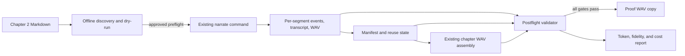
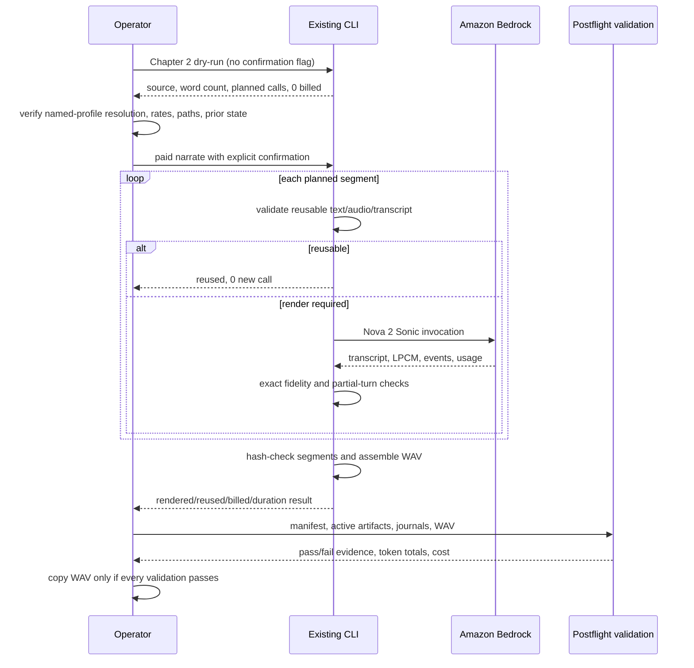

# Design Document: Chapter 2 Audio Proof

## Overview

This operational workflow uses the existing Python audiobook CLI to render Chapter 2 once with Tiffany and Amazon Nova 2 Sonic in `us-east-1`, validate exact transcript fidelity, assemble the chapter WAV, create a proof-listening copy, and record auditable usage and cost evidence. It changes no narration code, dependencies, prose, Chapter 1 artifact, or novel-spec artifact.

The workflow is fail-closed: nonbillable inspection and dry-run planning precede the only paid command; postflight delivery occurs only after every active segment and the assembled WAV pass validation. Existing valid Chapter 2 segments are reused by the tool rather than billed again.

## Verified Inputs and Deliverables

| Item | Contract |
|---|---|
| Workspace | `/Users/jessica/Documents/frontier-book` |
| Command working directory | `/Users/jessica/Documents/frontier-book/audiobook-studio` |
| Chapter source | `The Final Frontier Novel/chapters/discovery-part/discovery-part-002-an-ordinary-morning.md` |
| Verified source header | `chapter: 2`, `pov_id: POV-NIA`, `words: 1137`, `status: revised` |
| Runtime | existing `audiobook-studio/.venv/bin/python -m frontier_audiobook` |
| Model and region | `amazon.nova-2-sonic-v1:0`, `us-east-1` |
| Voice/profile/segmentation | `tiffany`, `frontier-audiobook`, target `5` words |
| Build root | `audiobook-studio/build/narration/chapter-002-tiffany/` |
| Manifest | `audiobook-studio/build/narration/chapter-002-tiffany/manifest.json` |
| Assembled WAV | `audiobook-studio/build/narration/chapter-002-tiffany/chapter-002-tiffany.wav` |
| Proof copy | `voice-samples/chapter-2-tiffany-proof.wav` |
| Evidence report | `audiobook-studio/build/narration/chapter-002-tiffany/chapter-002-tiffany-proof-report.md` |

The proof copy must be byte-identical to the assembled WAV. The report is local build evidence and may contain only the fixed profile label, identity-resolution pass/fail value, and timestamp from the non-model identity call; it must contain no account ID, ARN, role identifier, access key, credential value, other returned identity detail, or transcript body.

## Architecture



## Components and Interfaces

The workflow coordinates existing runtime and operational components; it introduces no new narration component, dependency, or service.

### Existing Audiobook CLI

**Purpose:** Discover Chapter 2, plan narration without billing, render or reuse segment artifacts, validate accepted segment output, and assemble the chapter WAV.

#### Nonbillable preflight interface

Run from `audiobook-studio/`:

```bash
.venv/bin/python -m frontier_audiobook audition narrate \
  --chapter 2 \
  --voice tiffany \
  --max-words 5 \
  --dry-run
```

Preflight also verifies the exact source path, restricted header, declared/body word count, model configuration, `us-east-1`, Tiffany availability, successful resolution of the exact named profile `AWS_PROFILE=frontier-audiobook` through a non-model identity call, output isolation, available disk space, and whether a Chapter 2 manifest already contains reusable or unresolved artifacts. The successful non-model identity call is sufficient; Preflight does not inspect or gate on credential type, source, age, expiration, or lifetime. Preflight must not alter the source or make a Bedrock call.

#### Paid render/resume interface

Run only after preflight passes and paid execution is explicitly authorized:

```bash
AWS_PROFILE=frontier-audiobook \
.venv/bin/python -m frontier_audiobook audition narrate \
  --chapter 2 \
  --voice tiffany \
  --max-words 5 \
  --confirm-paid-render
```

The command intentionally omits `--accept-verbatim-prefix`; every accepted active segment therefore requires an exact normalized transcript match. The CLI revalidates intact matching artifacts and reports them as `reused`; only missing or rejected segments enter a new billable call. The command itself performs final chapter assembly after all segments pass.

### Amazon Bedrock Runtime

**Purpose:** Supply Nova 2 Sonic transcript, LPCM audio, event, and usage output for segments that require narration.

**Interface contract:** The runtime is invoked only by the explicitly confirmed paid command, in `us-east-1`, through the `frontier-audiobook` profile, using model `amazon.nova-2-sonic-v1:0` and voice `tiffany`.

### Postflight Validator

**Purpose:** Read the Chapter 2 source, manifest, active artifacts, event journals, and assembled WAV; enforce the delivery gate; and derive fidelity, usage, duration, hash, and cost evidence without changing narration code or source prose.

**Interface contract:** Validation consumes the artifact models defined below. Any missing, malformed, ambiguous, mismatched, or internally inconsistent input produces a failed delivery gate rather than an estimated or partial success.

### Proof Delivery and Evidence Reporter

**Purpose:** Copy the validated assembled WAV to the proof destination and write the local evidence report.

**Interface contract:** Delivery occurs only after postflight passes. The proof copy must be byte-identical to the assembled WAV. The report may persist only the fixed profile label, identity-resolution pass/fail value, and timestamp from the non-model identity call and must omit every other returned identity detail, including account IDs, ARNs, role identifiers, access keys, and credential values; it must also omit transcript bodies.

## Workflow and Gates



The hard gates are:

1. **Preflight gate:** zero billable calls, exact Chapter 2 source, expected configuration, successful non-model identity resolution with the exact named profile `AWS_PROFILE=frontier-audiobook`, and no unresolved or ambiguous prior artifact state.
2. **Paid gate:** the exact command includes `AWS_PROFILE=frontier-audiobook` and `--confirm-paid-render`; no automatic retry follows a failure or uncertain call.
3. **Delivery gate:** all active segments are exact, event-bound, hash-valid, and assembled; only then may the proof copy and final report be produced.

## Data Models

The workflow validates the existing Chapter 2 artifact and evidence models rather than introducing a second manifest or changing runtime schemas.

### Chapter Manifest

Postflight validates the existing manifest rather than inventing a second manifest. Required top-level values are:

```python
EXPECTED = {
    "chapter": 2,
    "voice_id": "tiffany",
    "chapter_path": "The Final Frontier Novel/chapters/discovery-part/discovery-part-002-an-ordinary-morning.md",
    "target_segment_words": 5,
    "chapter_audio_path": "audiobook-studio/build/narration/chapter-002-tiffany/chapter-002-tiffany.wav",
}
```

Validation additionally requires:

- `source_sha256` and `spoken_sha256` match a fresh read through existing manuscript transformation rules;
- `segment_count == len(segments)`, segment IDs are unique and contiguous, and each active segment has `status == "narrated"`;
- every active segment has `exact_transcript_match == true`, `coverage_ratio == 1.0`, and zero `mid_sentence_partial_turns`;
- every active audio path, transcript path, and event journal is inside the Chapter 2 build root and corresponds to the active audio stem;
- recorded audio hashes match bytes on disk, transcript comparison remains exact, and event replay reconstructs the accepted transcript/audio;
- the chapter WAV hash, frame-derived duration, 24 kHz sample rate, 16-bit sample size, and mono channel count match the manifest/configuration.

`carried_over_segments` are historical evidence only. They are excluded from active segment counts, assembly, fidelity totals, and active-artifact token totals.

### Event Journal and Token Totals

For each active segment, resolve exactly one event journal at `events/<active-audio-stem>.jsonl`. Parse every `usageEvent` and sum only these integer delta fields:

```python
TokenTotals = dict[
    str, int  # input_speech, input_text, output_speech, output_text
]
```

For each journal, the sum of `details.delta` by modality must equal the final `details.total` by modality. The combined input/output sums must also agree with the terminal top-level token totals. Cumulative `details.total`, `totalInputTokens`, `totalOutputTokens`, and `totalTokens` values must not be summed across events.

Aggregate two scopes:

- **Active-artifact totals:** one validated journal for every active segment, including reused segments; this is the token basis attributable to the delivered WAV.
- **Current-execution totals:** journals for segments reported as newly `narrated` in this invocation; reused segments contribute zero new billed calls and zero current-execution cost.

Duplicate, missing, malformed, unbound, or internally inconsistent journals fail the delivery gate.

### Cost Evidence

The report records exact four-modality token totals, official rate source URL, rate retrieval date/effective date, USD rate per 1,000 tokens, per-modality subtotal, and total. Use decimal arithmetic:

```python
cost = sum(
    Decimal(token_totals[modality]) * Decimal(rate_per_1k[modality]) / Decimal(1000)
    for modality in ("input_speech", "input_text", "output_speech", "output_text")
)
```

The official `us-east-1` Amazon Bedrock offer snapshot available during design records these Nova Sonic 2.0 on-demand rates:

| Modality | USD per 1K tokens |
|---|---:|
| Input speech | `0.003` |
| Input text | `0.00033` |
| Output speech | `0.012` |
| Output text | `0.00275` |

Execution must re-check the current official rates before calculating. The report labels both active-artifact and current-execution totals as **computed pre-tax service cost**. A separate `Cost Explorer / invoice confirmation` line must say `pending`, `not performed`, or contain a later confirmed amount and date; computed cost must never be presented as invoice confirmation.

### Proof Report

`chapter-002-tiffany-proof-report.md` contains:

- source path plus source/spoken hashes, model, region, voice, profile label, segmentation target, and timestamps;
- manifest validation result and assembled/proof-copy SHA-256 values;
- exact/fidelity counts, zero partial-turn count, duration, total segments, newly billed calls, and reused segments;
- active-artifact and current-execution token tables with all four modalities;
- official rate evidence, formulas, per-modality subtotals, pre-tax totals, and independent billing-confirmation status;
- a statement that Chapter 1 artifacts, prose, tooling, dependencies, and the existing novel spec were not modified.

## Correctness Properties

*A correctness property states an invariant that must hold across every applicable artifact or execution. The properties below cover deterministic local validation; fixed preflight checks, external AWS behavior, and report presentation use smoke, integration, example, or edge-case validation instead.*

### Property 1: Active manifest set is complete and unambiguous

For any final Chapter 2 manifest, `segment_count` equals the active `segments` collection length, active identifiers form one unique contiguous sequence in assembly order, and no `carried_over_segments` record contributes to active fidelity, assembly, segment, or token totals.

**Validates: Requirements 3.2, 3.3, 3.7**

### Property 2: Active segment fidelity is exact

For any Active_Segment in the final Chapter 2 manifest, the recorded status and coverage indicate exact acceptance with zero mid-sentence partial turns, the recorded audio hash equals the segment WAV bytes, and replaying the bound Event_Journal reconstructs the accepted FINAL transcript and audio.

**Validates: Requirements 3.4, 3.5, 3.6**

### Property 3: Assembly integrity is preserved

For any ordered Active_Segment sequence accepted for Chapter 2, Chapter_WAV is assembled from exactly that sequence under the recorded stitching profile, uses 24 kHz 16-bit mono audio, and has a recorded SHA-256 and duration equal to the file bytes and frame-derived duration.

**Validates: Requirements 4.1, 4.2, 4.3, 4.4**

### Property 4: Reuse is excluded from current execution usage

For any Paid_Render invocation and any matching intact segment classified as a Reused_Segment, accepted artifact hashes remain unchanged, the Reused_Segment contributes zero new billable calls and zero Current_Execution_Totals, and the current-execution journal set contains exactly the newly narrated segments.

**Validates: Requirements 2.4, 2.5, 5.6, 5.7, 5.8**

### Property 5: Journal aggregation is exact

For any final Active_Segment set, exactly one bound Event_Journal exists per Active_Segment; for every journal, modality-specific usage delta sums equal terminal modality and combined totals; and aggregating each validated active journal once yields Active_Artifact_Totals without cumulative-field or carried-over double counting.

**Validates: Requirements 5.1, 5.2, 5.3, 5.4, 5.5**

### Property 6: Proof delivery preserves audio

For any Chapter_WAV admitted through the Delivery_Gate, copying Chapter_WAV to `voice-samples/chapter-2-tiffany-proof.wav` produces a Proof_Copy with the same byte count, complete byte sequence, and SHA-256 hash.

**Validates: Requirements 4.5, 4.6**

### Property 7: Cost is modality-complete and billing-distinct

For any validated Active_Artifact_Totals or Current_Execution_Totals and corresponding four Official_Rates, each modality subtotal equals `tokens × rate_per_1k ÷ 1000`, Computed_Pre_Tax_Service_Cost equals the decimal sum of all four subtotals, and Billing_Confirmation remains a separately labeled status or amount.

**Validates: Requirements 6.3, 6.4, 6.5, 6.6, 6.7**

## Error Handling

| Condition | Response |
|---|---|
| Source path/header/hash differs after preflight | Stop before another paid call; do not edit prose. |
| The exact named profile fails the non-model identity call, or permission, model, or region is wrong | Stop before paid render and resolve outside the spec artifacts. |
| Prior artifact is charge-uncertain, malformed, or ambiguous | Stop; inspect retained evidence. Do not rerun automatically or overwrite. |
| Exact transcript, event replay, or partial-turn validation fails | Keep build evidence quarantined; do not assemble/copy/report success. |
| Manifest/hash/WAV validation fails | Do not copy the proof WAV; record the blocking discrepancy. |
| Journal totals are missing or inconsistent | Do not estimate tokens or cost; fail the report gate. |
| Official rates cannot be verified | Report tokens but leave computed cost blocked; do not substitute third-party rates. |
| Proof destination already differs from validated WAV | Stop rather than overwrite without explicit operator review. |

## Testing Strategy

Testing is layered so nonbillable checks and deterministic local validation surround the single explicitly authorized external-service execution:

- **Preflight/smoke:** source discovery, restricted-header parsing, config values, dry-run output with `billable_calls_made: 0`, successful non-model identity resolution with the exact named profile, and destination isolation.
- **Integration:** one explicitly confirmed Chapter 2 render/resume through the existing CLI and Amazon Bedrock.
- **Deterministic postflight:** manifest schema/value checks, source and artifact hashes, event replay, exact transcript comparison, WAV metadata/duration, journal reconciliation, cost arithmetic, and byte-identical proof-copy verification.
- **Human proof-listening:** listening is the purpose of the copy but is outside automated fidelity acceptance; no subjective result changes transcript/hash validation.

No property-based test suite or narration-code change is introduced: this is a one-chapter external-service execution using existing validated code, with deterministic checks over the produced evidence.

## Security, Cost, and Isolation

- Use only the exact named profile `AWS_PROFILE=frontier-audiobook`, which is user-approved as a valid static-credential profile and is not SSO. Require only that the profile resolve successfully through a non-model identity call and that the same exact profile be used for the paid command; credential type, age, expiration, and lifetime are not acceptance criteria. In every evidence artifact, persist only the profile label, identity-resolution pass/fail value, and timestamp from the identity call—never an account ID, ARN, role identifier, access key, credential value, or other returned identity detail.
- The paid command is singular and explicit. A failed or uncertain invocation is inspected before any possible retry.
- Build artifacts remain under ignored `audiobook-studio/build/`; only the requested proof WAV is copied to `voice-samples/`.
- Do not modify `The Final Frontier Novel/`, `.kiro/specs/The-Final-Frontier-novel/`, `audiobook-studio/src/`, dependency files, `voice-samples/chapter-1-*`, or `audiobook-studio/build/narration/chapter-001-*`.

## Dependencies

No new dependency is allowed. Use the existing Python 3.12 virtual environment, `frontier_audiobook` package, pinned Bedrock runtime SDK, Python standard library for validation/decimal arithmetic, AWS profile, and local filesystem.

## Sources

Pricing is checked against the [official Amazon Nova pricing page](https://aws.amazon.com/nova/pricing/) and the [official Amazon Bedrock `us-east-1` regional offer index](https://pricing.us-east-1.amazonaws.com/offers/v1.0/aws/AmazonBedrock/current/us-east-1/index.json). Repository behavior is derived from the local CLI, narration, manuscript, configuration, Chapter 1 manifest, and README files inspected for this design.

Content from external sources was rephrased for compliance with licensing restrictions.
