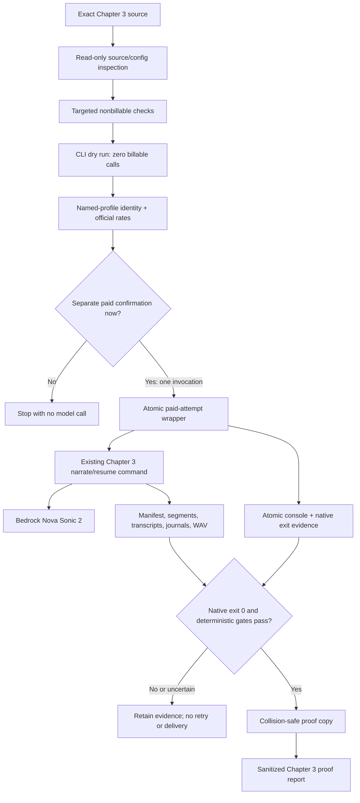

# Design Document: Chapter 3 Audio Proof

## Overview

This specification plans a guarded, paid proof-listening render of Chapter 3 with the existing Python 3.12 audiobook CLI, Tiffany, and Amazon Nova Sonic 2. The workflow performs source and configuration inspection, a nonbillable dry run, minimal named-profile identity verification, current official rate verification, one separately confirmed paid render/resume attempt, deterministic artifact validation, token and cost accounting, and collision-safe proof delivery.

The workflow is fail-closed around the paid boundary. Creating or approving this specification does **not** authorize a paid call. Immediately before the only paid leaf, the executor must obtain a separate explicit confirmation for one Chapter 3 invocation. A failed or charge-uncertain attempt is retained and never retried automatically.

Chapter 3 proof work is isolated from publishing work. Front matter and title-page implementation for the written and audiobook editions is a separate publishing workstream already requested by the user and is intentionally absent from this specification and its implementation tasks.

## Verified Source and Runtime Contract

All values in this section were derived by read-only local inspection during specification creation. Execution preflight must re-read and re-verify the same values; any drift blocks the paid leaf until the specification or source is deliberately reconciled.

### Restricted header

| Field | Actual Chapter 3 value |
|---|---|
| Source path | `The Final Frontier Novel/chapters/discovery-part/discovery-part-003-the-failed-check.md` |
| `movement` | `discovery_part` |
| `chapter` | `3` |
| `pov_id` | `POV-MARA` |
| `timeline_id` | `TL-DECEMBER-RECEIVE` |
| `motif_events` | `[]` |
| `hook` | `The check she built to kill the result kills the wrong thing, and the eight seconds survive it as hers.` |
| `words` | `1192` |
| `length_class` | `normal` |
| `status` | `revised` |

### Measured source contracts

| Measurement | Actual value |
|---|---:|
| Normalized Prose Body word count | `1192` |
| Spoken token count under `frontier-word-sequence-v1` | `1193` |
| Local planner segment count at target `5` | `91` |
| Narration-only-punctuation segments | `10` |
| Largest locally planned segment | `30` spoken tokens |
| Raw source-file SHA-256 | `ddaff1d45d28b8996845301be56ee91afc22a2f211e0e8bf42bb53384cb74d9f` |
| Normalized Prose Body SHA-256 | `a07e7dff0cceea845107eb49958c84092754daa5531ec794ea5325adfe546d45` |
| Spoken-text SHA-256 | `a78247a0639799d40d66a16c5d27bc0c67dd64f42d589c7a72e132e39e59cfa7` |

The Prose Body count is `len(body.split())` after strict UTF-8 decoding, LF normalization, and NFC normalization. The spoken count is the length of `normalized_tokens(markdown_to_spoken(body))`; it is therefore intentionally distinct from the whitespace count. The segmentation value `5` is a soft packing target, not a hard upper bound: the existing safe-turn policy preserves sentences and may produce larger segments up to its fixed safety limits.

### Reused runtime contract

| Item | Contract |
|---|---|
| Workspace | `/Users/jessica/Documents/frontier-book` |
| Command working directory | `/Users/jessica/Documents/frontier-book/audiobook-studio` |
| Runtime | existing `audiobook-studio/.venv/bin/python -m frontier_audiobook` |
| Configuration | `audiobook-studio/config/audition.toml` |
| Inspected configuration SHA-256 | `640e8c29b18b92af28c861b54f51f587fb1f618a59605eb740fc532f9ce3e69f` |
| Model | `amazon.nova-2-sonic-v1:0` |
| Region | `us-east-1` |
| Voice | `tiffany` |
| Profile label | `frontier-audiobook` |
| Segmentation target | `--max-words 5` |
| Fidelity policy | exact normalized token sequence; omit `--accept-verbatim-prefix` |
| Output format | 24,000 Hz, 16-bit, mono PCM WAV |
| Paid retry policy | no automatic retry |

## Outputs and Mutation Boundary

| Artifact | Path |
|---|---|
| Build root | `audiobook-studio/build/narration/chapter-003-tiffany/` |
| Evidence root | `audiobook-studio/build/narration/chapter-003-tiffany/evidence/` |
| Manifest | `audiobook-studio/build/narration/chapter-003-tiffany/manifest.json` |
| Assembled WAV | `audiobook-studio/build/narration/chapter-003-tiffany/chapter-003-tiffany.wav` |
| Proof copy | `voice-samples/chapter-3-tiffany-proof.wav` |
| Proof report | `audiobook-studio/build/narration/chapter-003-tiffany/chapter-003-tiffany-proof-report.md` |
| Paid-attempt bundle | `audiobook-studio/build/narration/chapter-003-tiffany/evidence/paid-attempt-001/` |

The workflow write allowlist contains only the Chapter 3 build root and, after the Delivery Gate passes, the Chapter 3 proof-copy path. The specification directory is written only during planning, before execution begins. Chapter 1 and Chapter 2 build trees and proof files are immutable inputs to the isolation check.

## Architecture



### Paid-attempt sequence

```mermaid
sequenceDiagram
    participant O as Operator
    participant W as Paid Attempt Wrapper
    participant C as Existing CLI
    participant B as Bedrock
    participant V as Postflight Validator

    O->>O: Complete all nonbillable gates
    O->>O: Confirm exactly one paid Chapter 3 invocation
    O->>W: Start attempt-001 only
    W->>W: Create same-filesystem staging directory
    W->>C: Spawn exact paid command with named profile
    loop each planned active segment
        C->>C: Revalidate matching reusable artifact
        alt intact reusable artifact
            C-->>W: reused, zero new call
        else render required
            C->>B: one Nova invocation
            B-->>C: transcript, LPCM, events, usage
            C->>C: exact fidelity and partial-turn checks
        end
    end
    C->>C: Assemble Chapter 3 WAV
    C-->>W: Final CLI summary and native process exit
    W->>W: fsync log + result + directory; atomic directory rename
    W-->>O: Committed attempt bundle or retained uncertain staging
    O->>V: Replay and validate all active artifacts
    V-->>O: Delivery Gate pass/fail
```

## Components and Interfaces

### Source Contract Inspector

**Purpose:** Resolve exactly one Chapter 3 file and derive the restricted-header, normalized-body, spoken-token, hash, and local segmentation contracts using existing repository functions.

**Interface:**

```python
@dataclass(frozen=True)
class SourceSnapshot:
    path: str
    restricted_header: dict[str, str]
    raw_file_sha256: str
    body_sha256: str
    spoken_sha256: str
    body_word_count: int
    spoken_token_count: int
    planned_segment_count: int
    narration_only_punctuation_segments: int
```

The inspector is read-only. The paid leaf requires a new snapshot equal to the approved preflight snapshot.

### Protected-Path Inventory

**Purpose:** Preserve prior audio/spec/tooling work while distinguishing workflow-owned writes from pre-existing or concurrent manuscript edits.

Each inventory record contains a workspace-relative path, kind, existence, byte count, SHA-256, Git status at capture, and attribution state. Records are retained per file; a group aggregate may be included for convenience but cannot be the sole delivery gate.

```python
Attribution = Literal[
    "pre-existing",
    "workflow-owned",
    "concurrent-or-unattributed",
    "unchanged",
]

@dataclass(frozen=True)
class FileInventoryRecord:
    path: str
    kind: str
    exists: bool
    size_bytes: int | None
    sha256: str | None
    git_status: str | None
    attribution: Attribution
```

Hard immutability applies to:

- the exact Chapter 3 source after preflight;
- `audiobook-studio/src/frontier_audiobook/`, configuration, dependency locks, and relevant tests/tools;
- `.kiro/specs/The-Final-Frontier-novel/` and `.kiro/specs/chapter-2-audio-proof/`;
- all Chapter 1 and Chapter 2 narration build trees and proof audio files.

Other manuscript files are inventoried per file. A changed non-Chapter-3 manuscript path is reported as `concurrent-or-unattributed` and does not fail Chapter 3 solely because a whole-novel aggregate changed. The workflow never claims such a change is unrelated without evidence. Any task-owned write outside the allowlist fails isolation.

### Nonbillable Planner

**Purpose:** Verify the local plan without a model call.

Run from `audiobook-studio/`:

```bash
.venv/bin/python -m frontier_audiobook audition narrate \
  --chapter 3 \
  --voice tiffany \
  --max-words 5 \
  --dry-run
```

Expected output includes chapter `3`, voice `tiffany`, `word_count: 1193`, `planned_calls: 91`, and `billable_calls_made: 0`. The dry run does not require the AWS profile and must not include `--confirm-paid-render`.

### External Preflight Verifier

**Purpose:** Resolve the exact profile through one non-model identity call and capture current official pricing without invoking Bedrock Runtime.

The identity evidence persists only:

```json
{
  "profile_label": "frontier-audiobook",
  "identity_resolved": true,
  "checked_at_utc": "<timestamp>"
}
```

Account IDs, ARNs, user or role identifiers, access keys, credential values, credential source/type/age/expiry, and every other returned identity field are forbidden in evidence. Successful resolution is the sole credential acceptance criterion.

Official pricing comes from the current Amazon Bedrock `us-east-1` offer for Nova Sonic 2.0 on-demand inference. All four rates—input speech, input text, output speech, and output text—must be present with source URL, publication/retrieval/effective dates, model, region, unit, and currency. The accepted Chapter 2 values (`0.003`, `0.00033`, `0.012`, and `0.00275` USD per 1K tokens respectively) are reference values only; execution uses them only if the current official offer confirms them.

### Atomic Paid Attempt Wrapper

**Purpose:** Eliminate the Chapter 2 ambiguity in which a complete CLI summary existed but the native process status was unavailable.

The wrapper uses only the Python standard library and lives under the Chapter 3 evidence root. Before any paid call, targeted nonbillable self-checks run the wrapper against synthetic exit `0` and nonzero commands. The real attempt is `attempt-001`; the wrapper refuses a second attempt ID.

The wrapper contract is:

1. Refuse to start if a committed attempt, staging attempt, or ambiguity marker already exists.
2. Create a same-filesystem staging directory such as `.paid-attempt-001.staging-<nonce>`.
3. Spawn the exact CLI as a direct child process with `AWS_PROFILE=frontier-audiobook`; do not invoke through a pipeline whose status could be lost.
4. Tee the combined child stdout/stderr to the operator and a staging `render-console.log`.
5. Wait for the child and capture the native integer `returncode` directly from `subprocess.Popen.wait()`.
6. Write `attempt.json` containing the exact argv, working directory, profile label, timestamps, native return code, termination signal if applicable, console SHA-256, and sanitization facts. Do not persist the environment or credentials.
7. Flush and `fsync` the log, result file, and staging directory.
8. Atomically rename the staging directory to `paid-attempt-001` on the same filesystem.

A committed paid attempt is valid only when both files exist, their recorded hashes reconcile, and `native_return_code` is an integer. A staging directory left after child launch, a missing result, a missing native status, wrapper interruption, or an inconsistent hash is **charge-uncertain**. Charge uncertainty blocks postflight success, proof delivery, and every retry under this specification.

### Existing Audiobook CLI and Bedrock Runtime

The separately confirmed paid command is exactly:

```bash
AWS_PROFILE=frontier-audiobook \
.venv/bin/python -m frontier_audiobook audition narrate \
  --chapter 3 \
  --voice tiffany \
  --max-words 5 \
  --confirm-paid-render
```

The command intentionally omits `--accept-verbatim-prefix`. The existing CLI may reuse intact matching Chapter 3 segments; only a missing or rejected segment may enter one new model call in this invocation. A nonzero native exit, fidelity failure, partial turn, process interruption, or uncertain charge state stops the workflow without automatic retry.

### Postflight Validator

**Purpose:** Deterministically replay and validate the source, atomic paid-attempt evidence, manifest, active artifacts, event journals, assembled WAV, usage totals, and cost evidence.

Validation is read-only except for evidence files under the Chapter 3 build root. Missing, malformed, duplicate, ambiguous, unbound, or inconsistent evidence fails the Delivery Gate; no value is estimated.

### Proof Deliverer and Reporter

**Purpose:** Copy the validated Chapter WAV to the clearly named proof path and produce a sanitized report.

If the proof path is absent, copy and verify. If it already contains identical bytes, retain and record `already-identical`. If it exists with a different hash, stop without overwrite. Listening feedback is recorded only as supplemental evidence after deterministic checks; listening can neither waive nor replace a failed check.

## Data Models

### Chapter Manifest Contract

The final existing manifest must contain these fixed values:

```python
EXPECTED = {
    "chapter": 3,
    "voice_id": "tiffany",
    "chapter_path": "The Final Frontier Novel/chapters/discovery-part/discovery-part-003-the-failed-check.md",
    "source_sha256": "a07e7dff0cceea845107eb49958c84092754daa5531ec794ea5325adfe546d45",
    "spoken_sha256": "a78247a0639799d40d66a16c5d27bc0c67dd64f42d589c7a72e132e39e59cfa7",
    "word_count": 1193,
    "segment_count": 91,
    "narration_only_punctuation_segments": 10,
    "target_segment_words": 5,
    "chapter_audio_path": "audiobook-studio/build/narration/chapter-003-tiffany/chapter-003-tiffany.wav",
}
```

Execution must fail before or during the paid boundary if a deliberate source edit makes these values stale. The source contract must be updated explicitly rather than silently accepting drift.

For the final active set:

- `segment_count == len(segments) == 91`;
- identifiers are unique and contiguous from `0001` through `0091` in assembly order;
- each active record has `status == "narrated"`, `exact_transcript_match == true`, `coverage_ratio == 1.0`, and `mid_sentence_partial_turns == 0`;
- segment text token concatenation equals the 1,193-token spoken sequence;
- each audio/transcript/event path is inside the Chapter 3 build root and bound by active audio stem;
- every recorded hash equals the current bytes;
- replay reconstructs accepted FINAL text and LPCM audio;
- `carried_over_segments` are historical only and excluded from active segment, fidelity, assembly, and token totals.

### Paid Attempt Evidence

```json
{
  "schema_version": 1,
  "attempt_id": "paid-attempt-001",
  "started_at_utc": "<timestamp>",
  "ended_at_utc": "<timestamp>",
  "working_directory": "/Users/jessica/Documents/frontier-book/audiobook-studio",
  "argv": [".venv/bin/python", "-m", "frontier_audiobook", "audition", "narrate", "--chapter", "3", "--voice", "tiffany", "--max-words", "5", "--confirm-paid-render"],
  "profile_label": "frontier-audiobook",
  "native_return_code": 0,
  "termination_signal": null,
  "console_path": "render-console.log",
  "console_sha256": "<sha256>",
  "automatic_retry_performed": false,
  "accept_verbatim_prefix": false
}
```

The committed directory is the atomic unit. The final CLI summary is parsed only after native return code `0`; a summary never substitutes for process status.

### Event Journals and Token Totals

Resolve exactly one `events/<active-audio-stem>.jsonl` per active segment. For each journal, sum only integer `usageEvent.details.delta` values for:

```python
MODALITIES = (
    "input_speech",
    "input_text",
    "output_speech",
    "output_text",
)
```

Each modality delta sum must equal its terminal `details.total`. Combined input/output sums must equal terminal top-level input, output, and total token values. Cumulative totals are reconciliation values and are never added across events.

Two scopes are reported:

- **Active Artifact Totals:** each validated active journal exactly once, including reused segments;
- **Current Execution Totals:** only journals for segments newly narrated during `paid-attempt-001`; reused segments contribute zero new calls and zero current-execution tokens.

### WAV and Proof-Copy Contract

The assembled WAV must be 24,000 Hz, 16-bit, mono, uncompressed PCM. Its recorded hash and duration must match the bytes and frame-derived duration. Assembly order and stitching profile must match the final active set. The proof copy must have the same byte count, complete byte sequence, and SHA-256 as the assembled WAV.

### Cost Evidence

For each token scope, calculate with `Decimal` and current official four-modality rates:

```python
subtotal[modality] = (
    Decimal(tokens[modality])
    * Decimal(rate_per_1k[modality])
    / Decimal(1000)
)
computed_pre_tax_service_cost = sum(subtotal.values())
```

Persist tokens, exact decimal rates, formulas, unrounded subtotals, sum, official provenance, and verification timestamp. `Cost Explorer / invoice confirmation` is a separate field with `pending`, `not performed`, or a confirmed amount and date. Computed service cost is never labeled as billing confirmation.

### Proof Report

The report includes:

- Chapter 3 source/header/count/hash contract and runtime parameters;
- minimal identity record and execution timestamps;
- exact paid argv, committed native return code, console hash, and no-retry status;
- active-set, fidelity, replay, assembly, reuse, journal, cost, isolation, and proof-copy results;
- all four token modalities for both scopes;
- official rates and computed pre-tax costs, separately from billing confirmation;
- targeted test/check results and separately labeled broader-suite status or failures;
- optional listening status labeled supplemental;
- a statement that Chapter 1/2 audio, Chapter 2 spec, governing novel spec, narration source/dependencies, and front-matter/title-page work were not modified by this workflow.

The report contains no transcript or prose body and no identity detail beyond the fixed profile label, pass/fail value, and timestamp.

## Correctness Properties

*A correctness property is a behavior that must hold across every applicable input, artifact, or execution state. These properties are exercised with deterministic local fixtures and produced evidence; they do not authorize randomized or repeated external-service calls.*

### Property 1: Source plan conserves the spoken sequence

For any approved Chapter 3 source snapshot, transforming and segmenting the source with the configured rules produces exactly 1,193 normalized Spoken_Tokens across exactly 91 ordered segments, and concatenating all segment token sequences reproduces Spoken_Text without insertion, deletion, or reordering.

**Validates: Requirements 1.5, 6.4**

### Property 2: Attempt state is definitive or explicitly uncertain

For any observed Chapter 3 prior-artifact or `paid-attempt-001` state, the workflow assigns exactly one state from absent, reusable, rejected, or Charge_Uncertain; after a child process launches, a valid committed Paid_Attempt_Bundle contains a hash-matched console log and schema-valid result with the direct child's integer native return code, while every staging, missing, interrupted, nonzero, or inconsistent state blocks retry and delivery.

**Validates: Requirements 3.6, 3.7, 5.8, 5.9, 5.10, 5.11, 5.12, 5.13, 5.14, 5.15**

### Property 3: Active manifest set is complete and unambiguous

For any final Chapter_3_Manifest, fixed source and plan fields equal Source_Snapshot, `segment_count` equals the Active_Segment collection length, identifiers form one unique contiguous sequence from `0001` through `0091`, active text covers the approved Spoken_Text sequence, and no carried-over record contributes to active fidelity, assembly, segment, or token totals.

**Validates: Requirements 6.1, 6.2, 6.3, 6.4, 6.8**

### Property 4: Active segment fidelity is exact

For any Active_Segment, recorded acceptance fields indicate Exact_Fidelity with zero mid-sentence partial turns, recorded hashes equal current bytes, and replaying the bound Event_Journal reconstructs the accepted FINAL transcript and LPCM audio.

**Validates: Requirements 6.5, 6.6, 6.7**

### Property 5: Assembly integrity is preserved

For any accepted ordered Active_Segment set, Chapter_WAV is assembled from exactly that set under the recorded stitching profile, is 24 kHz 16-bit mono uncompressed PCM, and has a recorded SHA-256 and duration equal to the bytes and frame-derived duration.

**Validates: Requirements 7.1, 7.2, 7.3, 7.4**

### Property 6: Reuse is excluded from current execution usage

For any rendered/reused partition, every matching intact Reused_Segment retains accepted artifact hashes, contributes zero new billable calls and zero Current_Execution_Totals, every newly narrated segment contributes at most one call, and the current-execution journal set equals exactly the newly narrated segment set.

**Validates: Requirements 5.6, 5.7, 8.6, 8.7, 8.8**

### Property 7: Journal aggregation is exact

For any final Active_Segment set, exactly one bound Event_Journal exists per Active_Segment; only integer modality deltas contribute; each journal's modality and combined delta sums reconcile with terminal totals; and aggregating every validated active journal exactly once yields Active_Artifact_Totals without cumulative-field or carried-over double counting.

**Validates: Requirements 8.1, 8.2, 8.3, 8.4, 8.5**

### Property 8: Proof delivery preserves audio and collision safety

For any Chapter_WAV admitted through Delivery_Gate, an absent Proof_Copy is copied byte-for-byte, an identical Proof_Copy is retained without mutation, and a different existing Proof_Copy remains unchanged while delivery reports a collision failure; every successful delivery has equal byte counts, complete bytes, and SHA-256 values.

**Validates: Requirements 7.5, 7.6, 7.7, 7.8**

### Property 9: Cost is modality-complete and billing-distinct

For any validated Active_Artifact_Totals or Current_Execution_Totals and corresponding four current Official_Rates, each rate record has complete official provenance, every modality subtotal equals `tokens × rate_per_1k ÷ 1000`, Computed_Pre_Tax_Service_Cost equals the exact Decimal sum of all four subtotals, and Billing_Confirmation remains a separately labeled value.

**Validates: Requirements 4.6, 9.2, 9.3, 9.4, 9.5, 9.6**

### Property 10: Scoped isolation is per-file and attributable

For any preflight and postflight Per_File_Inventory pair, every record has the required typed fields, every workflow-owned path is inside Workflow_Write_Allowlist, Chapter_3_Source and every hard Protected_Artifact retain their preflight per-file hashes, and each changed non-source manuscript path without workflow ownership is reported as concurrent-or-unattributed without a whole-novel aggregate becoming the sole gate.

**Validates: Requirements 2.2, 2.4, 2.5, 2.6, 2.7, 2.8, 2.9, 2.10, 2.11, 10.11, 10.13**

### Property 11: Evidence sanitization follows explicit allowlists

For any identity response and generated evidence set, persisted identity-derived data contains only Named_AWS_Profile label, identity-resolution boolean, and timestamp, and no evidence/report artifact contains a transcript body, prose body, account ID, ARN, user or role identifier, access key, credential value, or other nonpermitted identity detail.

**Validates: Requirements 4.3, 4.4, 10.10**

## Error Handling

| Condition | Required response |
|---|---|
| Source path, restricted header, count, hash, or local plan differs | Stop before paid confirmation; do not edit prose. |
| Targeted nonbillable checks fail | Stop before identity/model work; record exact targeted failures. |
| Broader unrelated test suite fails | Report separately; do not use as the Chapter 3 gate unless a failure overlaps a targeted contract. |
| Named profile does not resolve | Stop before paid confirmation; retain only minimal identity evidence. |
| A current official rate is missing or ambiguous | Stop cost approval; do not substitute a third-party rate. |
| Confirmation is absent or stale | Stop with no model call; specification creation is not authorization. |
| Paid wrapper staging or committed evidence is ambiguous | Mark charge-uncertain; do not retry, copy, or report success. |
| Native return code is nonzero | Preserve attempt evidence and stop without retry. |
| Exact transcript, replay, hash, partial-turn, or manifest check fails | Quarantine Chapter 3 outputs; block assembly/delivery success. |
| Chapter 3 source changes after preflight | Existing CLI/source checks and postflight block continuation; require deliberate reconciliation. |
| Unrelated manuscript file changes concurrently | Report changed paths per file as concurrent or unattributed; do not fail solely on a whole-novel aggregate mismatch. |
| Workflow-owned write occurs outside the allowlist | Fail isolation and delivery. |
| Chapter 1/2 audio or protected spec changes | Fail isolation and delivery. |
| Proof destination differs | Leave destination unchanged and stop before report success. |
| Listening feedback conflicts with deterministic evidence | Deterministic failure remains blocking; listening is supplemental only. |

## Testing Strategy

### Targeted pre-paid checks

Run only checks that exercise affected contracts, using exact test node IDs where available:

- paid authorization fails closed;
- front matter is excluded and segmentation preserves word order;
- carried-over candidates are revalidated before reuse;
- source drift stops before the next paid call and before stitching;
- the soft word target and safe-turn policy preserve words;
- complete event replay is required;
- the atomic paid wrapper records native exit `0` and a representative nonzero exit in synthetic, non-AWS self-checks.

These targeted checks gate the paid leaf. They do not invoke AWS or narration. A broader test suite is not a delivery prerequisite. If a broader suite is run independently, its command, status, and failures are reported in a separate non-gating section; any failure that overlaps a targeted contract must be promoted to a blocking targeted failure.

### Deterministic postflight checks

Validate source hashes, the committed attempt bundle, final CLI summary, manifest values, active segment fields, per-file hashes, exact transcript token sequences, complete event replay, WAV format and frame duration, stitching order, reuse accounting, journal reconciliation, Decimal cost arithmetic, scoped isolation, and proof-copy identity.

### External integration boundary

The only model integration is the separately confirmed `paid-attempt-001`. Identity and rate retrieval are non-model preflight calls. No automated test repeats the paid call. There is no automatic recovery invocation.

### Human listening

Proof listening may be recorded as `accepted`, `issues noted`, or `not performed`, with timestamp and optional non-sensitive note. Listening never changes deterministic pass/fail status and cannot authorize overwrite or retry.

## Performance and Operational Considerations

- Local inspection predicts 91 segments; the dry run must confirm 91 planned calls before any reuse is considered. Actual new billable calls may be lower when valid Chapter 3 artifacts are reused.
- At most one new model call is allowed per non-reusable segment within the one invocation.
- Maintain at least 1 GiB free local disk space before execution and enough space for staging plus final evidence.
- Stream console output rather than retaining an unbounded in-memory buffer.
- Use same-filesystem staging and rename for the paid-attempt evidence bundle.
- Never sum cumulative token totals across events.

## Security and Privacy Considerations

- Use only `AWS_PROFILE=frontier-audiobook`; never copy credentials into argv, evidence, reports, or environment dumps.
- Persist only profile label, identity-resolution boolean, and timestamp from the identity call.
- Do not persist transcript bodies in evidence or the final report; transcripts remain only in existing Chapter 3 runtime artifact locations.
- Resolve and read artifact paths without following unsafe links and require all Chapter 3 artifacts to remain inside the build root.
- Preserve the original failed/uncertain evidence rather than rewriting history.

## Dependencies

No new package dependency is allowed. Use the existing Python 3.12 virtual environment, installed `frontier_audiobook` package, pinned Bedrock runtime SDK, Python standard library (`subprocess`, `hashlib`, `json`, `decimal`, `wave`, `os`, and filesystem primitives), exact named AWS profile, current official AWS offer data, and the local filesystem.

## Out of Scope

- Front matter and title-page implementation for either the written edition or audiobook edition; that work is a separate publishing workstream already requested.
- Prose edits, header corrections, or manuscript normalization changes.
- Narration source-code, dependency, model, voice, region, or profile changes.
- Chapter 1 or Chapter 2 rerendering, repair, replacement, or report changes.
- Cost Explorer or invoice retrieval unless separately authorized and available; its status remains distinct from computed service cost.
- Automatic paid retries or duplicate-charge reconciliation.

## Sources

Runtime behavior and schemas are derived from local `manuscript.py`, `verify.py`, `narrate.py`, `cli.py`, `config.py`, `audition.toml`, targeted tests, and accepted Chapter 2 evidence. Pricing execution uses the current [official Amazon Bedrock `us-east-1` offer index](https://pricing.us-east-1.amazonaws.com/offers/v1.0/aws/AmazonBedrock/current/us-east-1/index.json) and may cross-check the [official Amazon Nova pricing page](https://aws.amazon.com/nova/pricing/).

Content from external sources, if retrieved during later execution, must be rephrased for compliance with licensing restrictions.
